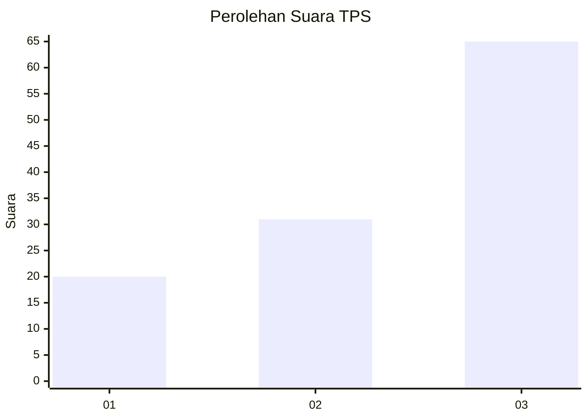
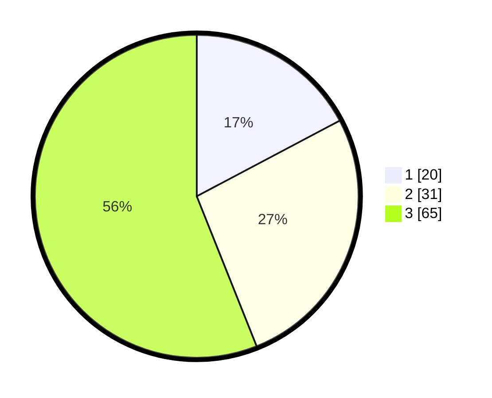

# Hasil

## Grafik

## Tabel

| No. | Nama Paslon    | Suara | Suara (raw) | Persentase |
|:--- |:-------------- | -----:| -----------:| ----------:|
| 1   | ANIES MUHAIMIN | 20    | [20][p-1]   | 17,24      |
| 2   | PRABOWO GIBRAN | 31    | [31][p-2]   | 26,72      |
| 3   | GANJAR MAHFUD  | 65    | [65][p-3]   | 56,03      |

[p-1]: https://github.com/gigit-pemilu/pemilu-2024/blob/main/pilpres/hitung-suara/sub/33-jawa-tengah/sub/12-wonogiri/sub/13-ngadirojo/sub/2005-kerjo-lor/sub/029-tps/sub/paslon-1.txt
[p-2]: https://github.com/gigit-pemilu/pemilu-2024/blob/main/pilpres/hitung-suara/sub/33-jawa-tengah/sub/12-wonogiri/sub/13-ngadirojo/sub/2005-kerjo-lor/sub/029-tps/sub/paslon-2.txt
[p-3]: https://github.com/gigit-pemilu/pemilu-2024/blob/main/pilpres/hitung-suara/sub/33-jawa-tengah/sub/12-wonogiri/sub/13-ngadirojo/sub/2005-kerjo-lor/sub/029-tps/sub/paslon-3.txt

## Foto C Plano

https://sirekap-obj-formc.kpu.go.id/e50b/pemilu/ppwp/33/12/13/20/05/3312132005029-20240215-162458--d1ea9df9-5ff8-4e2c-888c-a3cdc5615e14.jpg

https://sirekap-obj-formc.kpu.go.id/e50b/pemilu/ppwp/33/12/13/20/05/3312132005029-20240215-180118--559def8c-d0d8-4027-b24f-6599e4b50bc6.jpg

https://sirekap-obj-formc.kpu.go.id/e50b/pemilu/ppwp/33/12/13/20/05/3312132005029-20240215-180238--6f03f099-0bbb-4417-932f-691ad4019c42.jpg

## Metadata

| Key        | Value               |
| ---------- | ------------------- |
| Time Stamp | 2024-02-16 00:00:26 |

