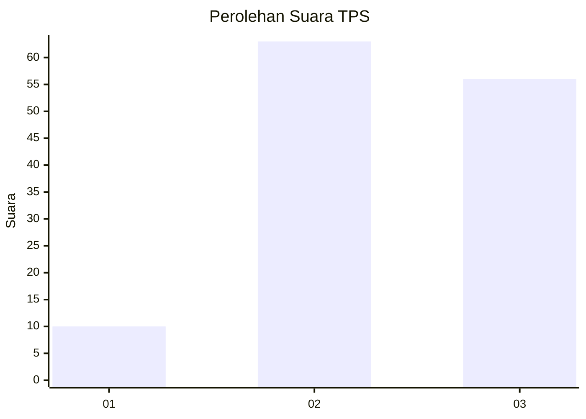
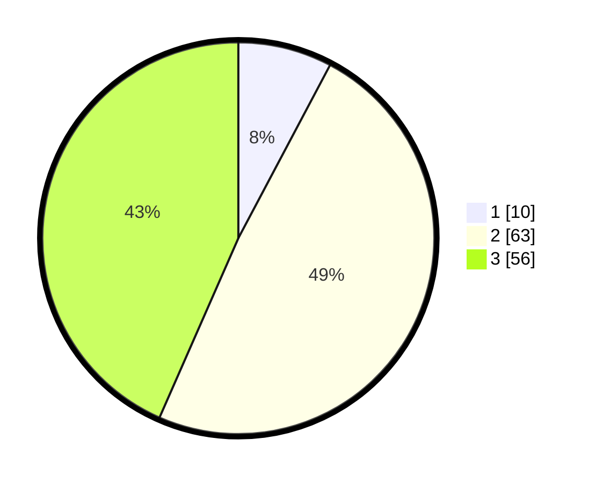

# Hasil

## Grafik

## Tabel

| No. | Nama Paslon    | Suara | Suara (raw) | Persentase |
|:--- |:-------------- | -----:| -----------:| ----------:|
| 1   | ANIES MUHAIMIN | 10    | [10][p-1]   | 7,75       |
| 2   | PRABOWO GIBRAN | 63    | [63][p-2]   | 48,84      |
| 3   | GANJAR MAHFUD  | 56    | [56][p-3]   | 43,41      |

[p-1]: https://github.com/gigit-pemilu/pemilu-2024-33-jawa-tengah/blob/main/pilpres/hitung-suara/sub/33-jawa-tengah/sub/12-wonogiri/sub/13-ngadirojo/sub/2008-mlokomanis-wetan/sub/003-tps/sub/paslon-1.txt
[p-2]: https://github.com/gigit-pemilu/pemilu-2024-33-jawa-tengah/blob/main/pilpres/hitung-suara/sub/33-jawa-tengah/sub/12-wonogiri/sub/13-ngadirojo/sub/2008-mlokomanis-wetan/sub/003-tps/sub/paslon-2.txt
[p-3]: https://github.com/gigit-pemilu/pemilu-2024-33-jawa-tengah/blob/main/pilpres/hitung-suara/sub/33-jawa-tengah/sub/12-wonogiri/sub/13-ngadirojo/sub/2008-mlokomanis-wetan/sub/003-tps/sub/paslon-3.txt

## Foto C Plano

https://sirekap-obj-formc.kpu.go.id/44af/pemilu/ppwp/33/12/13/20/08/3312132008003-20240215-204014--92931f64-b6f7-4eb4-840f-084f935f338b.jpg

https://sirekap-obj-formc.kpu.go.id/44af/pemilu/ppwp/33/12/13/20/08/3312132008003-20240215-203950--de2ca86f-5fda-42f6-95ac-fafa169deed2.jpg

https://sirekap-obj-formc.kpu.go.id/44af/pemilu/ppwp/33/12/13/20/08/3312132008003-20240215-204119--250374b1-db6a-4955-9979-1649def50a96.jpg

## Metadata

| Key        | Value               |
| ---------- | ------------------- |
| Time Stamp | 2024-02-16 14:00:34 |

