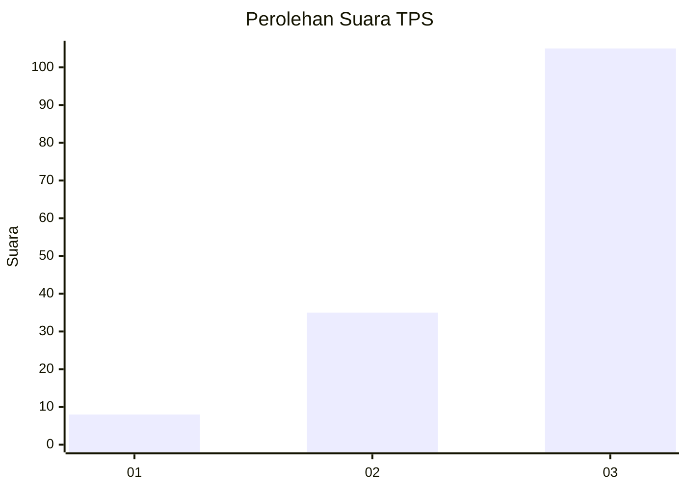
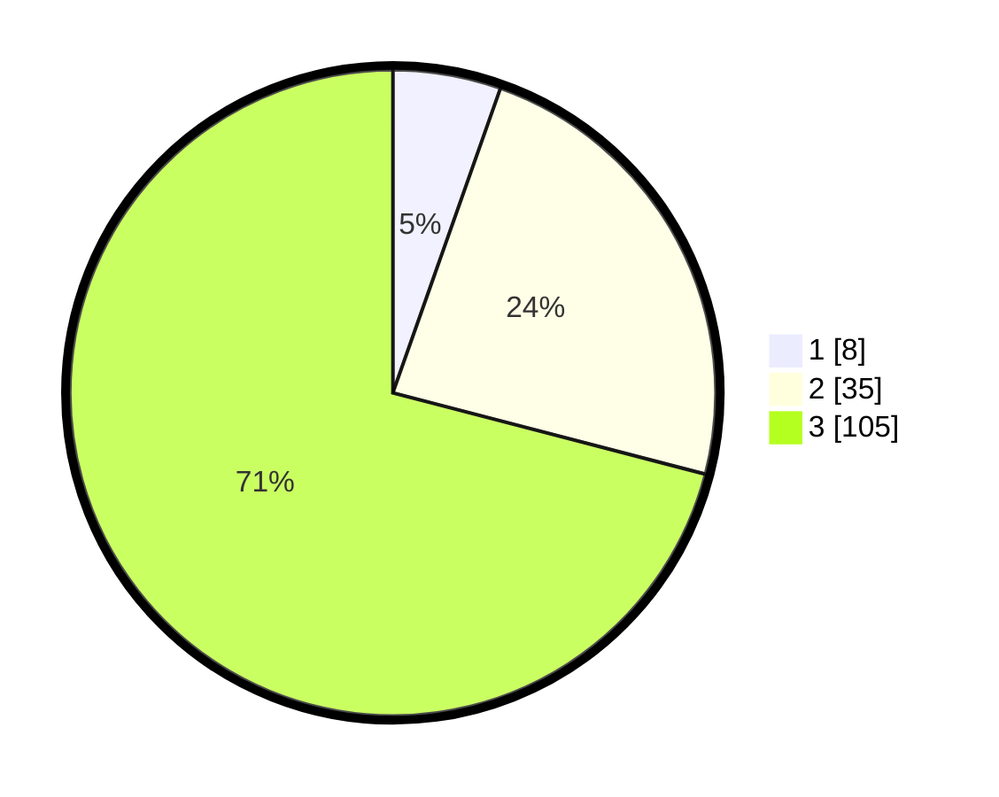

# Hasil

## Grafik

## Tabel

| No. | Nama Paslon    | Suara | Suara (raw) | Persentase |
|:--- |:-------------- | -----:| -----------:| ----------:|
| 1   | ANIES MUHAIMIN | 8     | [8][p-1]    | 5,41       |
| 2   | PRABOWO GIBRAN | 35    | [35][p-2]   | 23,65      |
| 3   | GANJAR MAHFUD  | 105   | [105][p-3]  | 70,95      |

[p-1]: https://github.com/gigit-pemilu/pemilu-2024/blob/main/pilpres/hitung-suara/sub/33-jawa-tengah/sub/12-wonogiri/sub/13-ngadirojo/sub/2008-mlokomanis-wetan/sub/004-tps/sub/paslon-1.txt
[p-2]: https://github.com/gigit-pemilu/pemilu-2024/blob/main/pilpres/hitung-suara/sub/33-jawa-tengah/sub/12-wonogiri/sub/13-ngadirojo/sub/2008-mlokomanis-wetan/sub/004-tps/sub/paslon-2.txt
[p-3]: https://github.com/gigit-pemilu/pemilu-2024/blob/main/pilpres/hitung-suara/sub/33-jawa-tengah/sub/12-wonogiri/sub/13-ngadirojo/sub/2008-mlokomanis-wetan/sub/004-tps/sub/paslon-3.txt

## Foto C Plano

https://sirekap-obj-formc.kpu.go.id/5f28/pemilu/ppwp/33/12/13/20/08/3312132008004-20240215-191629--2fdc3b53-95bc-4b1e-8b31-28c9e248139f.jpg

https://sirekap-obj-formc.kpu.go.id/5f28/pemilu/ppwp/33/12/13/20/08/3312132008004-20240218-172410--fc95b7bb-6130-4e41-b60e-7c3e68ffc5dd.jpg

https://sirekap-obj-formc.kpu.go.id/5f28/pemilu/ppwp/33/12/13/20/08/3312132008004-20240218-172409--f858547a-45e6-434f-b69c-2e2275650275.jpg

## Metadata

| Key        | Value               |
| ---------- | ------------------- |
| Time Stamp | 2024-02-19 13:00:00 |

