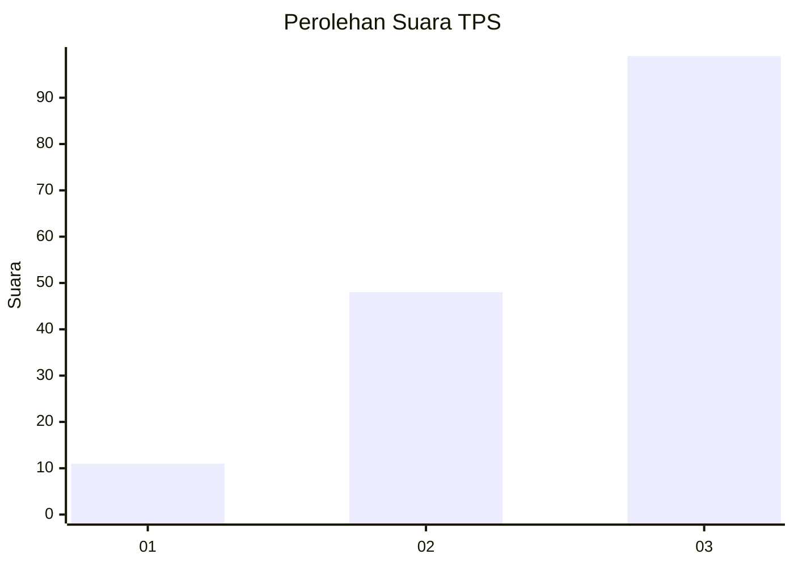
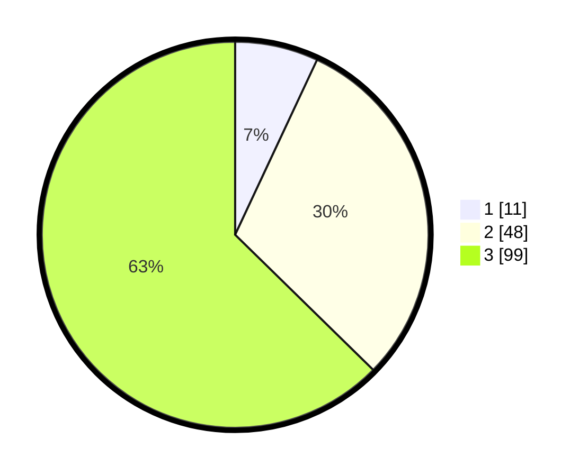

# Hasil

## Grafik

## Tabel

| No. | Nama Paslon    | Suara | Suara (raw) | Persentase |
|:--- |:-------------- | -----:| -----------:| ----------:|
| 1   | ANIES MUHAIMIN | 11    | [11][p-1]   | 6,96       |
| 2   | PRABOWO GIBRAN | 48    | [48][p-2]   | 30,38      |
| 3   | GANJAR MAHFUD  | 99    | [99][p-3]   | 62,66      |

[p-1]: https://github.com/gigit-pemilu/pemilu-2024/blob/main/pilpres/hitung-suara/sub/33-jawa-tengah/sub/12-wonogiri/sub/13-ngadirojo/sub/2008-mlokomanis-wetan/sub/005-tps/sub/paslon-1.txt
[p-2]: https://github.com/gigit-pemilu/pemilu-2024/blob/main/pilpres/hitung-suara/sub/33-jawa-tengah/sub/12-wonogiri/sub/13-ngadirojo/sub/2008-mlokomanis-wetan/sub/005-tps/sub/paslon-2.txt
[p-3]: https://github.com/gigit-pemilu/pemilu-2024/blob/main/pilpres/hitung-suara/sub/33-jawa-tengah/sub/12-wonogiri/sub/13-ngadirojo/sub/2008-mlokomanis-wetan/sub/005-tps/sub/paslon-3.txt

## Foto C Plano

https://sirekap-obj-formc.kpu.go.id/54f2/pemilu/ppwp/33/12/13/20/08/3312132008005-20240214-155027--2110ea69-4763-4566-a737-fc0db2da63fa.jpg

https://sirekap-obj-formc.kpu.go.id/54f2/pemilu/ppwp/33/12/13/20/08/3312132008005-20240214-155259--a2851cb8-0866-47a2-adc5-a4184cc9602b.jpg

https://sirekap-obj-formc.kpu.go.id/54f2/pemilu/ppwp/33/12/13/20/08/3312132008005-20240214-155422--46308fa7-8eaf-4696-aedd-3b4e5dd03fe8.jpg

## Metadata

| Key        | Value               |
| ---------- | ------------------- |
| Time Stamp | 2024-02-16 14:00:34 |

