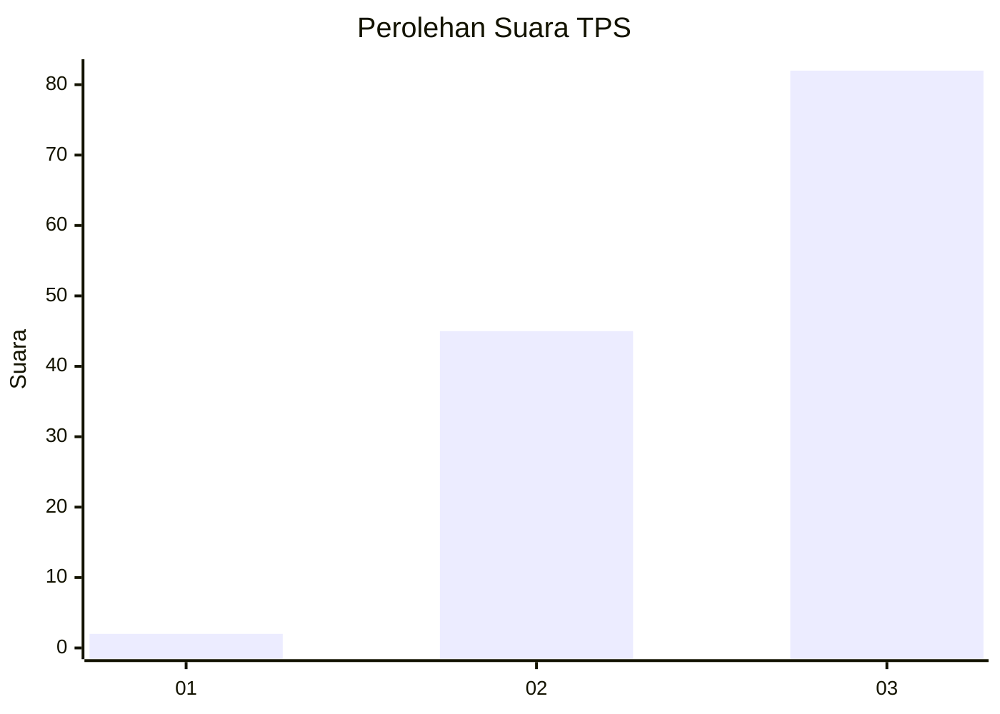
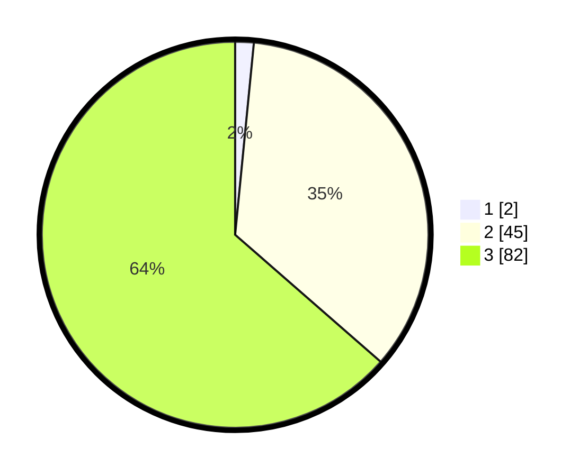

# Hasil

## Grafik

## Tabel

| No. | Nama Paslon    | Suara | Suara (raw) | Persentase |
|:--- |:-------------- | -----:| -----------:| ----------:|
| 1   | ANIES MUHAIMIN | 2     | [2][p-1]    | 1,55       |
| 2   | PRABOWO GIBRAN | 45    | [45][p-2]   | 34,88      |
| 3   | GANJAR MAHFUD  | 82    | [82][p-3]   | 63,57      |

[p-1]: https://github.com/gigit-pemilu/pemilu-2024-33-jawa-tengah/blob/main/pilpres/hitung-suara/sub/33-jawa-tengah/sub/12-wonogiri/sub/13-ngadirojo/sub/2008-mlokomanis-wetan/sub/008-tps/sub/paslon-1.txt
[p-2]: https://github.com/gigit-pemilu/pemilu-2024-33-jawa-tengah/blob/main/pilpres/hitung-suara/sub/33-jawa-tengah/sub/12-wonogiri/sub/13-ngadirojo/sub/2008-mlokomanis-wetan/sub/008-tps/sub/paslon-2.txt
[p-3]: https://github.com/gigit-pemilu/pemilu-2024-33-jawa-tengah/blob/main/pilpres/hitung-suara/sub/33-jawa-tengah/sub/12-wonogiri/sub/13-ngadirojo/sub/2008-mlokomanis-wetan/sub/008-tps/sub/paslon-3.txt

## Foto C Plano

https://sirekap-obj-formc.kpu.go.id/659c/pemilu/ppwp/33/12/13/20/08/3312132008008-20240216-202440--b3111094-0a56-4538-8614-5aba393eab5d.jpg

https://sirekap-obj-formc.kpu.go.id/659c/pemilu/ppwp/33/12/13/20/08/3312132008008-20240214-200105--321b93ff-d74d-4e63-842b-52f2807356ef.jpg

https://sirekap-obj-formc.kpu.go.id/659c/pemilu/ppwp/33/12/13/20/08/3312132008008-20240216-203255--057daf7a-0959-4d51-b0d0-fc87ee4341d0.jpg

## Metadata

| Key        | Value               |
| ---------- | ------------------- |
| Time Stamp | 2024-02-16 21:01:00 |

