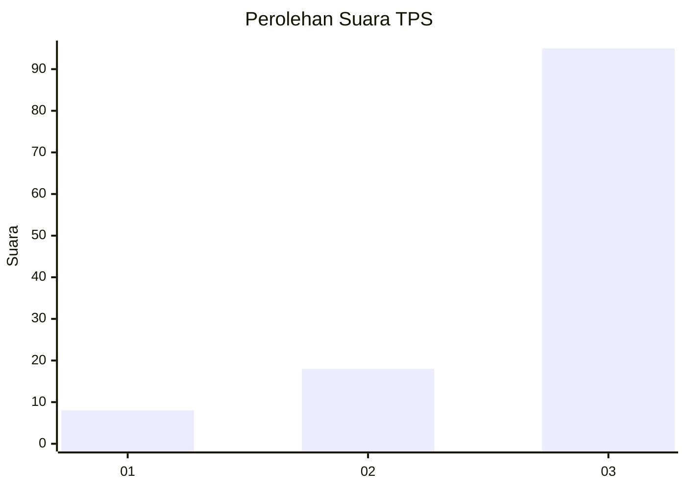
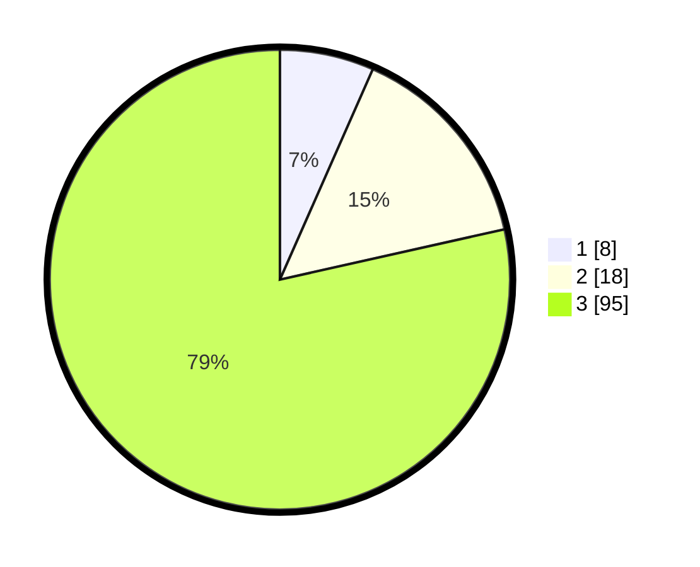

# Hasil

## Grafik

## Tabel

| No. | Nama Paslon    | Suara | Suara (raw) | Persentase |
|:--- |:-------------- | -----:| -----------:| ----------:|
| 1   | ANIES MUHAIMIN | 8     | [8][p-1]    | 6,61       |
| 2   | PRABOWO GIBRAN | 18    | [18][p-2]   | 14,88      |
| 3   | GANJAR MAHFUD  | 95    | [95][p-3]   | 78,51      |

[p-1]: https://github.com/gigit-pemilu/pemilu-2024/blob/main/pilpres/hitung-suara/sub/33-jawa-tengah/sub/12-wonogiri/sub/13-ngadirojo/sub/2011-jatimarto/sub/013-tps/sub/paslon-1.txt
[p-2]: https://github.com/gigit-pemilu/pemilu-2024/blob/main/pilpres/hitung-suara/sub/33-jawa-tengah/sub/12-wonogiri/sub/13-ngadirojo/sub/2011-jatimarto/sub/013-tps/sub/paslon-2.txt
[p-3]: https://github.com/gigit-pemilu/pemilu-2024/blob/main/pilpres/hitung-suara/sub/33-jawa-tengah/sub/12-wonogiri/sub/13-ngadirojo/sub/2011-jatimarto/sub/013-tps/sub/paslon-3.txt

## Foto C Plano

https://sirekap-obj-formc.kpu.go.id/8132/pemilu/ppwp/33/12/13/20/11/3312132011013-20240215-030118--691931aa-becb-4ad9-b6c9-c476e2c7414f.jpg

https://sirekap-obj-formc.kpu.go.id/8132/pemilu/ppwp/33/12/13/20/11/3312132011013-20240215-200341--40106039-923d-459a-be15-ace3883cf72c.jpg

https://sirekap-obj-formc.kpu.go.id/8132/pemilu/ppwp/33/12/13/20/11/3312132011013-20240215-200843--6871e0f5-d228-4b6b-886d-90a96f87cf73.jpg

## Metadata

| Key        | Value               |
| ---------- | ------------------- |
| Time Stamp | 2024-02-15 22:30:27 |

