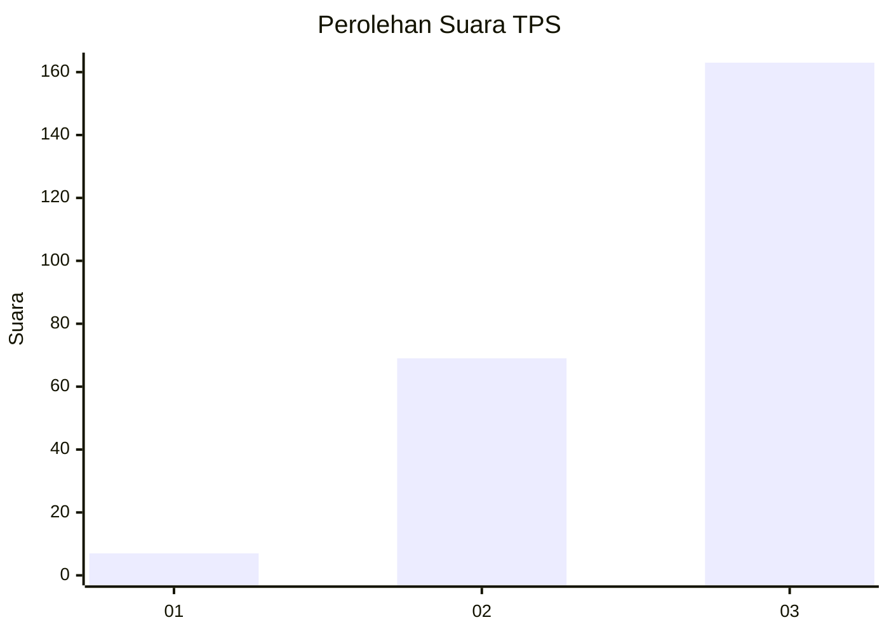
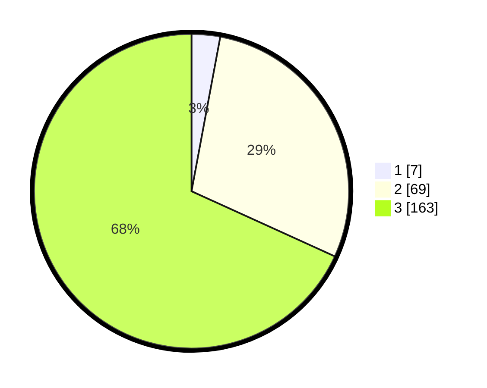

# Hasil

## Grafik

## Tabel

| No. | Nama Paslon    | Suara | Suara (raw) | Persentase |
|:--- |:-------------- | -----:| -----------:| ----------:|
| 1   | ANIES MUHAIMIN | 7     | [7][p-1]    | 2,93       |
| 2   | PRABOWO GIBRAN | 69    | [69][p-2]   | 28,87      |
| 3   | GANJAR MAHFUD  | 163   | [163][p-3]  | 68,20      |

[p-1]: https://github.com/gigit-pemilu/pemilu-2024-33-jawa-tengah/blob/main/pilpres/hitung-suara/sub/33-jawa-tengah/sub/12-wonogiri/sub/13-ngadirojo/sub/2011-jatimarto/sub/014-tps/sub/paslon-1.txt
[p-2]: https://github.com/gigit-pemilu/pemilu-2024-33-jawa-tengah/blob/main/pilpres/hitung-suara/sub/33-jawa-tengah/sub/12-wonogiri/sub/13-ngadirojo/sub/2011-jatimarto/sub/014-tps/sub/paslon-2.txt
[p-3]: https://github.com/gigit-pemilu/pemilu-2024-33-jawa-tengah/blob/main/pilpres/hitung-suara/sub/33-jawa-tengah/sub/12-wonogiri/sub/13-ngadirojo/sub/2011-jatimarto/sub/014-tps/sub/paslon-3.txt

## Foto C Plano

https://sirekap-obj-formc.kpu.go.id/0a64/pemilu/ppwp/33/12/13/20/11/3312132011014-20240214-224758--46636e90-38f6-4138-b3c6-a18583dc97a8.jpg

https://sirekap-obj-formc.kpu.go.id/0a64/pemilu/ppwp/33/12/13/20/11/3312132011014-20240214-224849--f18f52c4-c0c7-4eca-b067-c5e0f69f4cfe.jpg

https://sirekap-obj-formc.kpu.go.id/0a64/pemilu/ppwp/33/12/13/20/11/3312132011014-20240214-224943--9e81d68e-6945-4103-b0ce-e2b74fa1b1f4.jpg

## Metadata

| Key        | Value               |
| ---------- | ------------------- |
| Time Stamp | 2024-02-19 06:16:00 |

