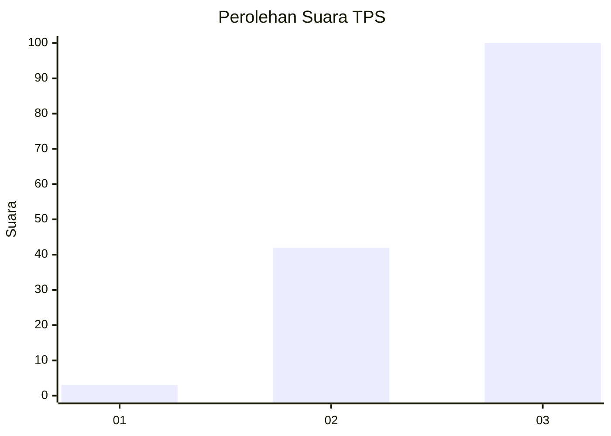
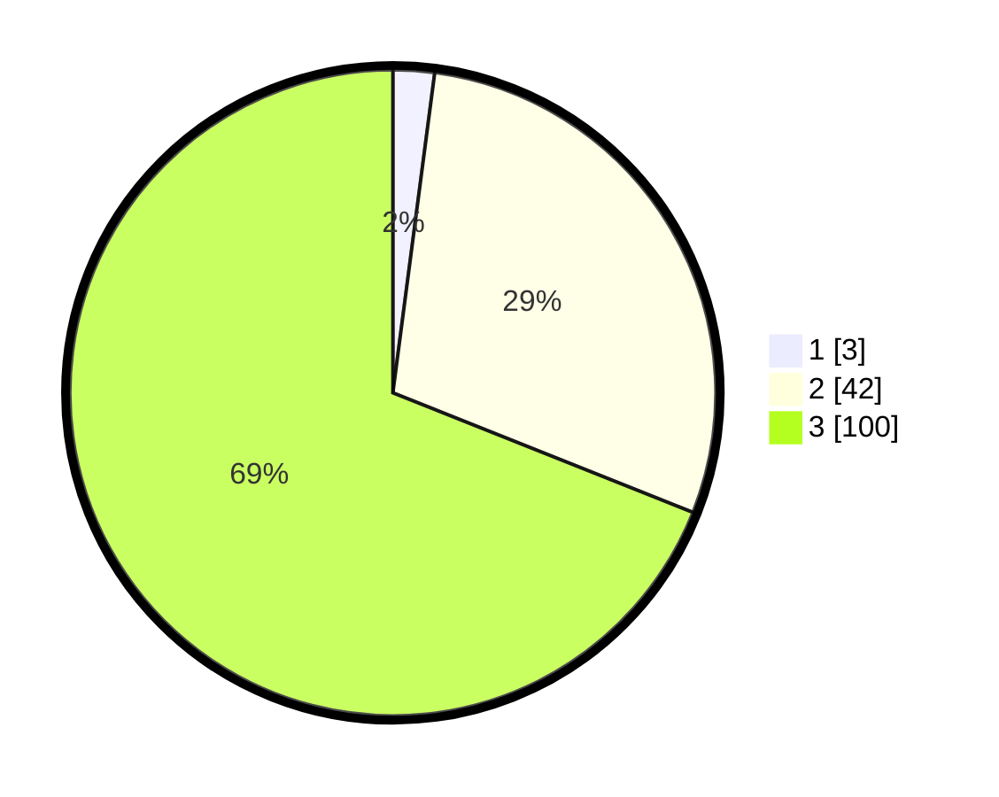

# Hasil

## Grafik

## Tabel

| No. | Nama Paslon    | Suara | Suara (raw) | Persentase |
|:--- |:-------------- | -----:| -----------:| ----------:|
| 1   | ANIES MUHAIMIN | 3     | [3][p-1]    | 2,07       |
| 2   | PRABOWO GIBRAN | 42    | [42][p-2]   | 28,97      |
| 3   | GANJAR MAHFUD  | 100   | [100][p-3]  | 68,97      |

[p-1]: https://github.com/gigit-pemilu/pemilu-2024/blob/main/pilpres/hitung-suara/sub/33-jawa-tengah/sub/12-wonogiri/sub/14-sidoharjo/sub/2001-sempukerep/sub/005-tps/sub/paslon-1.txt
[p-2]: https://github.com/gigit-pemilu/pemilu-2024/blob/main/pilpres/hitung-suara/sub/33-jawa-tengah/sub/12-wonogiri/sub/14-sidoharjo/sub/2001-sempukerep/sub/005-tps/sub/paslon-2.txt
[p-3]: https://github.com/gigit-pemilu/pemilu-2024/blob/main/pilpres/hitung-suara/sub/33-jawa-tengah/sub/12-wonogiri/sub/14-sidoharjo/sub/2001-sempukerep/sub/005-tps/sub/paslon-3.txt

## Foto C Plano

https://sirekap-obj-formc.kpu.go.id/dd7f/pemilu/ppwp/33/12/14/20/01/3312142001005-20240214-155446--92cf0078-14df-445e-9640-6d60c944b8e4.jpg

https://sirekap-obj-formc.kpu.go.id/dd7f/pemilu/ppwp/33/12/14/20/01/3312142001005-20240214-155550--6c4e6c25-26d2-438b-8fc1-731b0217ebba.jpg

https://sirekap-obj-formc.kpu.go.id/dd7f/pemilu/ppwp/33/12/14/20/01/3312142001005-20240214-155749--03484a0e-90cd-4310-a552-dc9e989df1d7.jpg

## Metadata

| Key        | Value               |
| ---------- | ------------------- |
| Time Stamp | 2024-02-19 06:16:00 |

