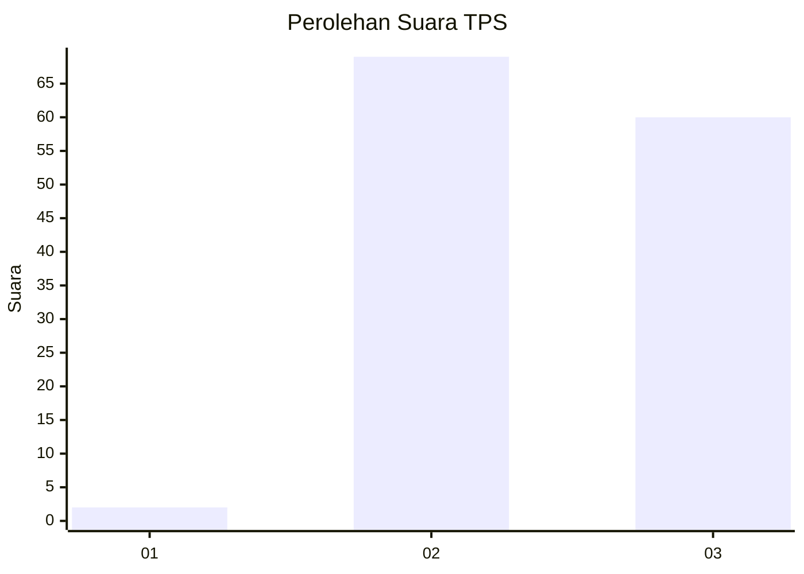
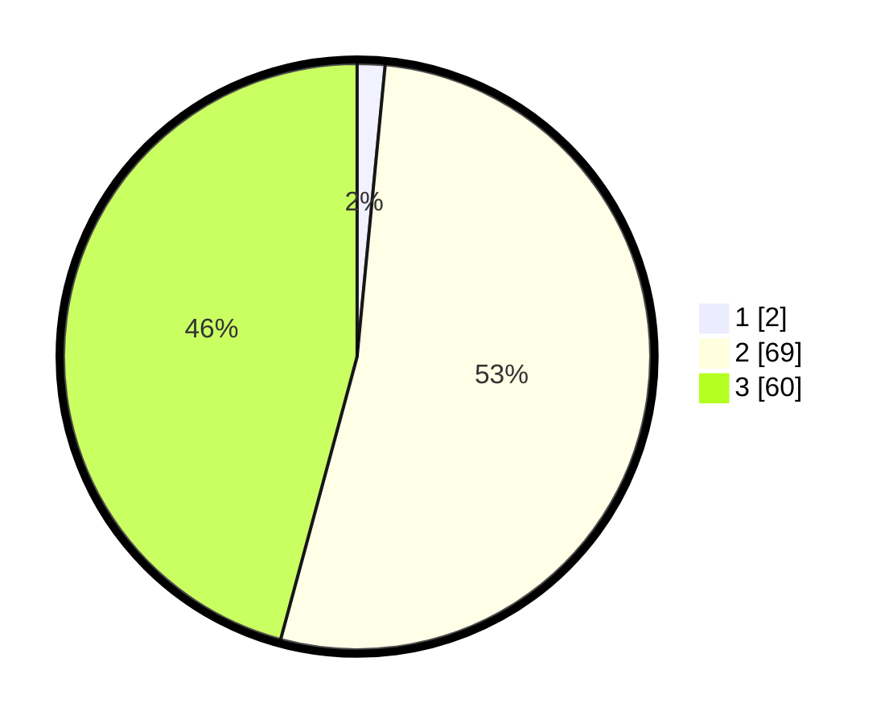

# Hasil

## Grafik

## Tabel

| No. | Nama Paslon    | Suara | Suara (raw) | Persentase |
|:--- |:-------------- | -----:| -----------:| ----------:|
| 1   | ANIES MUHAIMIN | 2     | [2][p-1]    | 1,53       |
| 2   | PRABOWO GIBRAN | 69    | [69][p-2]   | 52,67      |
| 3   | GANJAR MAHFUD  | 60    | [60][p-3]   | 45,80      |

[p-1]: https://github.com/gigit-pemilu/pemilu-2024/blob/main/pilpres/hitung-suara/sub/33-jawa-tengah/sub/12-wonogiri/sub/14-sidoharjo/sub/2001-sempukerep/sub/017-tps/sub/paslon-1.txt
[p-2]: https://github.com/gigit-pemilu/pemilu-2024/blob/main/pilpres/hitung-suara/sub/33-jawa-tengah/sub/12-wonogiri/sub/14-sidoharjo/sub/2001-sempukerep/sub/017-tps/sub/paslon-2.txt
[p-3]: https://github.com/gigit-pemilu/pemilu-2024/blob/main/pilpres/hitung-suara/sub/33-jawa-tengah/sub/12-wonogiri/sub/14-sidoharjo/sub/2001-sempukerep/sub/017-tps/sub/paslon-3.txt

## Foto C Plano

https://sirekap-obj-formc.kpu.go.id/877e/pemilu/ppwp/33/12/14/20/01/3312142001017-20240214-141408--d7b20e45-09dd-46e1-b01f-90ac244c69d3.jpg

https://sirekap-obj-formc.kpu.go.id/877e/pemilu/ppwp/33/12/14/20/01/3312142001017-20240216-132427--37f706c2-21da-4156-8024-efff81e848ee.jpg

https://sirekap-obj-formc.kpu.go.id/877e/pemilu/ppwp/33/12/14/20/01/3312142001017-20240216-132426--6d0d8382-5bdb-4efc-8d0a-9ddc858ef4ab.jpg

## Metadata

| Key        | Value               |
| ---------- | ------------------- |
| Time Stamp | 2024-02-19 13:00:00 |

