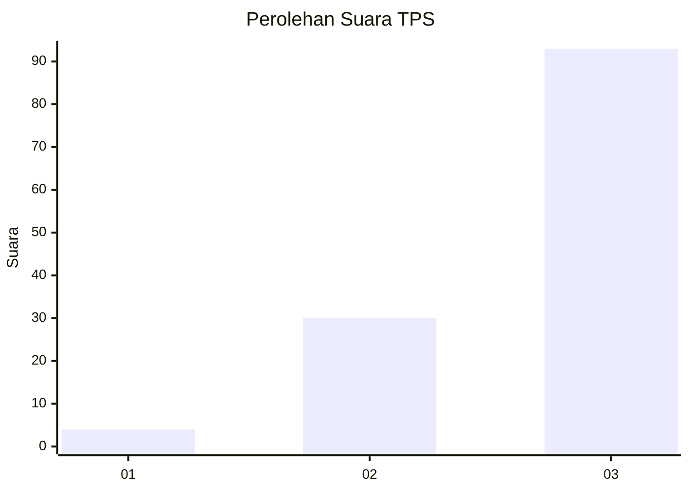
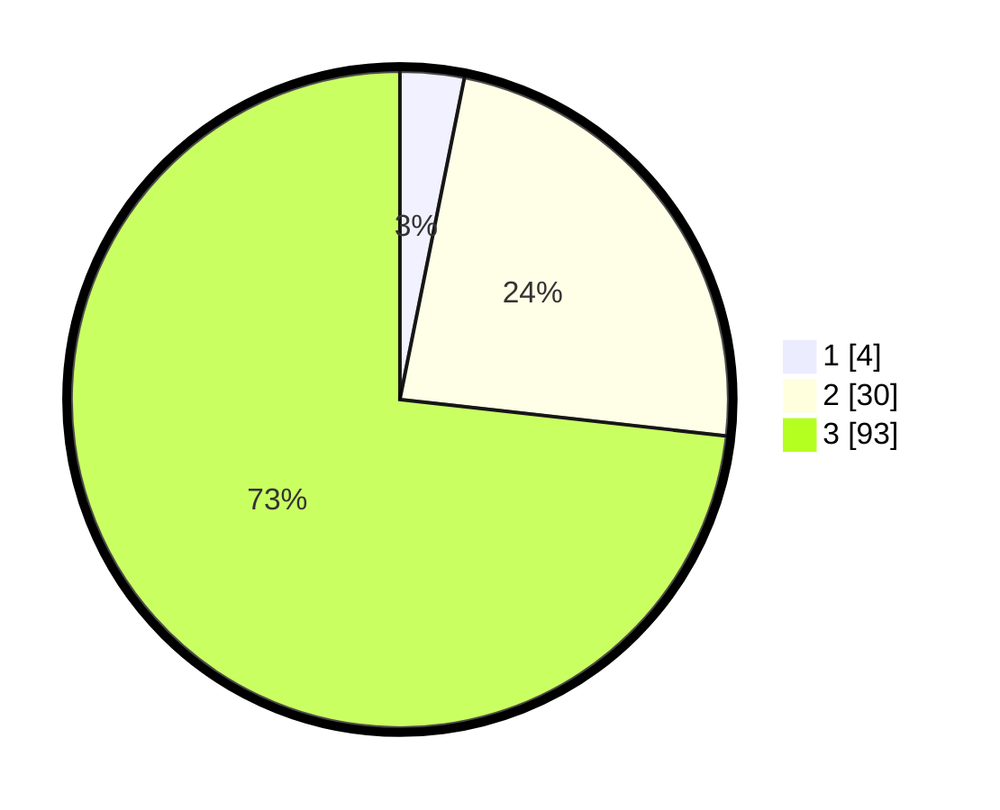

# Hasil

## Grafik

## Tabel

| No. | Nama Paslon    | Suara | Suara (raw) | Persentase |
|:--- |:-------------- | -----:| -----------:| ----------:|
| 1   | ANIES MUHAIMIN | 4     | [4][p-1]    | 3,15       |
| 2   | PRABOWO GIBRAN | 30    | [30][p-2]   | 23,62      |
| 3   | GANJAR MAHFUD  | 93    | [93][p-3]   | 73,23      |

[p-1]: https://github.com/gigit-pemilu/pemilu-2024-33-jawa-tengah/blob/main/pilpres/hitung-suara/sub/33-jawa-tengah/sub/12-wonogiri/sub/14-sidoharjo/sub/2004-kebonagung/sub/007-tps/sub/paslon-1.txt
[p-2]: https://github.com/gigit-pemilu/pemilu-2024-33-jawa-tengah/blob/main/pilpres/hitung-suara/sub/33-jawa-tengah/sub/12-wonogiri/sub/14-sidoharjo/sub/2004-kebonagung/sub/007-tps/sub/paslon-2.txt
[p-3]: https://github.com/gigit-pemilu/pemilu-2024-33-jawa-tengah/blob/main/pilpres/hitung-suara/sub/33-jawa-tengah/sub/12-wonogiri/sub/14-sidoharjo/sub/2004-kebonagung/sub/007-tps/sub/paslon-3.txt

## Foto C Plano

https://sirekap-obj-formc.kpu.go.id/40f9/pemilu/ppwp/33/12/14/20/04/3312142004007-20240216-073427--b61edd24-1b25-4e3b-a10f-80b3b3f3336c.jpg

https://sirekap-obj-formc.kpu.go.id/40f9/pemilu/ppwp/33/12/14/20/04/3312142004007-20240214-141735--c5b46129-c3e7-4874-b222-cee56dd59515.jpg

https://sirekap-obj-formc.kpu.go.id/40f9/pemilu/ppwp/33/12/14/20/04/3312142004007-20240214-141643--52f9bafa-f7ae-4eeb-b869-ff5612e777be.jpg

## Metadata

| Key        | Value               |
| ---------- | ------------------- |
| Time Stamp | 2024-02-16 08:00:28 |

