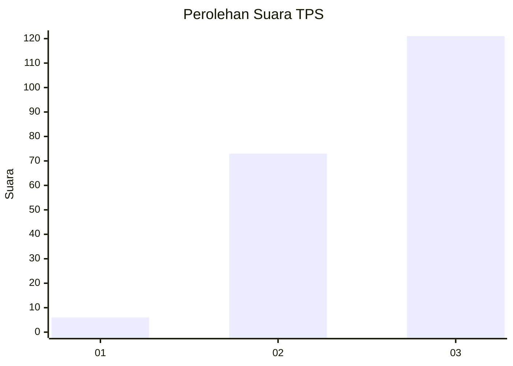
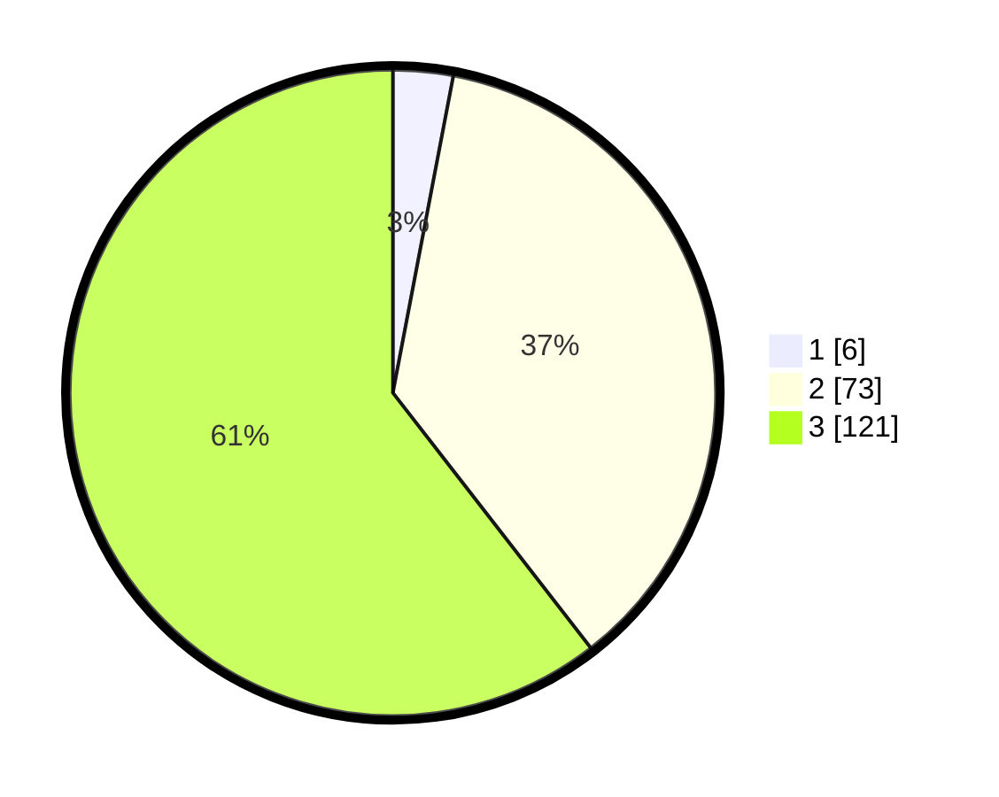

# Hasil

## Grafik

## Tabel

| No. | Nama Paslon    | Suara | Suara (raw) | Persentase |
|:--- |:-------------- | -----:| -----------:| ----------:|
| 1   | ANIES MUHAIMIN | 6     | [6][p-1]    | 3,00       |
| 2   | PRABOWO GIBRAN | 73    | [73][p-2]   | 36,50      |
| 3   | GANJAR MAHFUD  | 121   | [121][p-3]  | 60,50      |

[p-1]: https://github.com/gigit-pemilu/pemilu-2024/blob/main/pilpres/hitung-suara/sub/33-jawa-tengah/sub/12-wonogiri/sub/14-sidoharjo/sub/2007-ngabeyan/sub/005-tps/sub/paslon-1.txt
[p-2]: https://github.com/gigit-pemilu/pemilu-2024/blob/main/pilpres/hitung-suara/sub/33-jawa-tengah/sub/12-wonogiri/sub/14-sidoharjo/sub/2007-ngabeyan/sub/005-tps/sub/paslon-2.txt
[p-3]: https://github.com/gigit-pemilu/pemilu-2024/blob/main/pilpres/hitung-suara/sub/33-jawa-tengah/sub/12-wonogiri/sub/14-sidoharjo/sub/2007-ngabeyan/sub/005-tps/sub/paslon-3.txt

## Foto C Plano

https://sirekap-obj-formc.kpu.go.id/df3c/pemilu/ppwp/33/12/14/20/07/3312142007005-20240214-235038--9b5d52b1-f79d-419e-9d3b-6a2619095547.jpg

https://sirekap-obj-formc.kpu.go.id/df3c/pemilu/ppwp/33/12/14/20/07/3312142007005-20240214-235201--9b6cb970-39d5-4587-bbc8-7beae12ba8a6.jpg

https://sirekap-obj-formc.kpu.go.id/df3c/pemilu/ppwp/33/12/14/20/07/3312142007005-20240214-235315--c9155fcb-0f55-41ac-a883-92c346e070fa.jpg

## Metadata

| Key        | Value               |
| ---------- | ------------------- |
| Time Stamp | 2024-02-19 06:16:00 |

