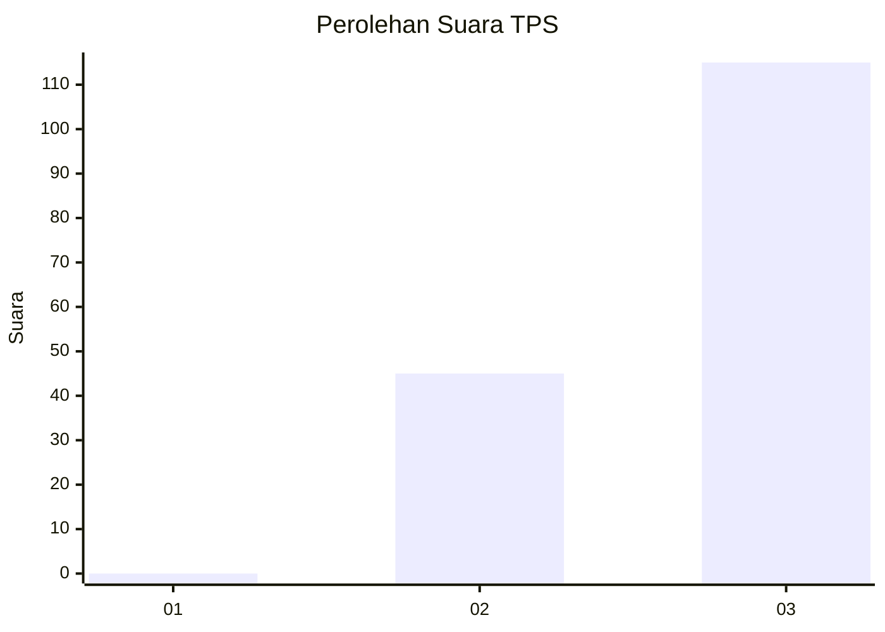
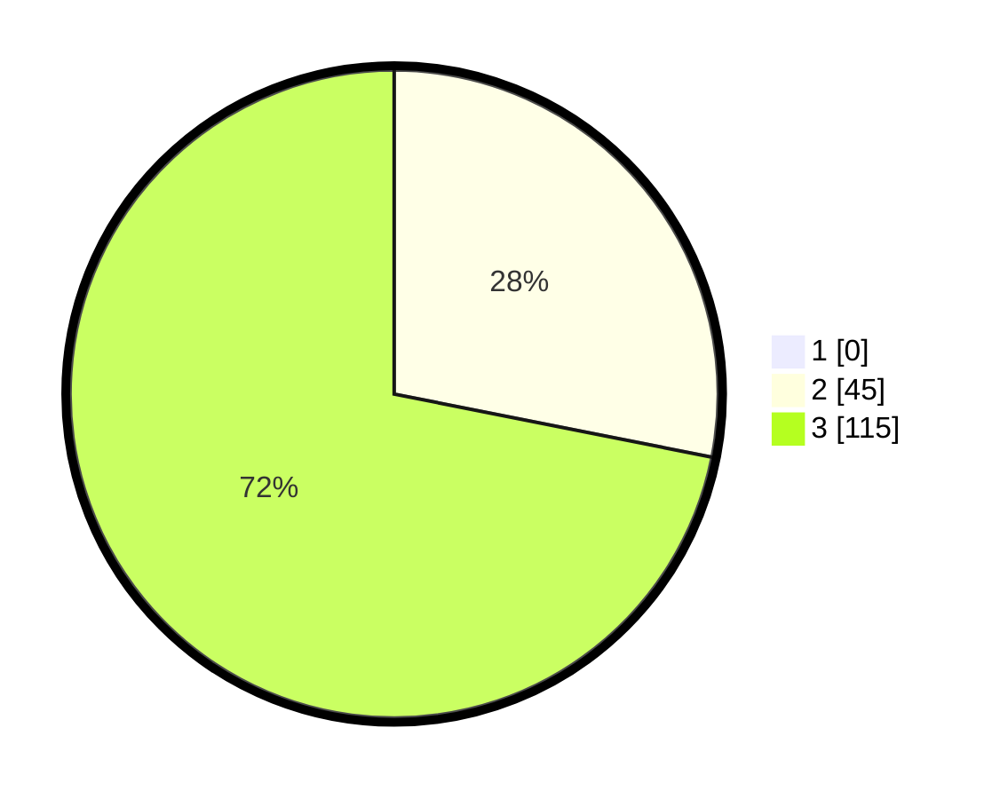

# Hasil

## Grafik

## Tabel

| No. | Nama Paslon    | Suara | Suara (raw) | Persentase |
|:--- |:-------------- | -----:| -----------:| ----------:|
| 1   | ANIES MUHAIMIN | 0     | [0][p-1]    | 0,00       |
| 2   | PRABOWO GIBRAN | 45    | [45][p-2]   | 28,13      |
| 3   | GANJAR MAHFUD  | 115   | [115][p-3]  | 71,88      |

[p-1]: https://github.com/gigit-pemilu/pemilu-2024/blob/main/pilpres/hitung-suara/sub/33-jawa-tengah/sub/12-wonogiri/sub/14-sidoharjo/sub/2007-ngabeyan/sub/009-tps/sub/paslon-1.txt
[p-2]: https://github.com/gigit-pemilu/pemilu-2024/blob/main/pilpres/hitung-suara/sub/33-jawa-tengah/sub/12-wonogiri/sub/14-sidoharjo/sub/2007-ngabeyan/sub/009-tps/sub/paslon-2.txt
[p-3]: https://github.com/gigit-pemilu/pemilu-2024/blob/main/pilpres/hitung-suara/sub/33-jawa-tengah/sub/12-wonogiri/sub/14-sidoharjo/sub/2007-ngabeyan/sub/009-tps/sub/paslon-3.txt

## Foto C Plano

https://sirekap-obj-formc.kpu.go.id/23e7/pemilu/ppwp/33/12/14/20/07/3312142007009-20240214-213601--8bcf16d4-138b-40ab-8fa3-5fe859602785.jpg

https://sirekap-obj-formc.kpu.go.id/23e7/pemilu/ppwp/33/12/14/20/07/3312142007009-20240214-205428--3b69078d-daf5-4951-bd15-3483c3f14c48.jpg

https://sirekap-obj-formc.kpu.go.id/23e7/pemilu/ppwp/33/12/14/20/07/3312142007009-20240214-205548--97a70d8b-625f-4438-a22b-94ede56416dd.jpg

## Metadata

| Key        | Value               |
| ---------- | ------------------- |
| Time Stamp | 2024-02-16 08:30:27 |

