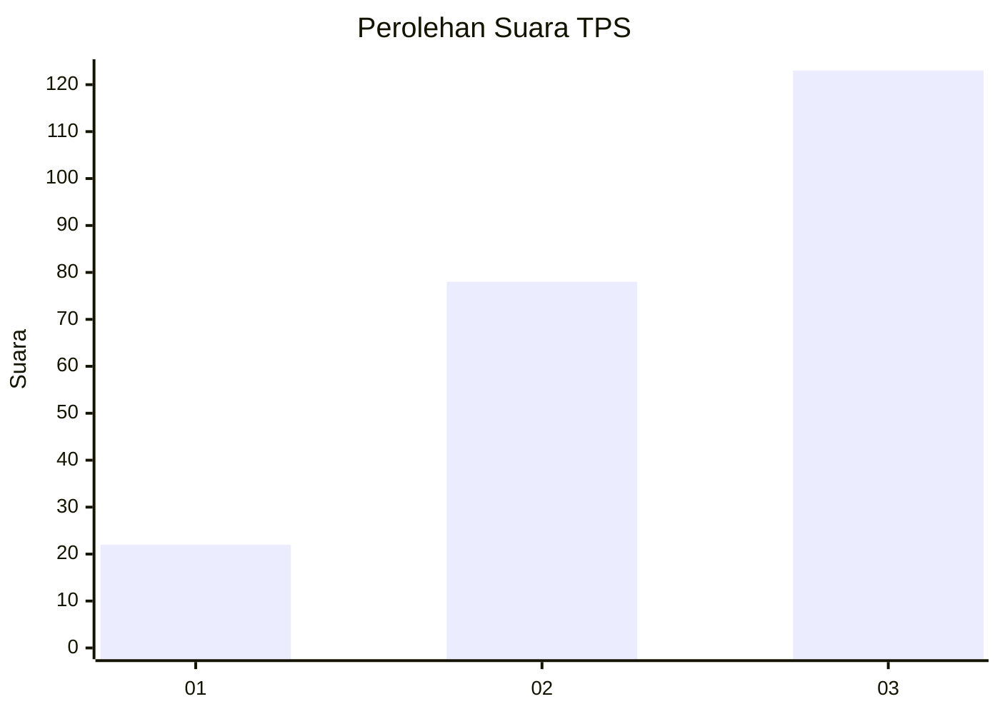
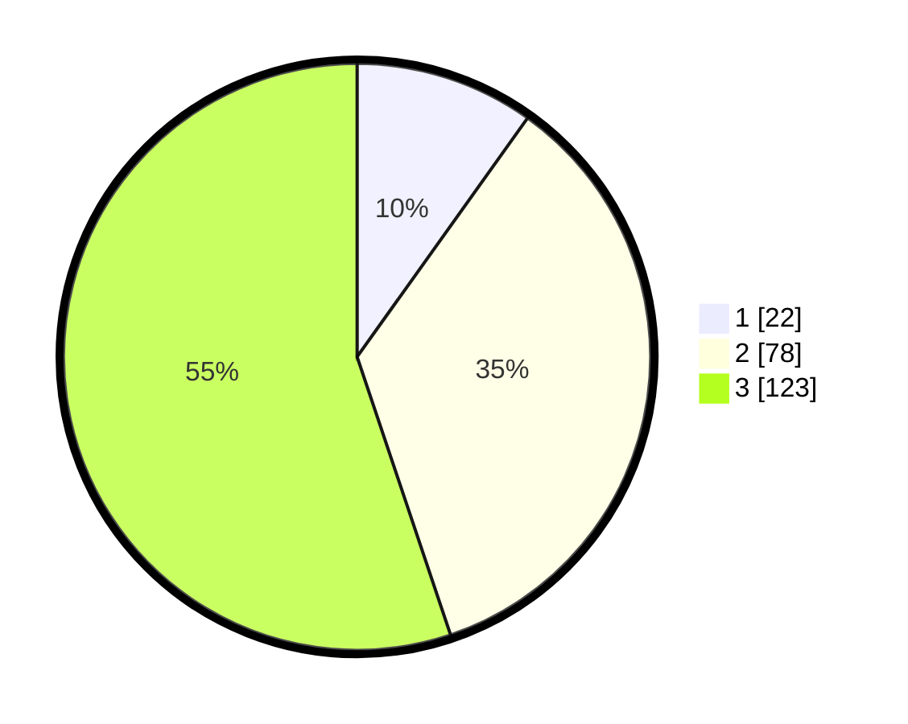

# Hasil

## Grafik

## Tabel

| No. | Nama Paslon    | Suara | Suara (raw) | Persentase |
|:--- |:-------------- | -----:| -----------:| ----------:|
| 1   | ANIES MUHAIMIN | 22    | [22][p-1]   | 9,87       |
| 2   | PRABOWO GIBRAN | 78    | [78][p-2]   | 34,98      |
| 3   | GANJAR MAHFUD  | 123   | [123][p-3]  | 55,16      |

[p-1]: https://github.com/gigit-pemilu/pemilu-2024/blob/main/pilpres/hitung-suara/sub/33-jawa-tengah/sub/12-wonogiri/sub/14-sidoharjo/sub/2011-jatinom/sub/002-tps/sub/paslon-1.txt
[p-2]: https://github.com/gigit-pemilu/pemilu-2024/blob/main/pilpres/hitung-suara/sub/33-jawa-tengah/sub/12-wonogiri/sub/14-sidoharjo/sub/2011-jatinom/sub/002-tps/sub/paslon-2.txt
[p-3]: https://github.com/gigit-pemilu/pemilu-2024/blob/main/pilpres/hitung-suara/sub/33-jawa-tengah/sub/12-wonogiri/sub/14-sidoharjo/sub/2011-jatinom/sub/002-tps/sub/paslon-3.txt

## Foto C Plano

https://sirekap-obj-formc.kpu.go.id/cd59/pemilu/ppwp/33/12/14/20/11/3312142011002-20240214-195239--50de92a7-9a37-4555-a976-82f347b573fa.jpg

https://sirekap-obj-formc.kpu.go.id/cd59/pemilu/ppwp/33/12/14/20/11/3312142011002-20240214-195244--81a0e345-411b-499d-841c-0fba7309a643.jpg

https://sirekap-obj-formc.kpu.go.id/cd59/pemilu/ppwp/33/12/14/20/11/3312142011002-20240214-195254--ed8e879e-3f4f-426d-a69e-dbb1b33004ff.jpg

## Metadata

| Key        | Value               |
| ---------- | ------------------- |
| Time Stamp | 2024-02-19 06:16:00 |

