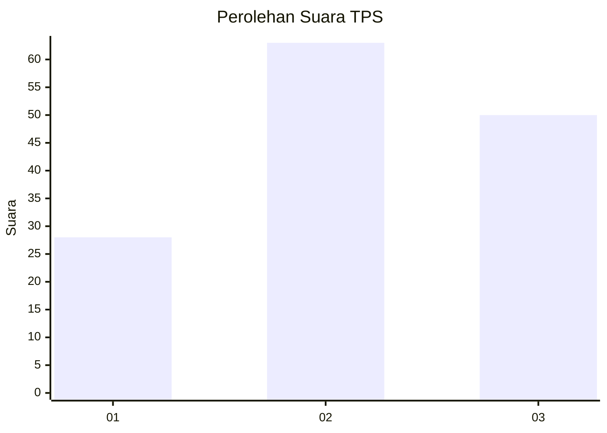
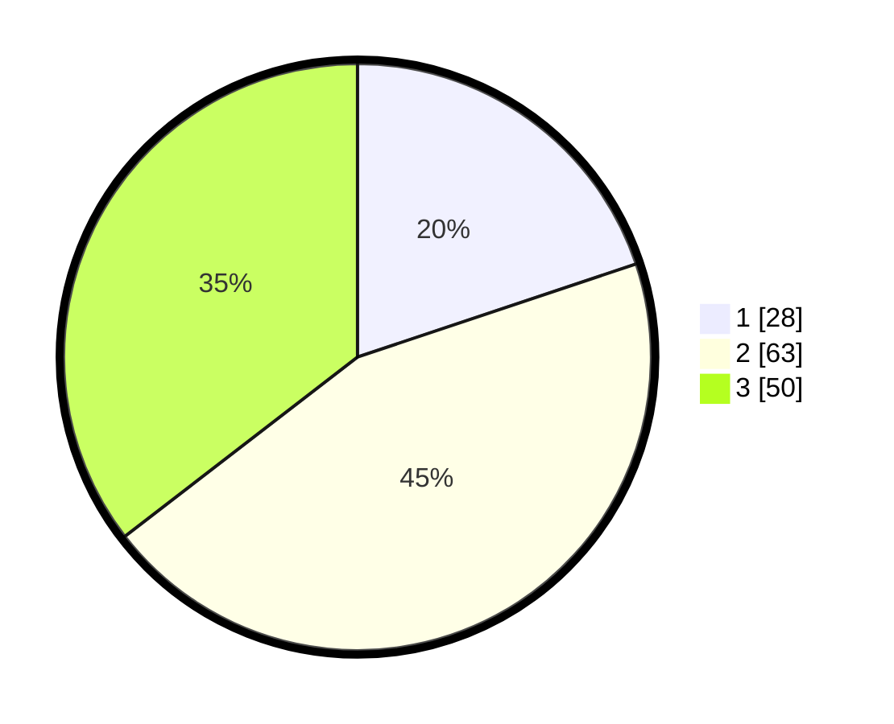

# Hasil

## Grafik

## Tabel

| No. | Nama Paslon    | Suara | Suara (raw) | Persentase |
|:--- |:-------------- | -----:| -----------:| ----------:|
| 1   | ANIES MUHAIMIN | 28    | [28][p-1]   | 19,86      |
| 2   | PRABOWO GIBRAN | 63    | [63][p-2]   | 44,68      |
| 3   | GANJAR MAHFUD  | 50    | [50][p-3]   | 35,46      |

[p-1]: https://github.com/gigit-pemilu/pemilu-2024/blob/main/pilpres/hitung-suara/sub/33-jawa-tengah/sub/12-wonogiri/sub/15-jatiroto/sub/1009-sanggrong/sub/002-tps/sub/paslon-1.txt
[p-2]: https://github.com/gigit-pemilu/pemilu-2024/blob/main/pilpres/hitung-suara/sub/33-jawa-tengah/sub/12-wonogiri/sub/15-jatiroto/sub/1009-sanggrong/sub/002-tps/sub/paslon-2.txt
[p-3]: https://github.com/gigit-pemilu/pemilu-2024/blob/main/pilpres/hitung-suara/sub/33-jawa-tengah/sub/12-wonogiri/sub/15-jatiroto/sub/1009-sanggrong/sub/002-tps/sub/paslon-3.txt

## Foto C Plano

https://sirekap-obj-formc.kpu.go.id/2c1a/pemilu/ppwp/33/12/15/10/09/3312151009002-20240214-191658--50d89e49-45a9-4ea3-8e0c-6a1b1737bfd3.jpg

https://sirekap-obj-formc.kpu.go.id/2c1a/pemilu/ppwp/33/12/15/10/09/3312151009002-20240214-191304--47c1db42-7cdd-4ecc-bd68-2e88ebe769f9.jpg

https://sirekap-obj-formc.kpu.go.id/2c1a/pemilu/ppwp/33/12/15/10/09/3312151009002-20240214-191322--5edf76f2-191c-482a-9031-2aa63ca40f65.jpg

## Metadata

| Key        | Value               |
| ---------- | ------------------- |
| Time Stamp | 2024-02-19 06:16:00 |

