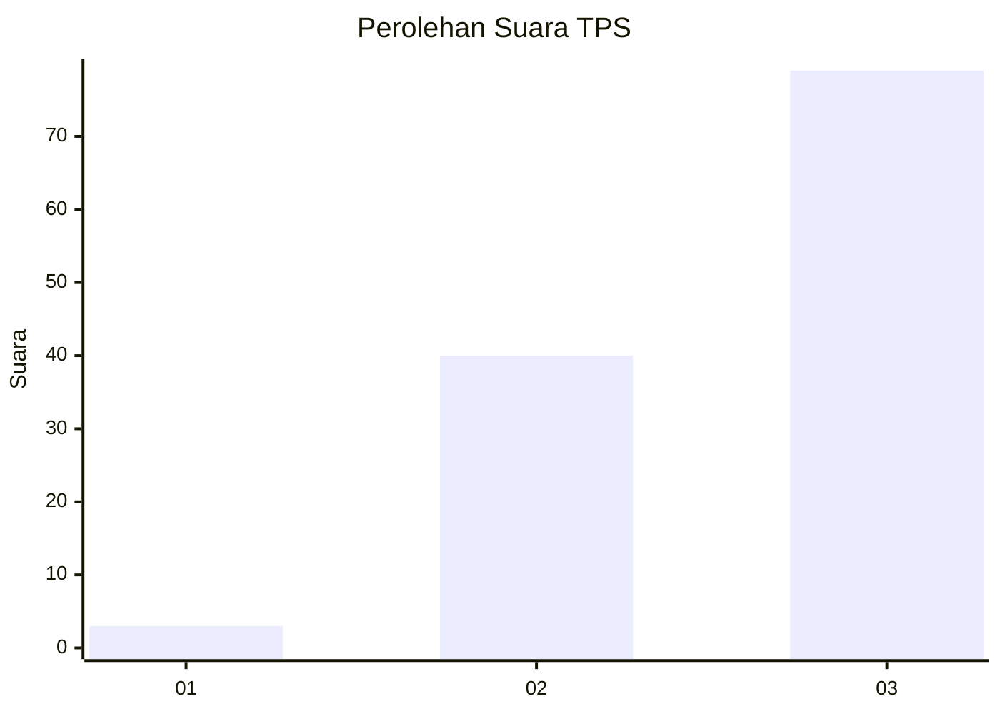
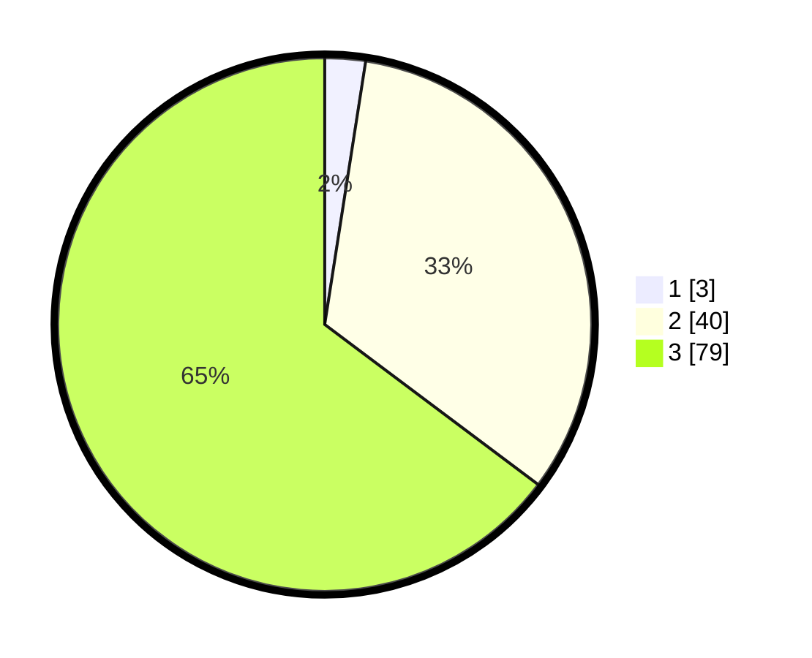

# Hasil

## Grafik

## Tabel

| No. | Nama Paslon    | Suara | Suara (raw) | Persentase |
|:--- |:-------------- | -----:| -----------:| ----------:|
| 1   | ANIES MUHAIMIN | 3     | [3][p-1]    | 2,46       |
| 2   | PRABOWO GIBRAN | 40    | [40][p-2]   | 32,79      |
| 3   | GANJAR MAHFUD  | 79    | [79][p-3]   | 64,75      |

[p-1]: https://github.com/gigit-pemilu/pemilu-2024-33-jawa-tengah/blob/main/pilpres/hitung-suara/sub/33-jawa-tengah/sub/12-wonogiri/sub/15-jatiroto/sub/1014-jatiroto/sub/006-tps/sub/paslon-1.txt
[p-2]: https://github.com/gigit-pemilu/pemilu-2024-33-jawa-tengah/blob/main/pilpres/hitung-suara/sub/33-jawa-tengah/sub/12-wonogiri/sub/15-jatiroto/sub/1014-jatiroto/sub/006-tps/sub/paslon-2.txt
[p-3]: https://github.com/gigit-pemilu/pemilu-2024-33-jawa-tengah/blob/main/pilpres/hitung-suara/sub/33-jawa-tengah/sub/12-wonogiri/sub/15-jatiroto/sub/1014-jatiroto/sub/006-tps/sub/paslon-3.txt

## Foto C Plano

https://sirekap-obj-formc.kpu.go.id/9f57/pemilu/ppwp/33/12/15/10/14/3312151014006-20240214-230603--a036c0c3-82a7-475a-908c-6ef948ebbc3c.jpg

https://sirekap-obj-formc.kpu.go.id/9f57/pemilu/ppwp/33/12/15/10/14/3312151014006-20240214-230717--65b64464-8e56-4f75-b30b-774c82e6cd36.jpg

https://sirekap-obj-formc.kpu.go.id/9f57/pemilu/ppwp/33/12/15/10/14/3312151014006-20240214-230941--7eb1678e-545a-4a7d-80b5-c2627927c67c.jpg

## Metadata

| Key        | Value               |
| ---------- | ------------------- |
| Time Stamp | 2024-02-19 06:16:00 |

