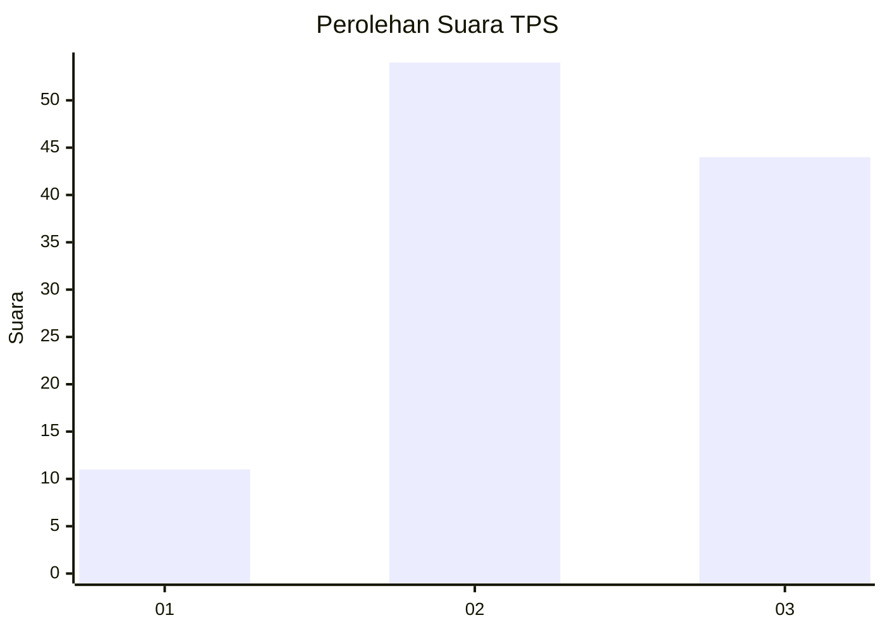
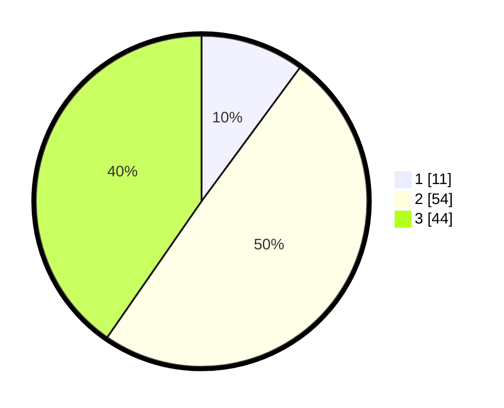

# Hasil

## Grafik

## Tabel

| No. | Nama Paslon    | Suara | Suara (raw) | Persentase |
|:--- |:-------------- | -----:| -----------:| ----------:|
| 1   | ANIES MUHAIMIN | 11    | [11][p-1]   | 10,09      |
| 2   | PRABOWO GIBRAN | 54    | [54][p-2]   | 49,54      |
| 3   | GANJAR MAHFUD  | 44    | [44][p-3]   | 40,37      |

[p-1]: https://github.com/gigit-pemilu/pemilu-2024-33-jawa-tengah/blob/main/pilpres/hitung-suara/sub/33-jawa-tengah/sub/12-wonogiri/sub/15-jatiroto/sub/1014-jatiroto/sub/013-tps/sub/paslon-1.txt
[p-2]: https://github.com/gigit-pemilu/pemilu-2024-33-jawa-tengah/blob/main/pilpres/hitung-suara/sub/33-jawa-tengah/sub/12-wonogiri/sub/15-jatiroto/sub/1014-jatiroto/sub/013-tps/sub/paslon-2.txt
[p-3]: https://github.com/gigit-pemilu/pemilu-2024-33-jawa-tengah/blob/main/pilpres/hitung-suara/sub/33-jawa-tengah/sub/12-wonogiri/sub/15-jatiroto/sub/1014-jatiroto/sub/013-tps/sub/paslon-3.txt

## Foto C Plano

https://sirekap-obj-formc.kpu.go.id/21f2/pemilu/ppwp/33/12/15/10/14/3312151014013-20240214-201446--76d2a4c5-733a-4808-a349-f49569fb89ff.jpg

https://sirekap-obj-formc.kpu.go.id/21f2/pemilu/ppwp/33/12/15/10/14/3312151014013-20240214-201600--09bd6873-2dd8-423d-b7a5-137029aa49cf.jpg

https://sirekap-obj-formc.kpu.go.id/21f2/pemilu/ppwp/33/12/15/10/14/3312151014013-20240214-201657--e118bb6e-f383-4900-bcc1-7c6fd05c2744.jpg

## Metadata

| Key        | Value               |
| ---------- | ------------------- |
| Time Stamp | 2024-02-14 21:46:01 |

