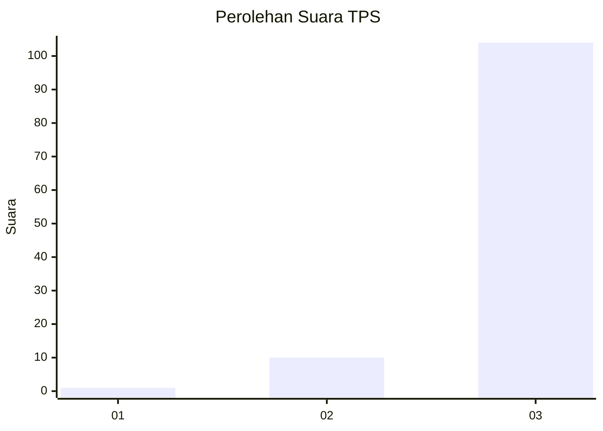
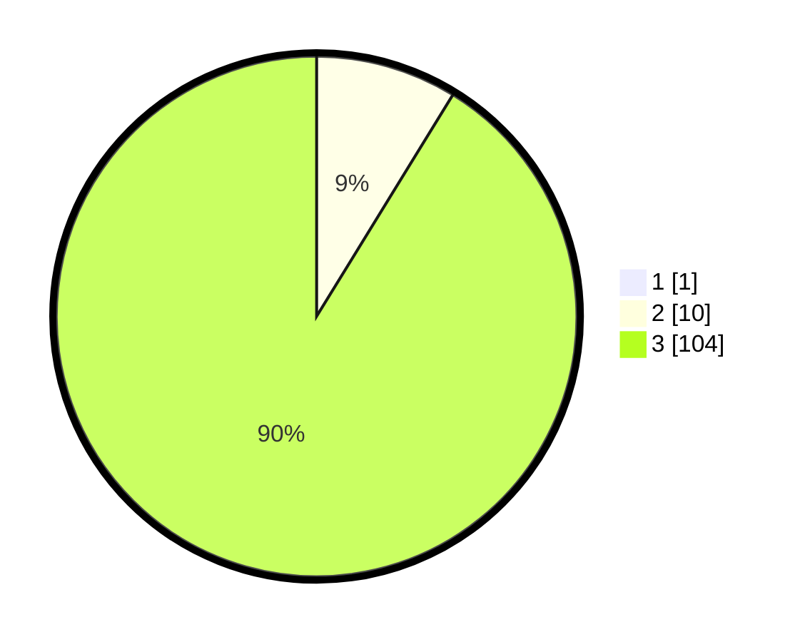

# Hasil

## Grafik

## Tabel

| No. | Nama Paslon    | Suara | Suara (raw) | Persentase |
|:--- |:-------------- | -----:| -----------:| ----------:|
| 1   | ANIES MUHAIMIN | 1     | [1][p-1]    | 0,87       |
| 2   | PRABOWO GIBRAN | 10    | [10][p-2]   | 8,70       |
| 3   | GANJAR MAHFUD  | 104   | [104][p-3]  | 90,43      |

[p-1]: https://github.com/gigit-pemilu/pemilu-2024/blob/main/pilpres/hitung-suara/sub/33-jawa-tengah/sub/12-wonogiri/sub/15-jatiroto/sub/2001-brenggolo/sub/001-tps/sub/paslon-1.txt
[p-2]: https://github.com/gigit-pemilu/pemilu-2024/blob/main/pilpres/hitung-suara/sub/33-jawa-tengah/sub/12-wonogiri/sub/15-jatiroto/sub/2001-brenggolo/sub/001-tps/sub/paslon-2.txt
[p-3]: https://github.com/gigit-pemilu/pemilu-2024/blob/main/pilpres/hitung-suara/sub/33-jawa-tengah/sub/12-wonogiri/sub/15-jatiroto/sub/2001-brenggolo/sub/001-tps/sub/paslon-3.txt

## Foto C Plano

https://sirekap-obj-formc.kpu.go.id/9ffc/pemilu/ppwp/33/12/15/20/01/3312152001001-20240214-220614--10a2a00f-0e7b-4329-89c3-013ebfa7b328.jpg

https://sirekap-obj-formc.kpu.go.id/9ffc/pemilu/ppwp/33/12/15/20/01/3312152001001-20240214-221044--47ecd5e7-94a0-4542-8c0b-4f7378b09e66.jpg

https://sirekap-obj-formc.kpu.go.id/9ffc/pemilu/ppwp/33/12/15/20/01/3312152001001-20240214-220952--6a18a6b0-af06-41d5-a0b3-34682c4a5d9d.jpg

## Metadata

| Key        | Value               |
| ---------- | ------------------- |
| Time Stamp | 2024-02-19 06:16:00 |

