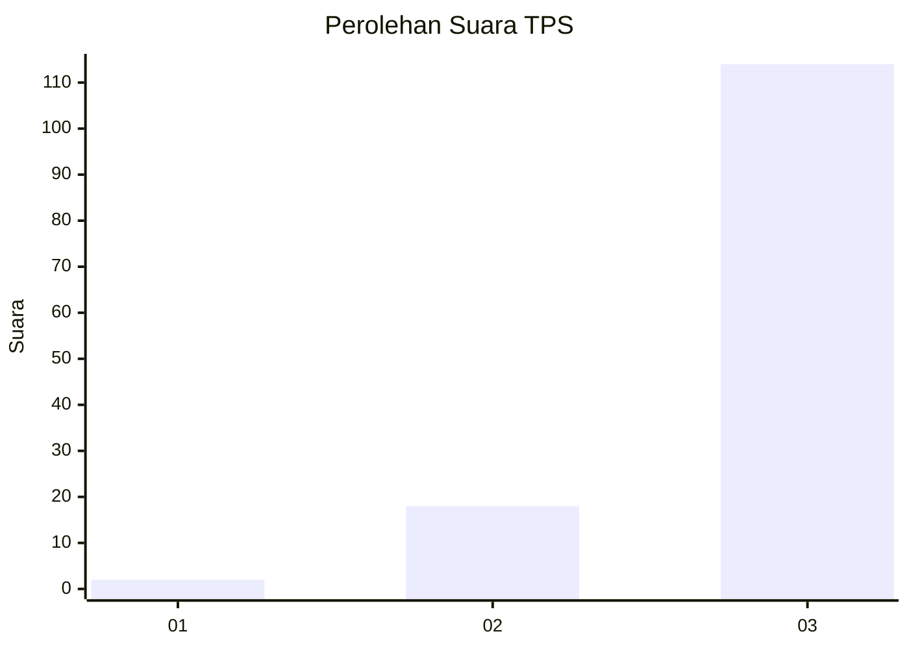
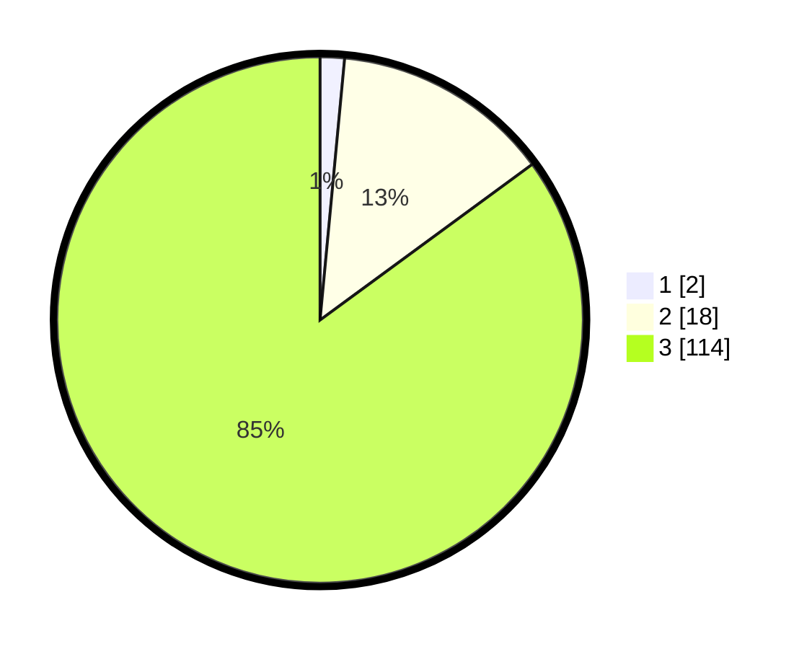

# Hasil

## Grafik

## Tabel

| No. | Nama Paslon    | Suara | Suara (raw) | Persentase |
|:--- |:-------------- | -----:| -----------:| ----------:|
| 1   | ANIES MUHAIMIN | 2     | [2][p-1]    | 1,49       |
| 2   | PRABOWO GIBRAN | 18    | [18][p-2]   | 13,43      |
| 3   | GANJAR MAHFUD  | 114   | [114][p-3]  | 85,07      |

[p-1]: https://github.com/gigit-pemilu/pemilu-2024/blob/main/pilpres/hitung-suara/sub/33-jawa-tengah/sub/12-wonogiri/sub/15-jatiroto/sub/2001-brenggolo/sub/002-tps/sub/paslon-1.txt
[p-2]: https://github.com/gigit-pemilu/pemilu-2024/blob/main/pilpres/hitung-suara/sub/33-jawa-tengah/sub/12-wonogiri/sub/15-jatiroto/sub/2001-brenggolo/sub/002-tps/sub/paslon-2.txt
[p-3]: https://github.com/gigit-pemilu/pemilu-2024/blob/main/pilpres/hitung-suara/sub/33-jawa-tengah/sub/12-wonogiri/sub/15-jatiroto/sub/2001-brenggolo/sub/002-tps/sub/paslon-3.txt

## Foto C Plano

https://sirekap-obj-formc.kpu.go.id/44cf/pemilu/ppwp/33/12/15/20/01/3312152001002-20240214-193944--ad391361-8e73-40b0-bc2f-9ab94ce656bb.jpg

https://sirekap-obj-formc.kpu.go.id/44cf/pemilu/ppwp/33/12/15/20/01/3312152001002-20240214-194029--fc292a25-1c64-4a80-9c76-60eadfd241fb.jpg

https://sirekap-obj-formc.kpu.go.id/44cf/pemilu/ppwp/33/12/15/20/01/3312152001002-20240214-194139--195996b2-6ff5-46cd-ab72-95eb558893c2.jpg

## Metadata

| Key        | Value               |
| ---------- | ------------------- |
| Time Stamp | 2024-02-19 06:16:00 |

