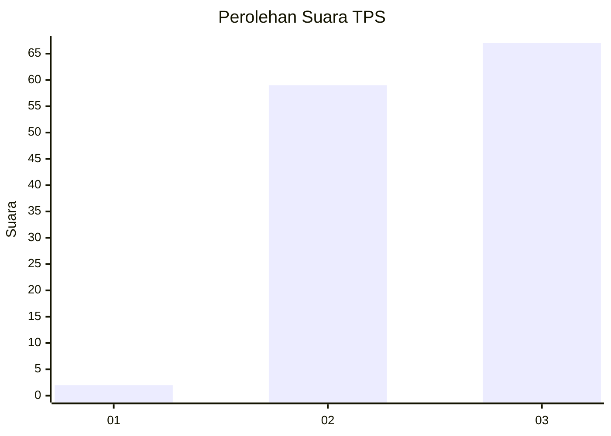
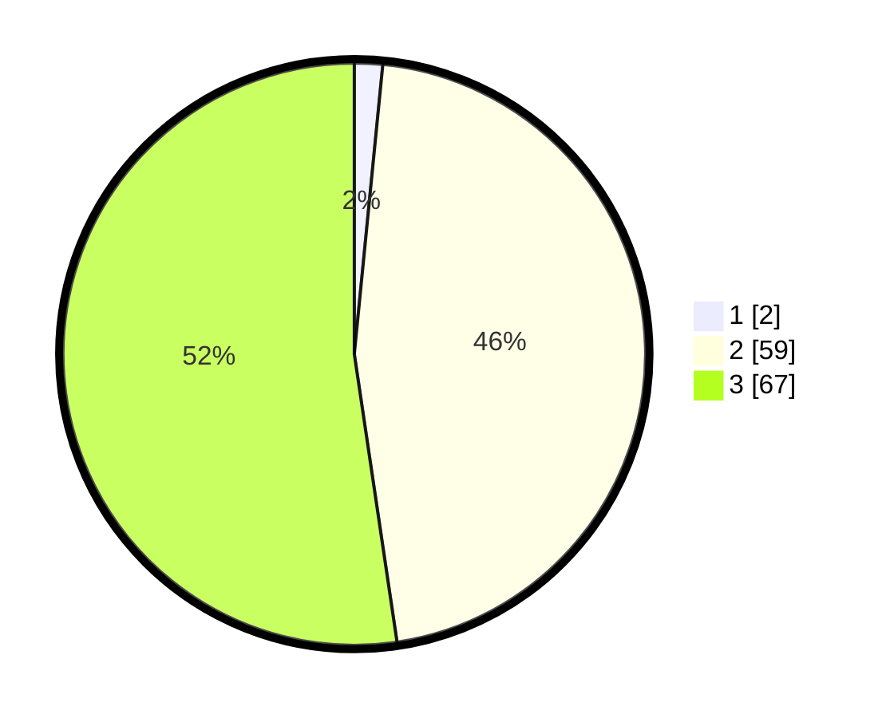

# Hasil

## Grafik

## Tabel

| No. | Nama Paslon    | Suara | Suara (raw) | Persentase |
|:--- |:-------------- | -----:| -----------:| ----------:|
| 1   | ANIES MUHAIMIN | 2     | [2][p-1]    | 1,56       |
| 2   | PRABOWO GIBRAN | 59    | [59][p-2]   | 46,09      |
| 3   | GANJAR MAHFUD  | 67    | [67][p-3]   | 52,34      |

[p-1]: https://github.com/gigit-pemilu/pemilu-2024-33-jawa-tengah/blob/main/pilpres/hitung-suara/sub/33-jawa-tengah/sub/12-wonogiri/sub/15-jatiroto/sub/2002-boto/sub/003-tps/sub/paslon-1.txt
[p-2]: https://github.com/gigit-pemilu/pemilu-2024-33-jawa-tengah/blob/main/pilpres/hitung-suara/sub/33-jawa-tengah/sub/12-wonogiri/sub/15-jatiroto/sub/2002-boto/sub/003-tps/sub/paslon-2.txt
[p-3]: https://github.com/gigit-pemilu/pemilu-2024-33-jawa-tengah/blob/main/pilpres/hitung-suara/sub/33-jawa-tengah/sub/12-wonogiri/sub/15-jatiroto/sub/2002-boto/sub/003-tps/sub/paslon-3.txt

## Foto C Plano

https://sirekap-obj-formc.kpu.go.id/3fb7/pemilu/ppwp/33/12/15/20/02/3312152002003-20240214-224321--dbe6ed79-d0b6-48e9-825c-86308758dd5d.jpg

https://sirekap-obj-formc.kpu.go.id/3fb7/pemilu/ppwp/33/12/15/20/02/3312152002003-20240214-224511--3b9ae923-a612-47d5-bbd2-ca181634e667.jpg

https://sirekap-obj-formc.kpu.go.id/3fb7/pemilu/ppwp/33/12/15/20/02/3312152002003-20240214-224645--58c879df-119a-4175-a0cc-b27410559ef3.jpg

## Metadata

| Key        | Value               |
| ---------- | ------------------- |
| Time Stamp | 2024-02-15 20:00:44 |

