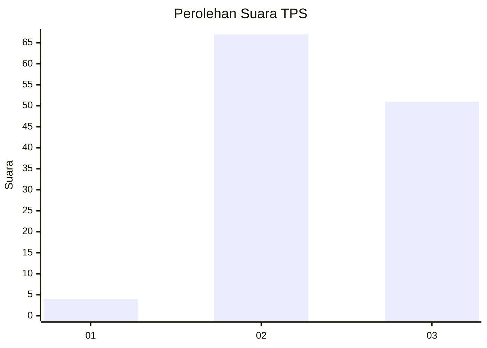
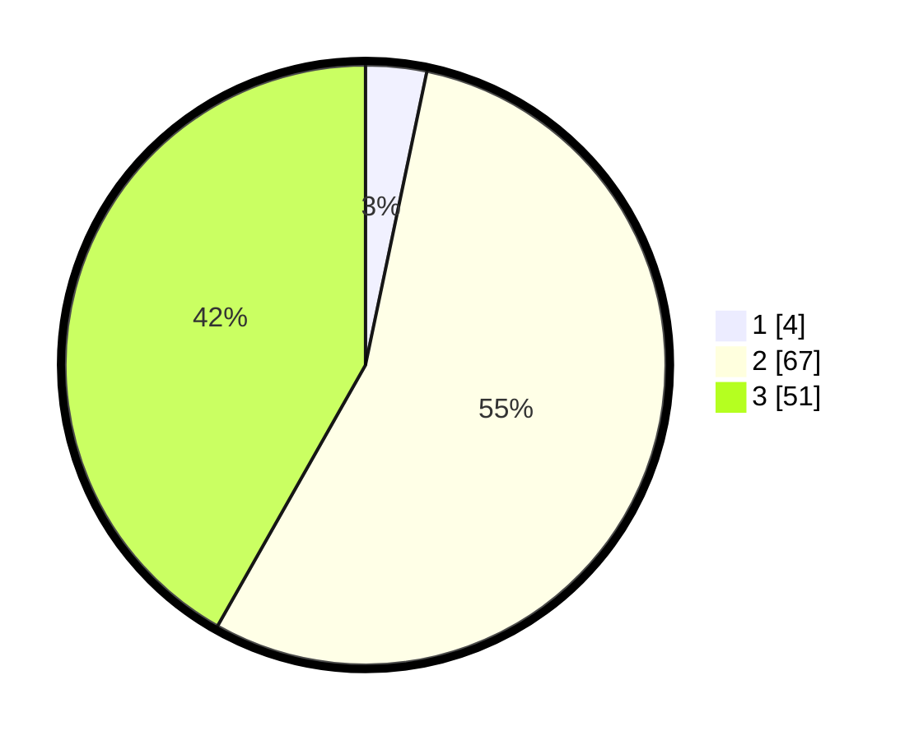

# Hasil

## Grafik

## Tabel

| No. | Nama Paslon    | Suara | Suara (raw) | Persentase |
|:--- |:-------------- | -----:| -----------:| ----------:|
| 1   | ANIES MUHAIMIN | 4     | [4][p-1]    | 3,28       |
| 2   | PRABOWO GIBRAN | 67    | [67][p-2]   | 54,92      |
| 3   | GANJAR MAHFUD  | 51    | [51][p-3]   | 41,80      |

[p-1]: https://github.com/gigit-pemilu/pemilu-2024/blob/main/pilpres/hitung-suara/sub/33-jawa-tengah/sub/12-wonogiri/sub/15-jatiroto/sub/2002-boto/sub/009-tps/sub/paslon-1.txt
[p-2]: https://github.com/gigit-pemilu/pemilu-2024/blob/main/pilpres/hitung-suara/sub/33-jawa-tengah/sub/12-wonogiri/sub/15-jatiroto/sub/2002-boto/sub/009-tps/sub/paslon-2.txt
[p-3]: https://github.com/gigit-pemilu/pemilu-2024/blob/main/pilpres/hitung-suara/sub/33-jawa-tengah/sub/12-wonogiri/sub/15-jatiroto/sub/2002-boto/sub/009-tps/sub/paslon-3.txt

## Foto C Plano

https://sirekap-obj-formc.kpu.go.id/8034/pemilu/ppwp/33/12/15/20/02/3312152002009-20240214-193453--fc181115-9dd9-4590-8478-036084b5f6a1.jpg

https://sirekap-obj-formc.kpu.go.id/8034/pemilu/ppwp/33/12/15/20/02/3312152002009-20240214-193624--2ab89d24-e839-4bd5-bf9a-59132c083f2f.jpg

https://sirekap-obj-formc.kpu.go.id/8034/pemilu/ppwp/33/12/15/20/02/3312152002009-20240214-193804--9e61f4cf-1e18-4177-b8c0-4f7fbc09f939.jpg

## Metadata

| Key        | Value               |
| ---------- | ------------------- |
| Time Stamp | 2024-02-24 22:31:28 |

