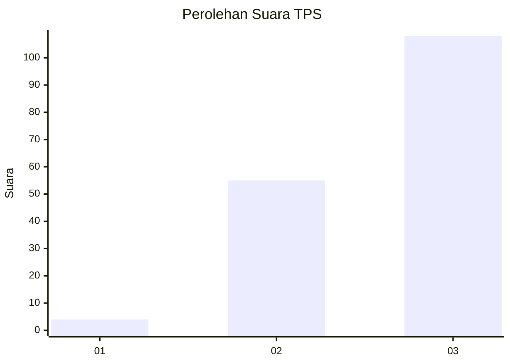
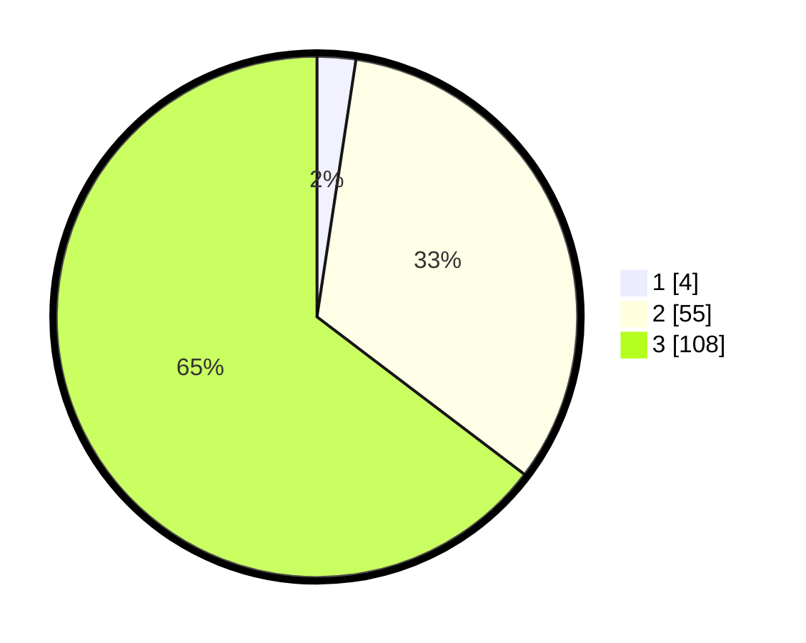

# Hasil

## Grafik

## Tabel

| No. | Nama Paslon    | Suara | Suara (raw) | Persentase |
|:--- |:-------------- | -----:| -----------:| ----------:|
| 1   | ANIES MUHAIMIN | 4     | [4][p-1]    | 2,40       |
| 2   | PRABOWO GIBRAN | 55    | [55][p-2]   | 32,93      |
| 3   | GANJAR MAHFUD  | 108   | [108][p-3]  | 64,67      |

[p-1]: https://github.com/gigit-pemilu/pemilu-2024/blob/main/pilpres/hitung-suara/sub/33-jawa-tengah/sub/12-wonogiri/sub/15-jatiroto/sub/2004-dawungan/sub/004-tps/sub/paslon-1.txt
[p-2]: https://github.com/gigit-pemilu/pemilu-2024/blob/main/pilpres/hitung-suara/sub/33-jawa-tengah/sub/12-wonogiri/sub/15-jatiroto/sub/2004-dawungan/sub/004-tps/sub/paslon-2.txt
[p-3]: https://github.com/gigit-pemilu/pemilu-2024/blob/main/pilpres/hitung-suara/sub/33-jawa-tengah/sub/12-wonogiri/sub/15-jatiroto/sub/2004-dawungan/sub/004-tps/sub/paslon-3.txt

## Foto C Plano

https://sirekap-obj-formc.kpu.go.id/9844/pemilu/ppwp/33/12/15/20/04/3312152004004-20240214-231347--a3eec709-7ed6-4706-85ee-539e2d23d41a.jpg

https://sirekap-obj-formc.kpu.go.id/9844/pemilu/ppwp/33/12/15/20/04/3312152004004-20240214-231529--c389d3f9-f8f9-407f-85b0-7ab90cb4c7fa.jpg

https://sirekap-obj-formc.kpu.go.id/9844/pemilu/ppwp/33/12/15/20/04/3312152004004-20240214-231710--e3f0dc66-144a-4e9b-a4a8-1c24ab734d61.jpg

## Metadata

| Key        | Value               |
| ---------- | ------------------- |
| Time Stamp | 2024-02-25 22:00:00 |

