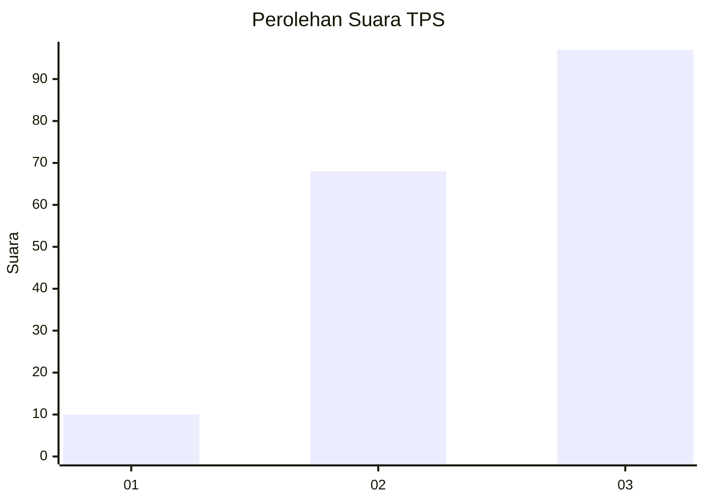
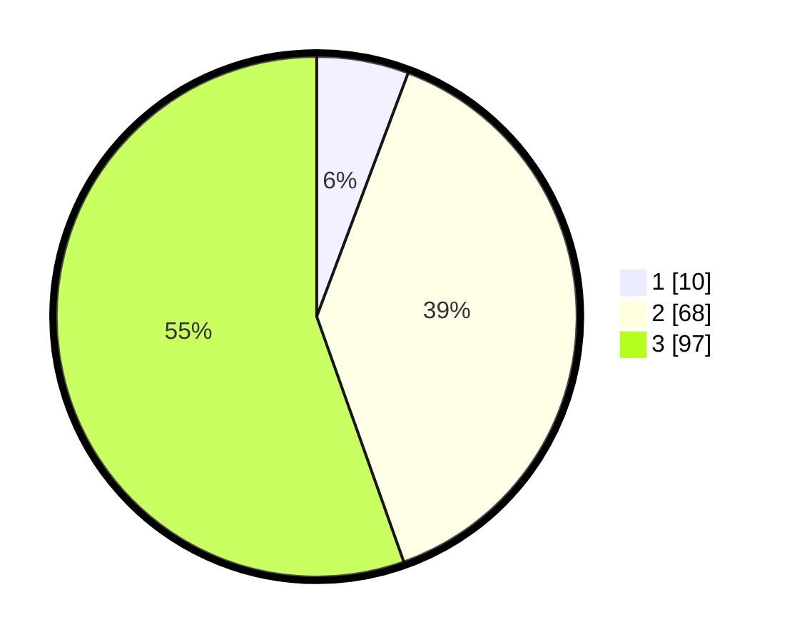

# Hasil

## Grafik

## Tabel

| No. | Nama Paslon    | Suara | Suara (raw) | Persentase |
|:--- |:-------------- | -----:| -----------:| ----------:|
| 1   | ANIES MUHAIMIN | 10    | [10][p-1]   | 5,71       |
| 2   | PRABOWO GIBRAN | 68    | [68][p-2]   | 38,86      |
| 3   | GANJAR MAHFUD  | 97    | [97][p-3]   | 55,43      |

[p-1]: https://github.com/gigit-pemilu/pemilu-2024/blob/main/pilpres/hitung-suara/sub/33-jawa-tengah/sub/12-wonogiri/sub/15-jatiroto/sub/2004-dawungan/sub/005-tps/sub/paslon-1.txt
[p-2]: https://github.com/gigit-pemilu/pemilu-2024/blob/main/pilpres/hitung-suara/sub/33-jawa-tengah/sub/12-wonogiri/sub/15-jatiroto/sub/2004-dawungan/sub/005-tps/sub/paslon-2.txt
[p-3]: https://github.com/gigit-pemilu/pemilu-2024/blob/main/pilpres/hitung-suara/sub/33-jawa-tengah/sub/12-wonogiri/sub/15-jatiroto/sub/2004-dawungan/sub/005-tps/sub/paslon-3.txt

## Foto C Plano

https://sirekap-obj-formc.kpu.go.id/8fd9/pemilu/ppwp/33/12/15/20/04/3312152004005-20240214-230307--fb8edd6d-5c59-4a33-a90c-dcbb65bc47fd.jpg

https://sirekap-obj-formc.kpu.go.id/8fd9/pemilu/ppwp/33/12/15/20/04/3312152004005-20240214-230449--a731f399-d025-49a4-adfb-d0ec2ab731ca.jpg

https://sirekap-obj-formc.kpu.go.id/8fd9/pemilu/ppwp/33/12/15/20/04/3312152004005-20240214-230550--e825cc87-743d-42c5-ac7f-18e27a644e48.jpg

## Metadata

| Key        | Value               |
| ---------- | ------------------- |
| Time Stamp | 2024-02-19 06:16:00 |

