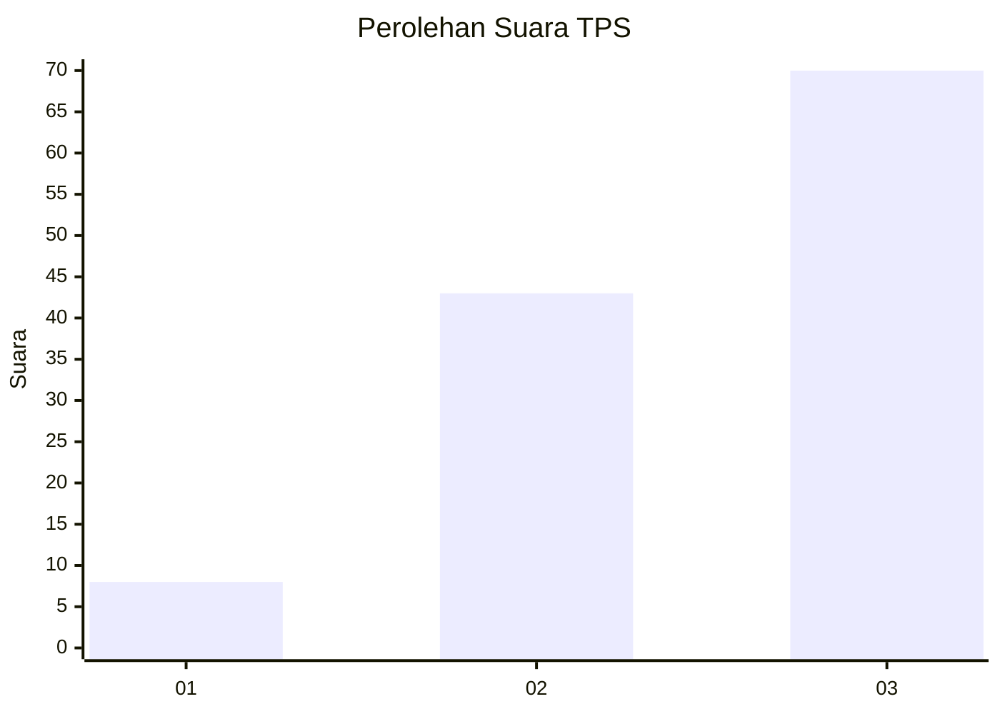
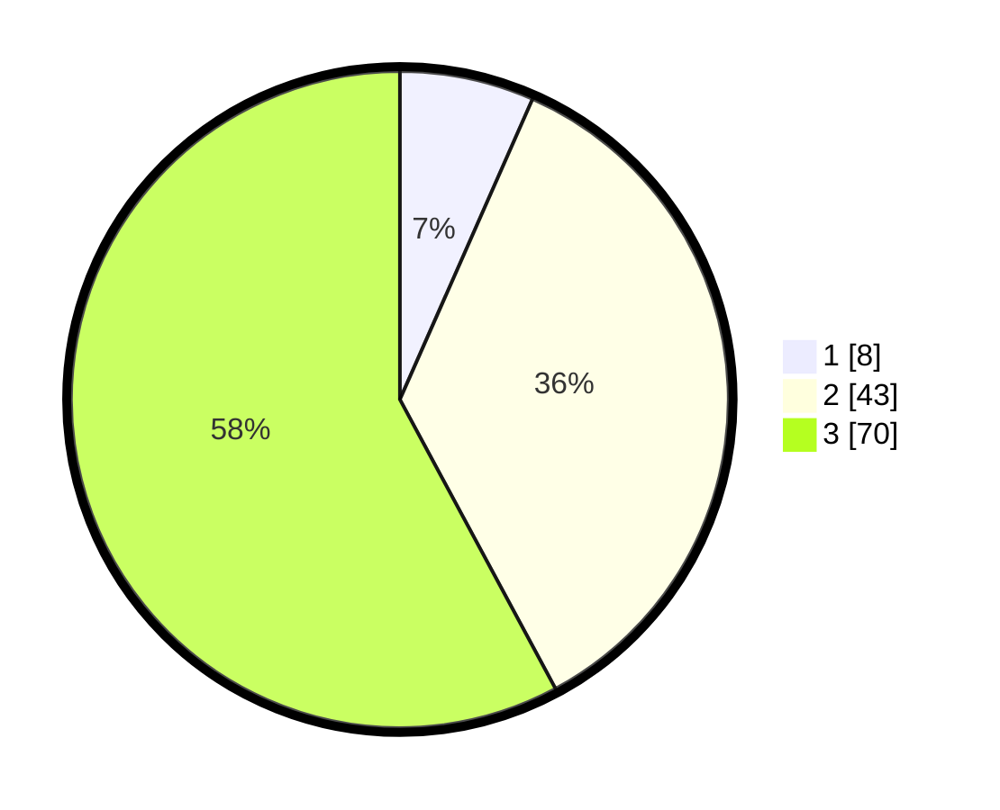

# Hasil

## Grafik

## Tabel

| No. | Nama Paslon    | Suara | Suara (raw) | Persentase |
|:--- |:-------------- | -----:| -----------:| ----------:|
| 1   | ANIES MUHAIMIN | 8     | [8][p-1]    | 6,61       |
| 2   | PRABOWO GIBRAN | 43    | [43][p-2]   | 35,54      |
| 3   | GANJAR MAHFUD  | 70    | [70][p-3]   | 57,85      |

[p-1]: https://github.com/gigit-pemilu/pemilu-2024-33-jawa-tengah/blob/main/pilpres/hitung-suara/sub/33-jawa-tengah/sub/12-wonogiri/sub/15-jatiroto/sub/2005-ngelo/sub/004-tps/sub/paslon-1.txt
[p-2]: https://github.com/gigit-pemilu/pemilu-2024-33-jawa-tengah/blob/main/pilpres/hitung-suara/sub/33-jawa-tengah/sub/12-wonogiri/sub/15-jatiroto/sub/2005-ngelo/sub/004-tps/sub/paslon-2.txt
[p-3]: https://github.com/gigit-pemilu/pemilu-2024-33-jawa-tengah/blob/main/pilpres/hitung-suara/sub/33-jawa-tengah/sub/12-wonogiri/sub/15-jatiroto/sub/2005-ngelo/sub/004-tps/sub/paslon-3.txt

## Foto C Plano

https://sirekap-obj-formc.kpu.go.id/0c45/pemilu/ppwp/33/12/15/20/05/3312152005004-20240214-141729--f31e58d0-d0a4-456a-bff7-2b1e44c93d76.jpg

https://sirekap-obj-formc.kpu.go.id/0c45/pemilu/ppwp/33/12/15/20/05/3312152005004-20240214-234439--f68a6d22-e6af-4e7d-9722-16fc7f5e186d.jpg

https://sirekap-obj-formc.kpu.go.id/0c45/pemilu/ppwp/33/12/15/20/05/3312152005004-20240214-234544--a7993305-7e75-440f-aba4-01d59b559b85.jpg

## Metadata

| Key        | Value               |
| ---------- | ------------------- |
| Time Stamp | 2024-02-19 06:16:00 |

