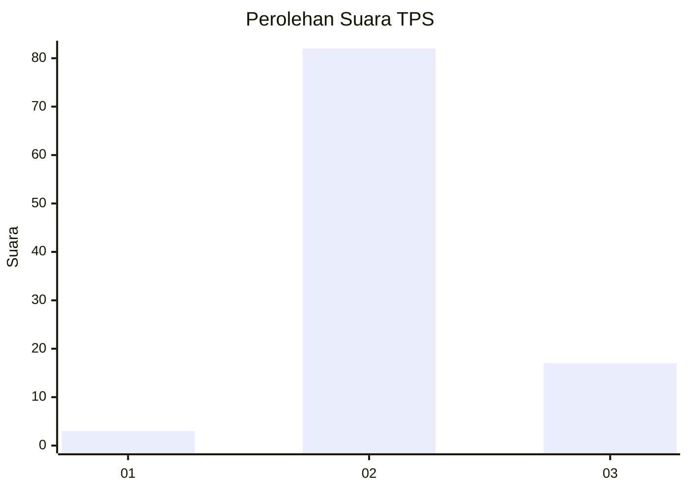
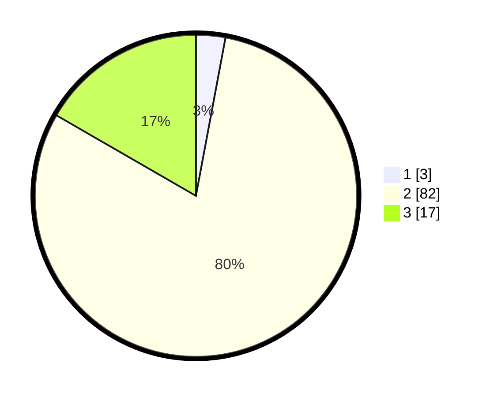

# Hasil

## Grafik

## Tabel

| No. | Nama Paslon    | Suara | Suara (raw) | Persentase |
|:--- |:-------------- | -----:| -----------:| ----------:|
| 1   | ANIES MUHAIMIN | 3     | [3][p-1]    | 2,94       |
| 2   | PRABOWO GIBRAN | 82    | [82][p-2]   | 80,39      |
| 3   | GANJAR MAHFUD  | 17    | [17][p-3]   | 16,67      |

[p-1]: https://github.com/gigit-pemilu/pemilu-2024/blob/main/pilpres/hitung-suara/sub/33-jawa-tengah/sub/12-wonogiri/sub/15-jatiroto/sub/2006-pingkuk/sub/002-tps/sub/paslon-1.txt
[p-2]: https://github.com/gigit-pemilu/pemilu-2024/blob/main/pilpres/hitung-suara/sub/33-jawa-tengah/sub/12-wonogiri/sub/15-jatiroto/sub/2006-pingkuk/sub/002-tps/sub/paslon-2.txt
[p-3]: https://github.com/gigit-pemilu/pemilu-2024/blob/main/pilpres/hitung-suara/sub/33-jawa-tengah/sub/12-wonogiri/sub/15-jatiroto/sub/2006-pingkuk/sub/002-tps/sub/paslon-3.txt

## Foto C Plano

https://sirekap-obj-formc.kpu.go.id/a232/pemilu/ppwp/33/12/15/20/06/3312152006002-20240214-210259--355a2ed4-fef3-45d7-bad0-7f89a8c5c05c.jpg

https://sirekap-obj-formc.kpu.go.id/a232/pemilu/ppwp/33/12/15/20/06/3312152006002-20240214-210544--e02b8d54-c24a-4d20-9734-33473d978d89.jpg

https://sirekap-obj-formc.kpu.go.id/a232/pemilu/ppwp/33/12/15/20/06/3312152006002-20240214-210714--0bad8fea-a6e3-4e13-967a-c32d6d4eca83.jpg

## Metadata

| Key        | Value               |
| ---------- | ------------------- |
| Time Stamp | 2024-02-24 22:31:28 |

