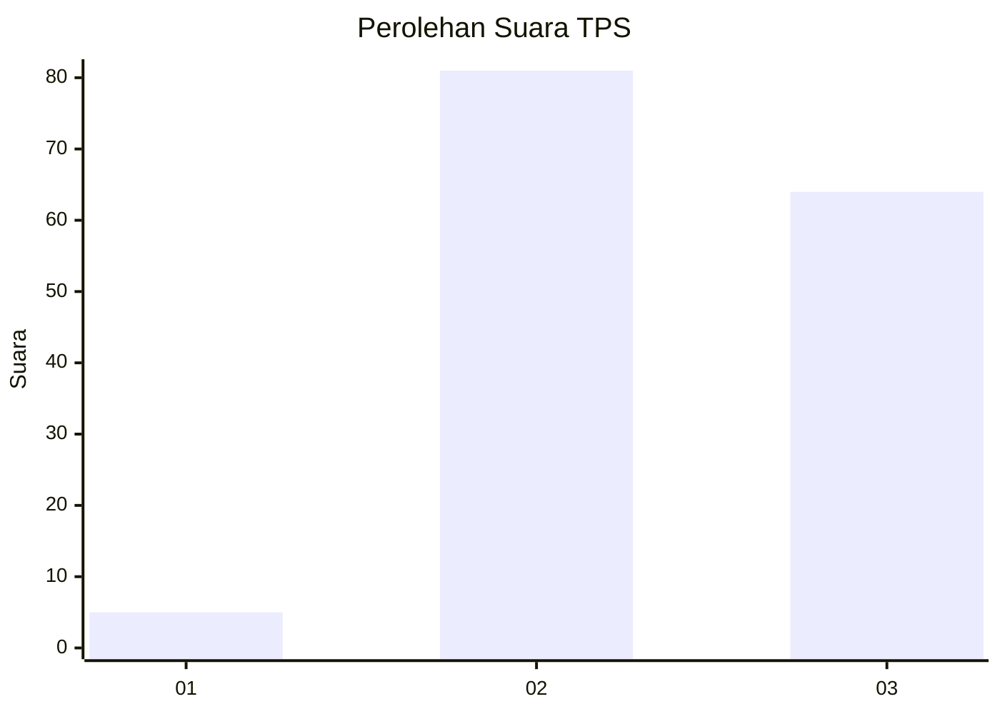
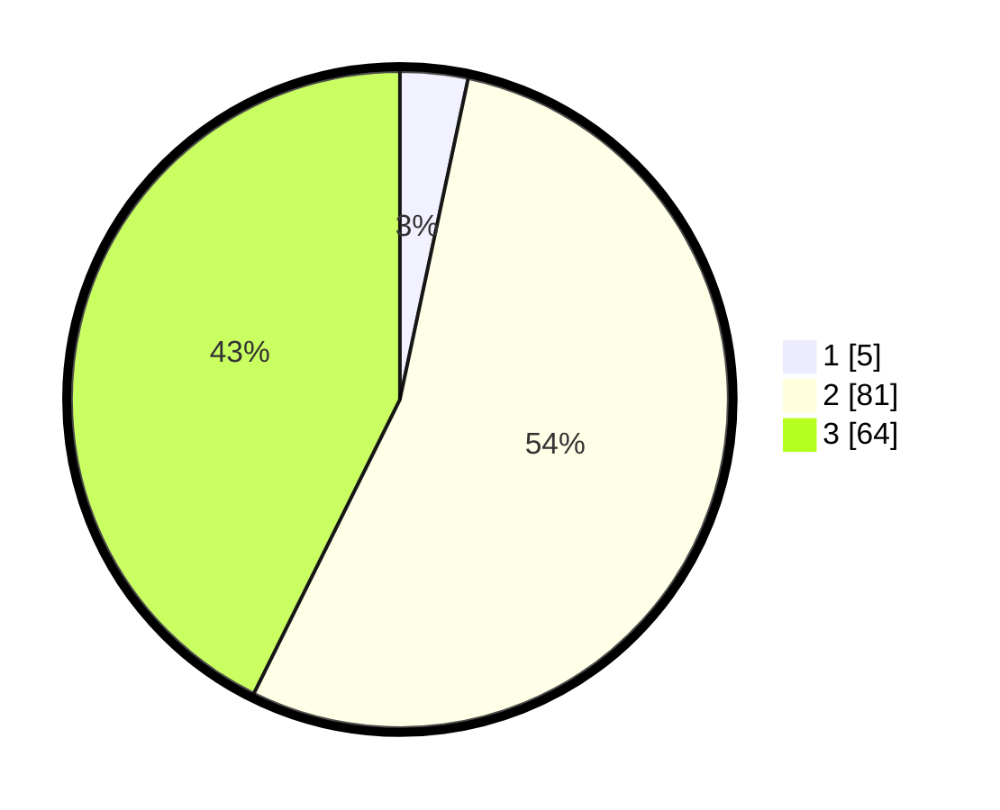

# Hasil

## Grafik

## Tabel

| No. | Nama Paslon    | Suara | Suara (raw) | Persentase |
|:--- |:-------------- | -----:| -----------:| ----------:|
| 1   | ANIES MUHAIMIN | 5     | [5][p-1]    | 3,33       |
| 2   | PRABOWO GIBRAN | 81    | [81][p-2]   | 54,00      |
| 3   | GANJAR MAHFUD  | 64    | [64][p-3]   | 42,67      |

[p-1]: https://github.com/gigit-pemilu/pemilu-2024/blob/main/pilpres/hitung-suara/sub/33-jawa-tengah/sub/12-wonogiri/sub/15-jatiroto/sub/2006-pingkuk/sub/006-tps/sub/paslon-1.txt
[p-2]: https://github.com/gigit-pemilu/pemilu-2024/blob/main/pilpres/hitung-suara/sub/33-jawa-tengah/sub/12-wonogiri/sub/15-jatiroto/sub/2006-pingkuk/sub/006-tps/sub/paslon-2.txt
[p-3]: https://github.com/gigit-pemilu/pemilu-2024/blob/main/pilpres/hitung-suara/sub/33-jawa-tengah/sub/12-wonogiri/sub/15-jatiroto/sub/2006-pingkuk/sub/006-tps/sub/paslon-3.txt

## Foto C Plano

https://sirekap-obj-formc.kpu.go.id/902b/pemilu/ppwp/33/12/15/20/06/3312152006006-20240214-223554--77b7de8e-9f12-4c82-a571-da3a742d9480.jpg

https://sirekap-obj-formc.kpu.go.id/902b/pemilu/ppwp/33/12/15/20/06/3312152006006-20240214-223651--315cc319-bd06-45ba-8b36-3133844f0f34.jpg

https://sirekap-obj-formc.kpu.go.id/902b/pemilu/ppwp/33/12/15/20/06/3312152006006-20240214-223744--dcf4d071-59bc-4e02-85bb-76fdb5875b89.jpg

## Metadata

| Key        | Value               |
| ---------- | ------------------- |
| Time Stamp | 2024-02-19 06:16:00 |

