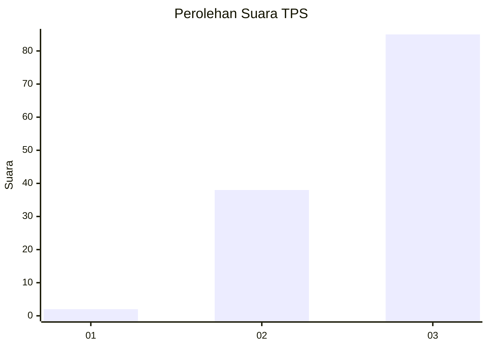
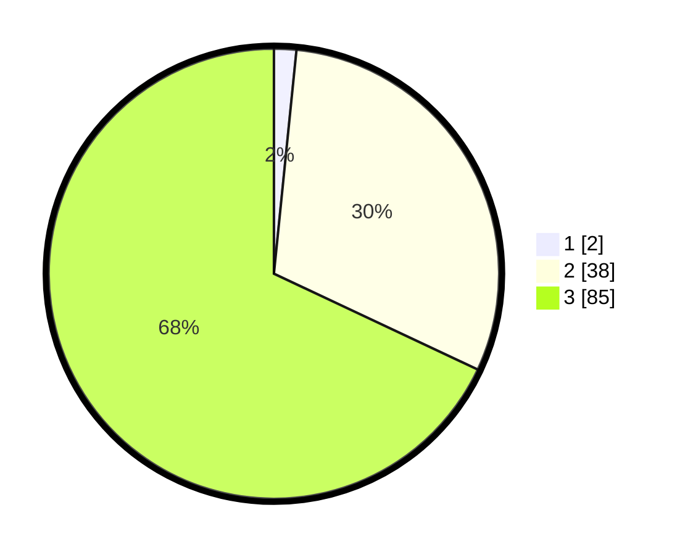

# Hasil

## Grafik

## Tabel

| No. | Nama Paslon    | Suara | Suara (raw) | Persentase |
|:--- |:-------------- | -----:| -----------:| ----------:|
| 1   | ANIES MUHAIMIN | 2     | [2][p-1]    | 1,60       |
| 2   | PRABOWO GIBRAN | 38    | [38][p-2]   | 30,40      |
| 3   | GANJAR MAHFUD  | 85    | [85][p-3]   | 68,00      |

[p-1]: https://github.com/gigit-pemilu/pemilu-2024-33-jawa-tengah/blob/main/pilpres/hitung-suara/sub/33-jawa-tengah/sub/12-wonogiri/sub/15-jatiroto/sub/2007-mojopuro/sub/003-tps/sub/paslon-1.txt
[p-2]: https://github.com/gigit-pemilu/pemilu-2024-33-jawa-tengah/blob/main/pilpres/hitung-suara/sub/33-jawa-tengah/sub/12-wonogiri/sub/15-jatiroto/sub/2007-mojopuro/sub/003-tps/sub/paslon-2.txt
[p-3]: https://github.com/gigit-pemilu/pemilu-2024-33-jawa-tengah/blob/main/pilpres/hitung-suara/sub/33-jawa-tengah/sub/12-wonogiri/sub/15-jatiroto/sub/2007-mojopuro/sub/003-tps/sub/paslon-3.txt

## Foto C Plano

https://sirekap-obj-formc.kpu.go.id/b8df/pemilu/ppwp/33/12/15/20/07/3312152007003-20240215-004432--21011bfd-b9a4-4079-99cc-243b1f51a5fa.jpg

https://sirekap-obj-formc.kpu.go.id/b8df/pemilu/ppwp/33/12/15/20/07/3312152007003-20240215-004538--66f4b683-17a1-4219-9759-dc480fe10a20.jpg

https://sirekap-obj-formc.kpu.go.id/b8df/pemilu/ppwp/33/12/15/20/07/3312152007003-20240215-004707--c22bef5f-d079-496d-b6d9-7f452b9d568b.jpg

## Metadata

| Key        | Value               |
| ---------- | ------------------- |
| Time Stamp | 2024-02-24 22:31:28 |

