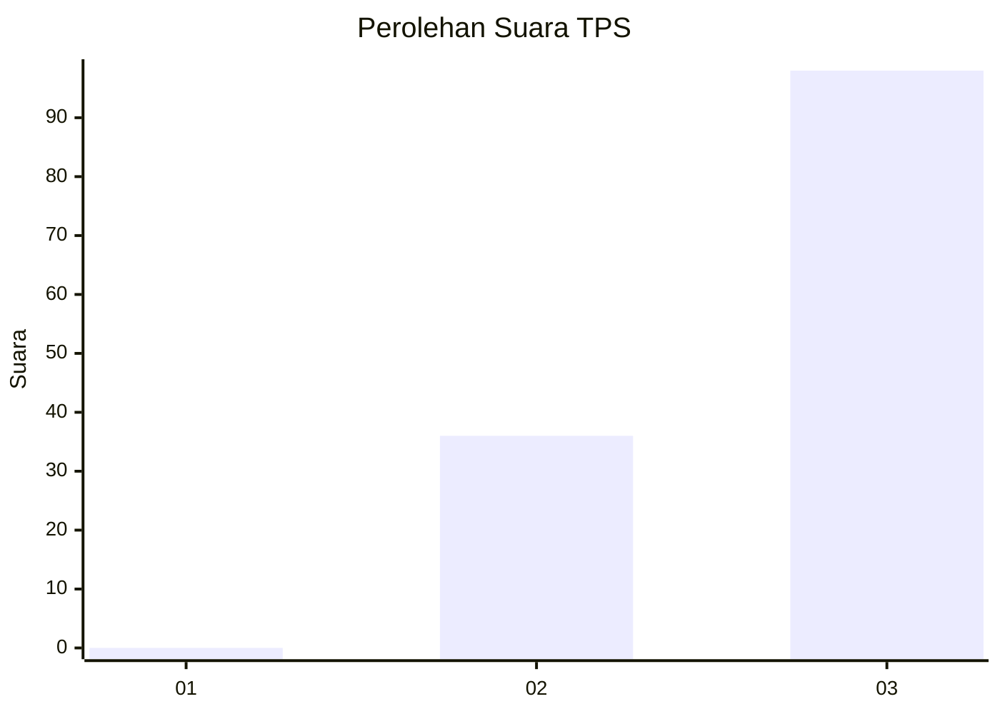
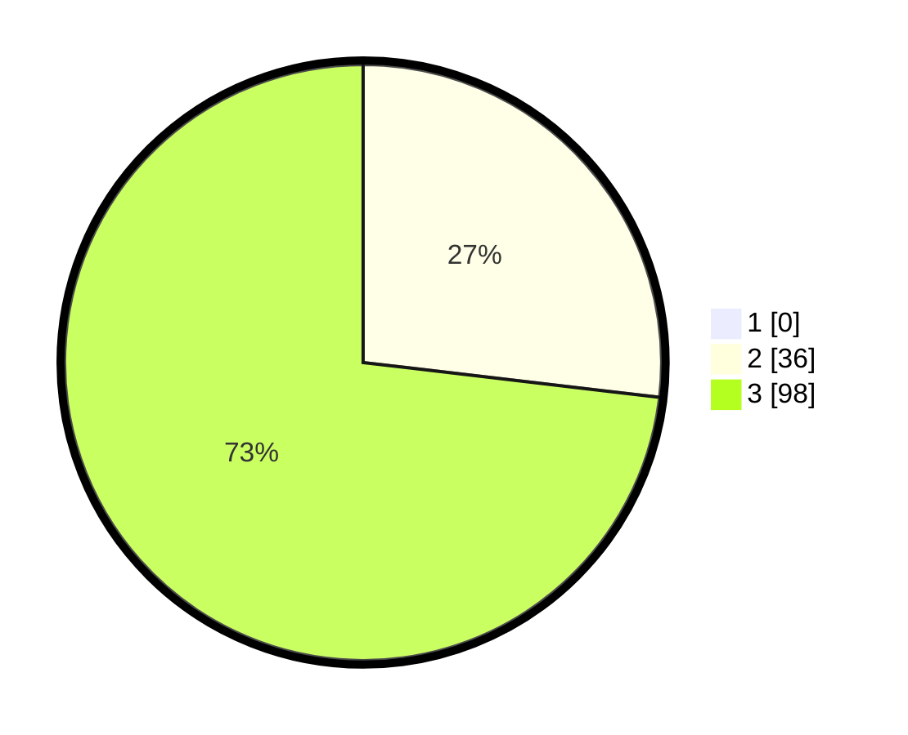

# Hasil

## Grafik

## Tabel

| No. | Nama Paslon    | Suara | Suara (raw) | Persentase |
|:--- |:-------------- | -----:| -----------:| ----------:|
| 1   | ANIES MUHAIMIN | 0     | [0][p-1]    | 0,00       |
| 2   | PRABOWO GIBRAN | 36    | [36][p-2]   | 26,87      |
| 3   | GANJAR MAHFUD  | 98    | [98][p-3]   | 73,13      |

[p-1]: https://github.com/gigit-pemilu/pemilu-2024/blob/main/pilpres/hitung-suara/sub/33-jawa-tengah/sub/12-wonogiri/sub/15-jatiroto/sub/2007-mojopuro/sub/008-tps/sub/paslon-1.txt
[p-2]: https://github.com/gigit-pemilu/pemilu-2024/blob/main/pilpres/hitung-suara/sub/33-jawa-tengah/sub/12-wonogiri/sub/15-jatiroto/sub/2007-mojopuro/sub/008-tps/sub/paslon-2.txt
[p-3]: https://github.com/gigit-pemilu/pemilu-2024/blob/main/pilpres/hitung-suara/sub/33-jawa-tengah/sub/12-wonogiri/sub/15-jatiroto/sub/2007-mojopuro/sub/008-tps/sub/paslon-3.txt

## Foto C Plano

https://sirekap-obj-formc.kpu.go.id/9b44/pemilu/ppwp/33/12/15/20/07/3312152007008-20240214-140946--94deb626-6c51-4828-91a5-f607d7541254.jpg

https://sirekap-obj-formc.kpu.go.id/9b44/pemilu/ppwp/33/12/15/20/07/3312152007008-20240214-141109--9e65df72-07c3-4989-a505-30e15e8ac818.jpg

https://sirekap-obj-formc.kpu.go.id/9b44/pemilu/ppwp/33/12/15/20/07/3312152007008-20240214-141222--f87f32b9-4328-4a19-9cd7-330c14ca6d7a.jpg

## Metadata

| Key        | Value               |
| ---------- | ------------------- |
| Time Stamp | 2024-02-14 21:46:01 |

