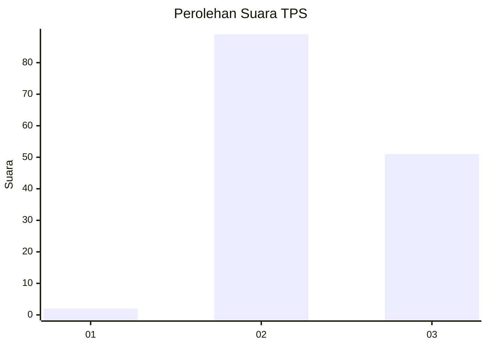
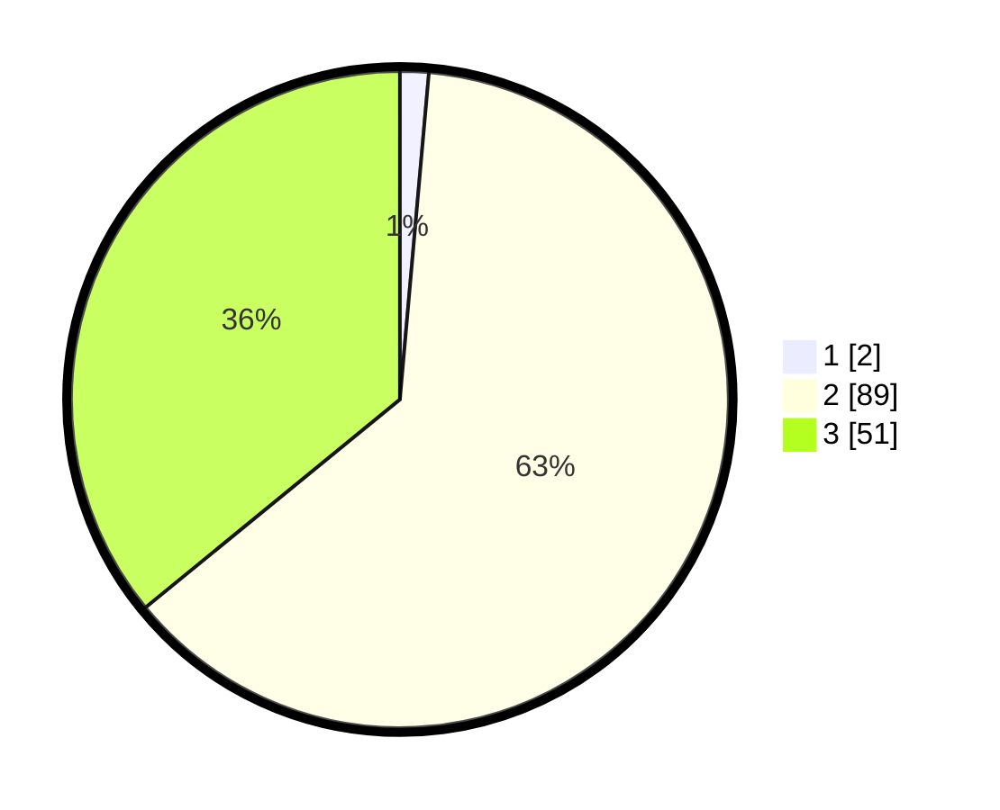

# Hasil

## Grafik

## Tabel

| No. | Nama Paslon    | Suara | Suara (raw) | Persentase |
|:--- |:-------------- | -----:| -----------:| ----------:|
| 1   | ANIES MUHAIMIN | 2     | [2][p-1]    | 1,41       |
| 2   | PRABOWO GIBRAN | 89    | [89][p-2]   | 62,68      |
| 3   | GANJAR MAHFUD  | 51    | [51][p-3]   | 35,92      |

[p-1]: https://github.com/gigit-pemilu/pemilu-2024-33-jawa-tengah/blob/main/pilpres/hitung-suara/sub/33-jawa-tengah/sub/12-wonogiri/sub/15-jatiroto/sub/2008-pesido/sub/003-tps/sub/paslon-1.txt
[p-2]: https://github.com/gigit-pemilu/pemilu-2024-33-jawa-tengah/blob/main/pilpres/hitung-suara/sub/33-jawa-tengah/sub/12-wonogiri/sub/15-jatiroto/sub/2008-pesido/sub/003-tps/sub/paslon-2.txt
[p-3]: https://github.com/gigit-pemilu/pemilu-2024-33-jawa-tengah/blob/main/pilpres/hitung-suara/sub/33-jawa-tengah/sub/12-wonogiri/sub/15-jatiroto/sub/2008-pesido/sub/003-tps/sub/paslon-3.txt

## Foto C Plano

https://sirekap-obj-formc.kpu.go.id/5f0d/pemilu/ppwp/33/12/15/20/08/3312152008003-20240214-141052--eb5770c0-91fe-4d55-9e9d-325c3fc45230.jpg

https://sirekap-obj-formc.kpu.go.id/5f0d/pemilu/ppwp/33/12/15/20/08/3312152008003-20240214-141406--bf064786-b322-4101-840d-83e3d261e30d.jpg

https://sirekap-obj-formc.kpu.go.id/5f0d/pemilu/ppwp/33/12/15/20/08/3312152008003-20240214-222048--58eb0601-21e4-42c4-baa1-c85879a5c3e0.jpg

## Metadata

| Key        | Value               |
| ---------- | ------------------- |
| Time Stamp | 2024-02-15 09:00:24 |

