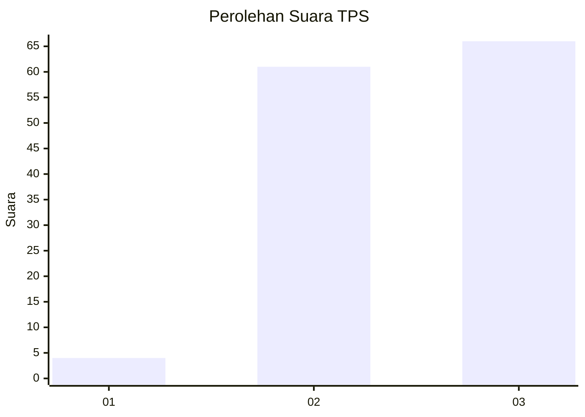
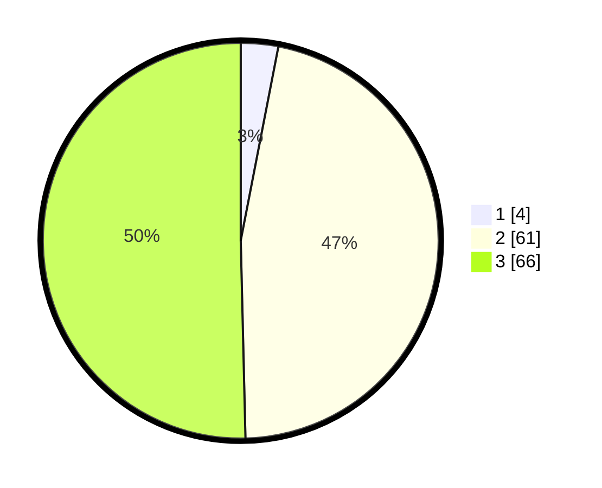

# Hasil

## Grafik

## Tabel

| No. | Nama Paslon    | Suara | Suara (raw) | Persentase |
|:--- |:-------------- | -----:| -----------:| ----------:|
| 1   | ANIES MUHAIMIN | 4     | [4][p-1]    | 3,05       |
| 2   | PRABOWO GIBRAN | 61    | [61][p-2]   | 46,56      |
| 3   | GANJAR MAHFUD  | 66    | [66][p-3]   | 50,38      |

[p-1]: https://github.com/gigit-pemilu/pemilu-2024/blob/main/pilpres/hitung-suara/sub/33-jawa-tengah/sub/12-wonogiri/sub/15-jatiroto/sub/2010-cangkring/sub/003-tps/sub/paslon-1.txt
[p-2]: https://github.com/gigit-pemilu/pemilu-2024/blob/main/pilpres/hitung-suara/sub/33-jawa-tengah/sub/12-wonogiri/sub/15-jatiroto/sub/2010-cangkring/sub/003-tps/sub/paslon-2.txt
[p-3]: https://github.com/gigit-pemilu/pemilu-2024/blob/main/pilpres/hitung-suara/sub/33-jawa-tengah/sub/12-wonogiri/sub/15-jatiroto/sub/2010-cangkring/sub/003-tps/sub/paslon-3.txt

## Foto C Plano

https://sirekap-obj-formc.kpu.go.id/6114/pemilu/ppwp/33/12/15/20/10/3312152010003-20240214-222948--3422a8e9-0b18-49bf-80ee-31af91d782bd.jpg

https://sirekap-obj-formc.kpu.go.id/6114/pemilu/ppwp/33/12/15/20/10/3312152010003-20240214-223053--7613a54c-9d19-4c83-a111-2f0580146ede.jpg

https://sirekap-obj-formc.kpu.go.id/6114/pemilu/ppwp/33/12/15/20/10/3312152010003-20240214-223132--7adb5733-9fa8-4b03-9605-dd493c42ca4b.jpg

## Metadata

| Key        | Value               |
| ---------- | ------------------- |
| Time Stamp | 2024-02-25 13:00:00 |

