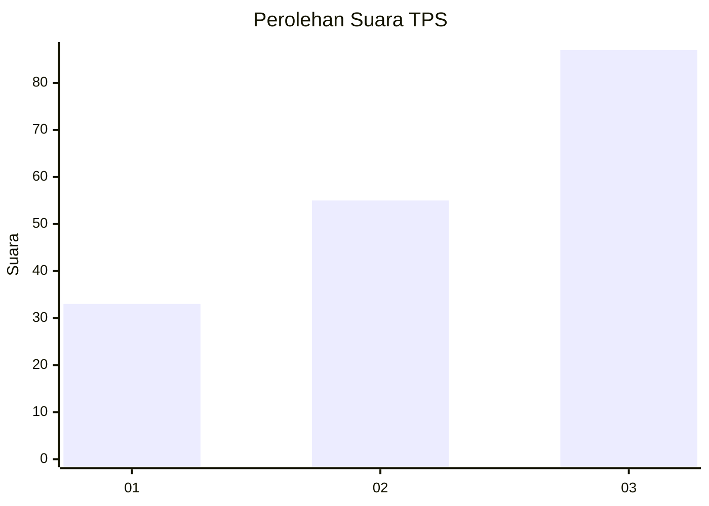
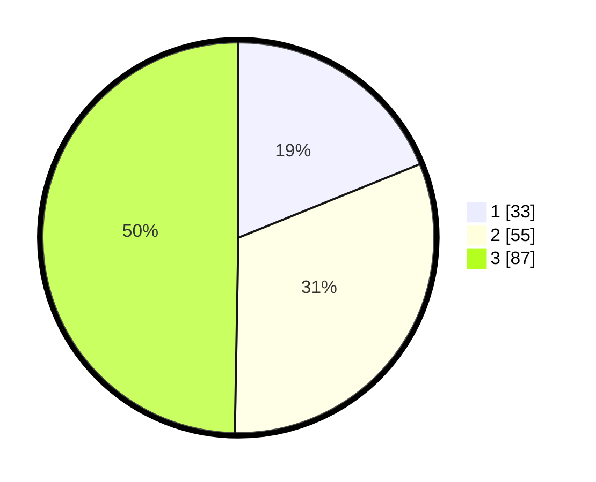

# Hasil

## Grafik

## Tabel

| No. | Nama Paslon    | Suara | Suara (raw) | Persentase |
|:--- |:-------------- | -----:| -----------:| ----------:|
| 1   | ANIES MUHAIMIN | 33    | [33][p-1]   | 18,86      |
| 2   | PRABOWO GIBRAN | 55    | [55][p-2]   | 31,43      |
| 3   | GANJAR MAHFUD  | 87    | [87][p-3]   | 49,71      |

[p-1]: https://github.com/gigit-pemilu/pemilu-2024/blob/main/pilpres/hitung-suara/sub/33-jawa-tengah/sub/12-wonogiri/sub/15-jatiroto/sub/2010-cangkring/sub/007-tps/sub/paslon-1.txt
[p-2]: https://github.com/gigit-pemilu/pemilu-2024/blob/main/pilpres/hitung-suara/sub/33-jawa-tengah/sub/12-wonogiri/sub/15-jatiroto/sub/2010-cangkring/sub/007-tps/sub/paslon-2.txt
[p-3]: https://github.com/gigit-pemilu/pemilu-2024/blob/main/pilpres/hitung-suara/sub/33-jawa-tengah/sub/12-wonogiri/sub/15-jatiroto/sub/2010-cangkring/sub/007-tps/sub/paslon-3.txt

## Foto C Plano

https://sirekap-obj-formc.kpu.go.id/cf77/pemilu/ppwp/33/12/15/20/10/3312152010007-20240214-210201--b0fec1bd-1211-4845-9e3c-2623f010f685.jpg

https://sirekap-obj-formc.kpu.go.id/cf77/pemilu/ppwp/33/12/15/20/10/3312152010007-20240215-020404--999458e1-008f-4b60-a207-9cd4d1e779a9.jpg

https://sirekap-obj-formc.kpu.go.id/cf77/pemilu/ppwp/33/12/15/20/10/3312152010007-20240214-210059--89026f7d-5a2d-4f95-a2e2-d649dc7fd4af.jpg

## Metadata

| Key        | Value               |
| ---------- | ------------------- |
| Time Stamp | 2024-02-16 09:00:28 |

