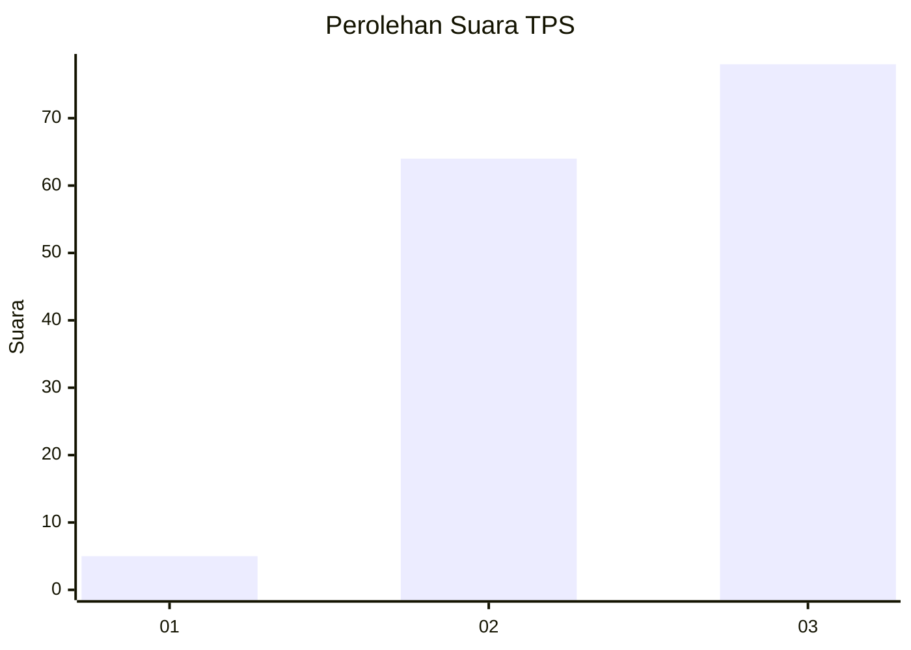
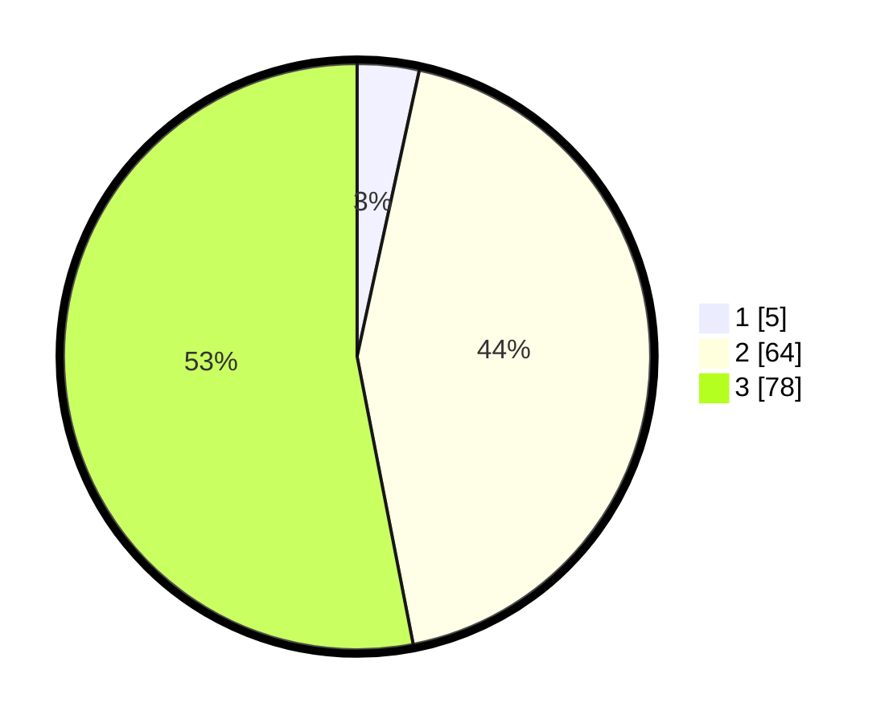

# Hasil

## Grafik

## Tabel

| No. | Nama Paslon    | Suara | Suara (raw) | Persentase |
|:--- |:-------------- | -----:| -----------:| ----------:|
| 1   | ANIES MUHAIMIN | 5     | [5][p-1]    | 3,40       |
| 2   | PRABOWO GIBRAN | 64    | [64][p-2]   | 43,54      |
| 3   | GANJAR MAHFUD  | 78    | [78][p-3]   | 53,06      |

[p-1]: https://github.com/gigit-pemilu/pemilu-2024/blob/main/pilpres/hitung-suara/sub/33-jawa-tengah/sub/12-wonogiri/sub/15-jatiroto/sub/2010-cangkring/sub/009-tps/sub/paslon-1.txt
[p-2]: https://github.com/gigit-pemilu/pemilu-2024/blob/main/pilpres/hitung-suara/sub/33-jawa-tengah/sub/12-wonogiri/sub/15-jatiroto/sub/2010-cangkring/sub/009-tps/sub/paslon-2.txt
[p-3]: https://github.com/gigit-pemilu/pemilu-2024/blob/main/pilpres/hitung-suara/sub/33-jawa-tengah/sub/12-wonogiri/sub/15-jatiroto/sub/2010-cangkring/sub/009-tps/sub/paslon-3.txt

## Foto C Plano

https://sirekap-obj-formc.kpu.go.id/79ed/pemilu/ppwp/33/12/15/20/10/3312152010009-20240214-215318--81e29241-8013-4500-86d8-a85d126da1f3.jpg

https://sirekap-obj-formc.kpu.go.id/79ed/pemilu/ppwp/33/12/15/20/10/3312152010009-20240214-220732--5cefdfbf-a169-40cb-a68f-fb901744ddf6.jpg

https://sirekap-obj-formc.kpu.go.id/79ed/pemilu/ppwp/33/12/15/20/10/3312152010009-20240214-220405--59fb4101-9cdd-450b-ad78-14cd15fa7422.jpg

## Metadata

| Key        | Value               |
| ---------- | ------------------- |
| Time Stamp | 2024-02-19 06:16:00 |

