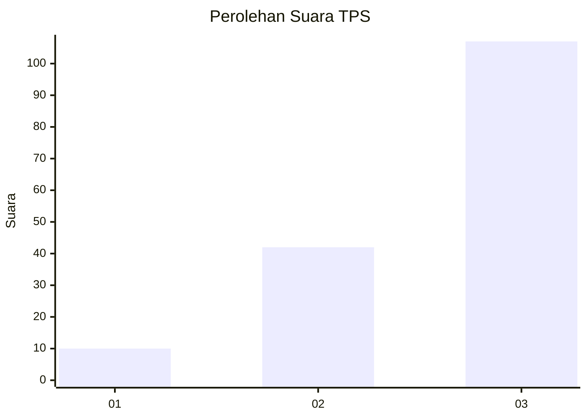
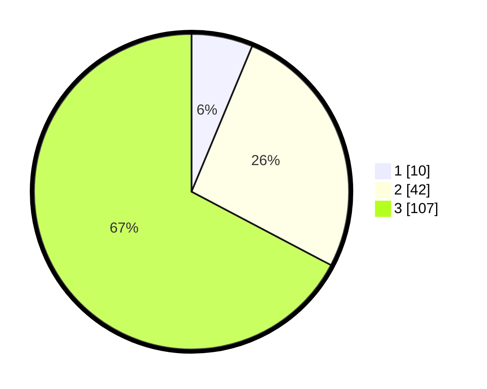

# Hasil

## Grafik

## Tabel

| No. | Nama Paslon    | Suara | Suara (raw) | Persentase |
|:--- |:-------------- | -----:| -----------:| ----------:|
| 1   | ANIES MUHAIMIN | 10    | [10][p-1]   | 6,29       |
| 2   | PRABOWO GIBRAN | 42    | [42][p-2]   | 26,42      |
| 3   | GANJAR MAHFUD  | 107   | [107][p-3]  | 67,30      |

[p-1]: https://github.com/gigit-pemilu/pemilu-2024-33-jawa-tengah/blob/main/pilpres/hitung-suara/sub/33-jawa-tengah/sub/12-wonogiri/sub/15-jatiroto/sub/2011-pengkol/sub/001-tps/sub/paslon-1.txt
[p-2]: https://github.com/gigit-pemilu/pemilu-2024-33-jawa-tengah/blob/main/pilpres/hitung-suara/sub/33-jawa-tengah/sub/12-wonogiri/sub/15-jatiroto/sub/2011-pengkol/sub/001-tps/sub/paslon-2.txt
[p-3]: https://github.com/gigit-pemilu/pemilu-2024-33-jawa-tengah/blob/main/pilpres/hitung-suara/sub/33-jawa-tengah/sub/12-wonogiri/sub/15-jatiroto/sub/2011-pengkol/sub/001-tps/sub/paslon-3.txt

## Foto C Plano

https://sirekap-obj-formc.kpu.go.id/e8e0/pemilu/ppwp/33/12/15/20/11/3312152011001-20240214-140948--c5128743-8e68-4f85-8fcd-9d2bdb631949.jpg

https://sirekap-obj-formc.kpu.go.id/e8e0/pemilu/ppwp/33/12/15/20/11/3312152011001-20240214-141556--2a783f48-928a-4fe9-8680-6861a25ecd87.jpg

https://sirekap-obj-formc.kpu.go.id/e8e0/pemilu/ppwp/33/12/15/20/11/3312152011001-20240214-141425--f3c759f1-9588-42da-951b-58846f983b7a.jpg

## Metadata

| Key        | Value               |
| ---------- | ------------------- |
| Time Stamp | 2024-02-15 00:41:44 |

