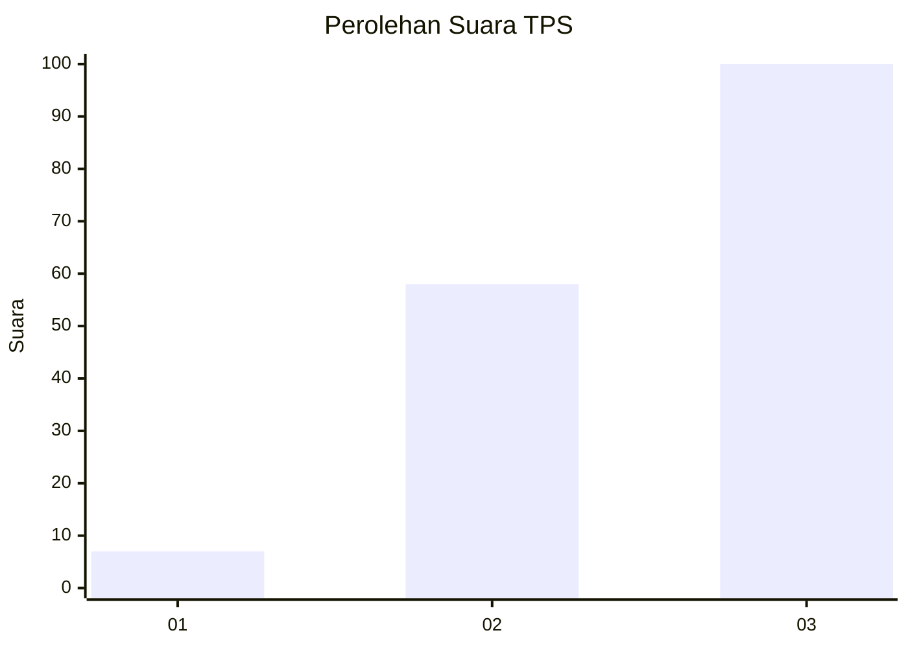
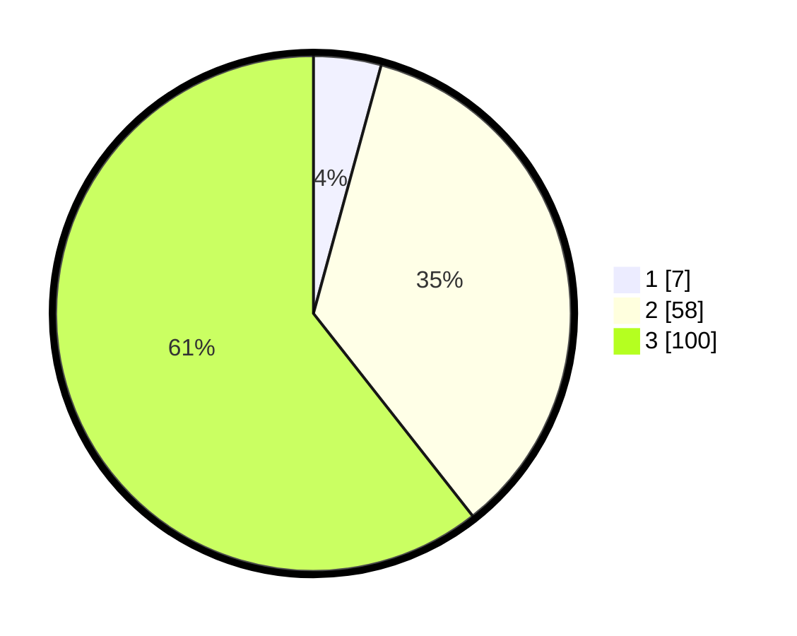

# Hasil

## Grafik

## Tabel

| No. | Nama Paslon    | Suara | Suara (raw) | Persentase |
|:--- |:-------------- | -----:| -----------:| ----------:|
| 1   | ANIES MUHAIMIN | 7     | [7][p-1]    | 4,24       |
| 2   | PRABOWO GIBRAN | 58    | [58][p-2]   | 35,15      |
| 3   | GANJAR MAHFUD  | 100   | [100][p-3]  | 60,61      |

[p-1]: https://github.com/gigit-pemilu/pemilu-2024-33-jawa-tengah/blob/main/pilpres/hitung-suara/sub/33-jawa-tengah/sub/12-wonogiri/sub/15-jatiroto/sub/2011-pengkol/sub/004-tps/sub/paslon-1.txt
[p-2]: https://github.com/gigit-pemilu/pemilu-2024-33-jawa-tengah/blob/main/pilpres/hitung-suara/sub/33-jawa-tengah/sub/12-wonogiri/sub/15-jatiroto/sub/2011-pengkol/sub/004-tps/sub/paslon-2.txt
[p-3]: https://github.com/gigit-pemilu/pemilu-2024-33-jawa-tengah/blob/main/pilpres/hitung-suara/sub/33-jawa-tengah/sub/12-wonogiri/sub/15-jatiroto/sub/2011-pengkol/sub/004-tps/sub/paslon-3.txt

## Foto C Plano

https://sirekap-obj-formc.kpu.go.id/3283/pemilu/ppwp/33/12/15/20/11/3312152011004-20240214-225251--acbf7373-b81c-40c5-99fd-3cd305c89b06.jpg

https://sirekap-obj-formc.kpu.go.id/3283/pemilu/ppwp/33/12/15/20/11/3312152011004-20240214-225322--a49ba2c9-5cc1-44a5-bc24-29aa4a125d4c.jpg

https://sirekap-obj-formc.kpu.go.id/3283/pemilu/ppwp/33/12/15/20/11/3312152011004-20240214-225351--6e40573a-52f1-487c-8825-fb59431a8201.jpg

## Metadata

| Key        | Value               |
| ---------- | ------------------- |
| Time Stamp | 2024-02-19 06:16:00 |

