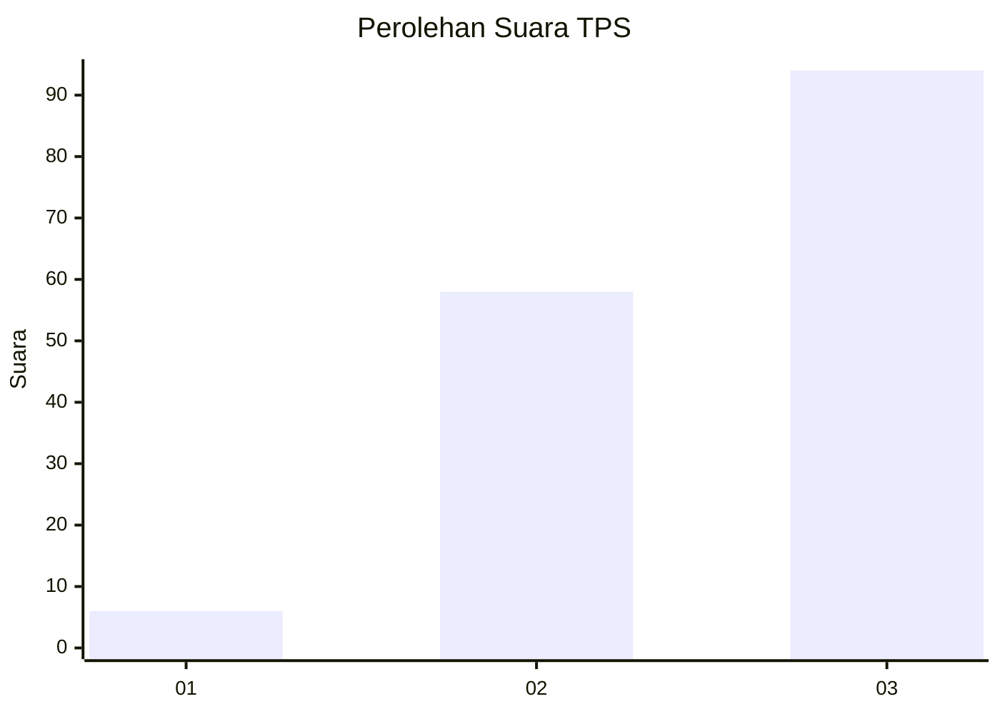
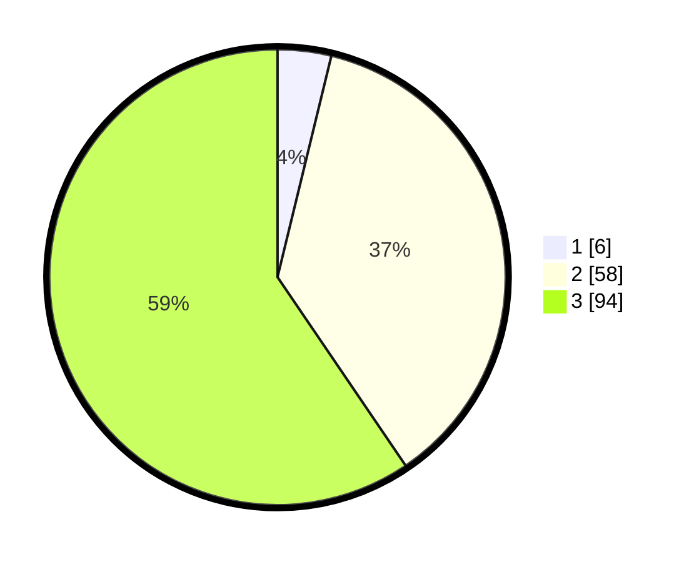

# Hasil

## Grafik

## Tabel

| No. | Nama Paslon    | Suara | Suara (raw) | Persentase |
|:--- |:-------------- | -----:| -----------:| ----------:|
| 1   | ANIES MUHAIMIN | 6     | [6][p-1]    | 3,80       |
| 2   | PRABOWO GIBRAN | 58    | [58][p-2]   | 36,71      |
| 3   | GANJAR MAHFUD  | 94    | [94][p-3]   | 59,49      |

[p-1]: https://github.com/gigit-pemilu/pemilu-2024/blob/main/pilpres/hitung-suara/sub/33-jawa-tengah/sub/12-wonogiri/sub/15-jatiroto/sub/2011-pengkol/sub/005-tps/sub/paslon-1.txt
[p-2]: https://github.com/gigit-pemilu/pemilu-2024/blob/main/pilpres/hitung-suara/sub/33-jawa-tengah/sub/12-wonogiri/sub/15-jatiroto/sub/2011-pengkol/sub/005-tps/sub/paslon-2.txt
[p-3]: https://github.com/gigit-pemilu/pemilu-2024/blob/main/pilpres/hitung-suara/sub/33-jawa-tengah/sub/12-wonogiri/sub/15-jatiroto/sub/2011-pengkol/sub/005-tps/sub/paslon-3.txt

## Foto C Plano

https://sirekap-obj-formc.kpu.go.id/5ed3/pemilu/ppwp/33/12/15/20/11/3312152011005-20240216-094807--17cbbcb6-73aa-413a-8d1b-8a0b0f7ae88f.jpg

https://sirekap-obj-formc.kpu.go.id/5ed3/pemilu/ppwp/33/12/15/20/11/3312152011005-20240216-100333--9caff154-ef99-4d92-aad7-97c7b5ad9126.jpg

https://sirekap-obj-formc.kpu.go.id/5ed3/pemilu/ppwp/33/12/15/20/11/3312152011005-20240215-031701--73643580-5eb1-4ed7-ad0e-2bb4eacf8e77.jpg

## Metadata

| Key        | Value               |
| ---------- | ------------------- |
| Time Stamp | 2024-02-19 06:16:00 |

