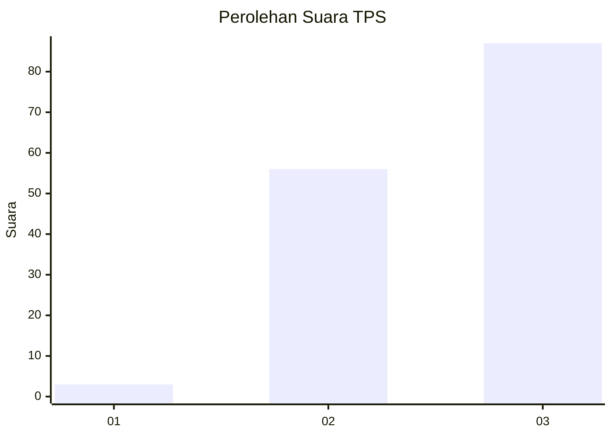
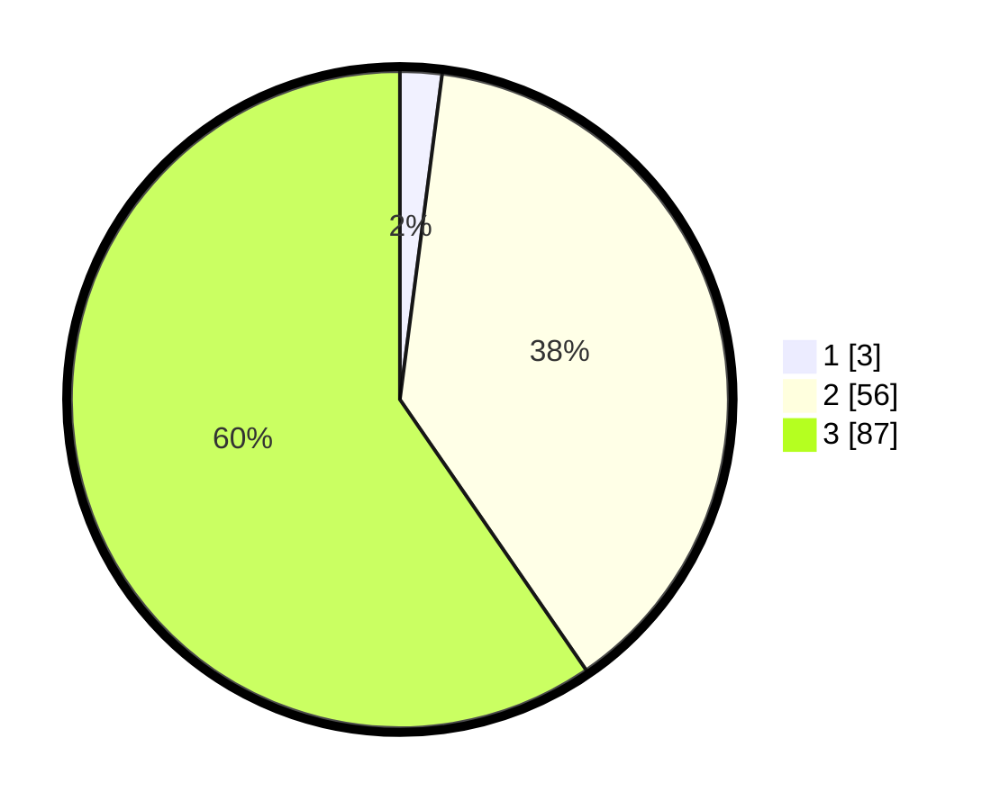

# Hasil

## Grafik

## Tabel

| No. | Nama Paslon    | Suara | Suara (raw) | Persentase |
|:--- |:-------------- | -----:| -----------:| ----------:|
| 1   | ANIES MUHAIMIN | 3     | [3][p-1]    | 2,05       |
| 2   | PRABOWO GIBRAN | 56    | [56][p-2]   | 38,36      |
| 3   | GANJAR MAHFUD  | 87    | [87][p-3]   | 59,59      |

[p-1]: https://github.com/gigit-pemilu/pemilu-2024/blob/main/pilpres/hitung-suara/sub/33-jawa-tengah/sub/12-wonogiri/sub/15-jatiroto/sub/2011-pengkol/sub/006-tps/sub/paslon-1.txt
[p-2]: https://github.com/gigit-pemilu/pemilu-2024/blob/main/pilpres/hitung-suara/sub/33-jawa-tengah/sub/12-wonogiri/sub/15-jatiroto/sub/2011-pengkol/sub/006-tps/sub/paslon-2.txt
[p-3]: https://github.com/gigit-pemilu/pemilu-2024/blob/main/pilpres/hitung-suara/sub/33-jawa-tengah/sub/12-wonogiri/sub/15-jatiroto/sub/2011-pengkol/sub/006-tps/sub/paslon-3.txt

## Foto C Plano

https://sirekap-obj-formc.kpu.go.id/35fd/pemilu/ppwp/33/12/15/20/11/3312152011006-20240214-233050--2a93a78c-e679-44eb-8092-7d75cc407268.jpg

https://sirekap-obj-formc.kpu.go.id/35fd/pemilu/ppwp/33/12/15/20/11/3312152011006-20240214-225325--df3ea711-41d5-47b5-812a-6eda31b34a67.jpg

https://sirekap-obj-formc.kpu.go.id/35fd/pemilu/ppwp/33/12/15/20/11/3312152011006-20240214-225418--6c760efb-5cce-4a40-8239-c38aea327661.jpg

## Metadata

| Key        | Value               |
| ---------- | ------------------- |
| Time Stamp | 2024-02-19 06:16:00 |

