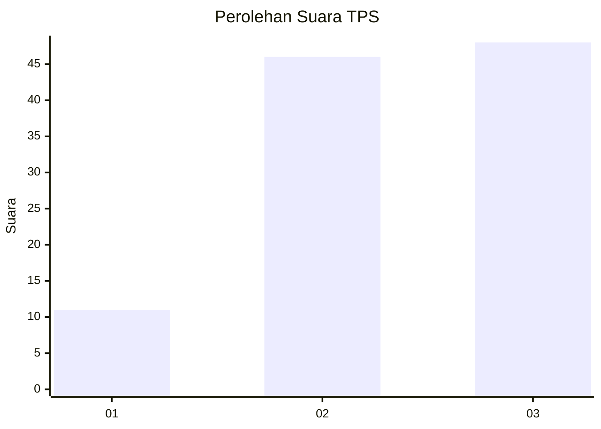
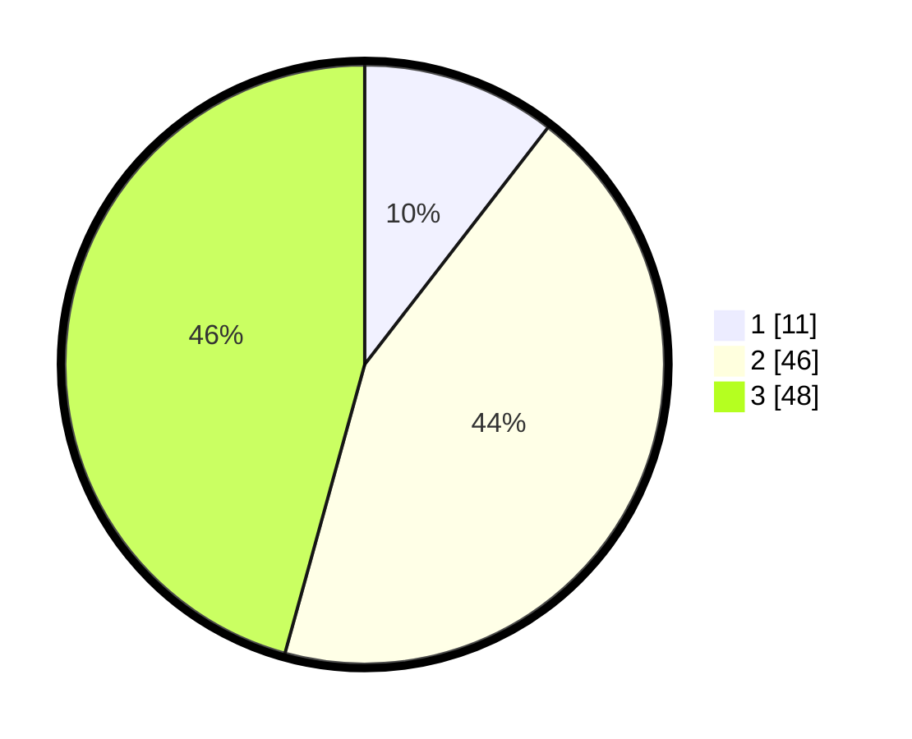

# Hasil

## Grafik

## Tabel

| No. | Nama Paslon    | Suara | Suara (raw) | Persentase |
|:--- |:-------------- | -----:| -----------:| ----------:|
| 1   | ANIES MUHAIMIN | 11    | [11][p-1]   | 10,48      |
| 2   | PRABOWO GIBRAN | 46    | [46][p-2]   | 43,81      |
| 3   | GANJAR MAHFUD  | 48    | [48][p-3]   | 45,71      |

[p-1]: https://github.com/gigit-pemilu/pemilu-2024/blob/main/pilpres/hitung-suara/sub/33-jawa-tengah/sub/12-wonogiri/sub/15-jatiroto/sub/2015-jatirejo/sub/005-tps/sub/paslon-1.txt
[p-2]: https://github.com/gigit-pemilu/pemilu-2024/blob/main/pilpres/hitung-suara/sub/33-jawa-tengah/sub/12-wonogiri/sub/15-jatiroto/sub/2015-jatirejo/sub/005-tps/sub/paslon-2.txt
[p-3]: https://github.com/gigit-pemilu/pemilu-2024/blob/main/pilpres/hitung-suara/sub/33-jawa-tengah/sub/12-wonogiri/sub/15-jatiroto/sub/2015-jatirejo/sub/005-tps/sub/paslon-3.txt

## Foto C Plano

https://sirekap-obj-formc.kpu.go.id/f3d7/pemilu/ppwp/33/12/15/20/15/3312152015005-20240214-205541--e7ba8c22-bd36-4caf-a93c-457166cc160c.jpg

https://sirekap-obj-formc.kpu.go.id/f3d7/pemilu/ppwp/33/12/15/20/15/3312152015005-20240214-224313--3bbcd29c-483a-4184-ab14-bd487c947975.jpg

https://sirekap-obj-formc.kpu.go.id/f3d7/pemilu/ppwp/33/12/15/20/15/3312152015005-20240214-224351--780ba605-0c7c-4fa4-bbe7-886f04ca7608.jpg

## Metadata

| Key        | Value               |
| ---------- | ------------------- |
| Time Stamp | 2024-02-19 13:00:00 |

