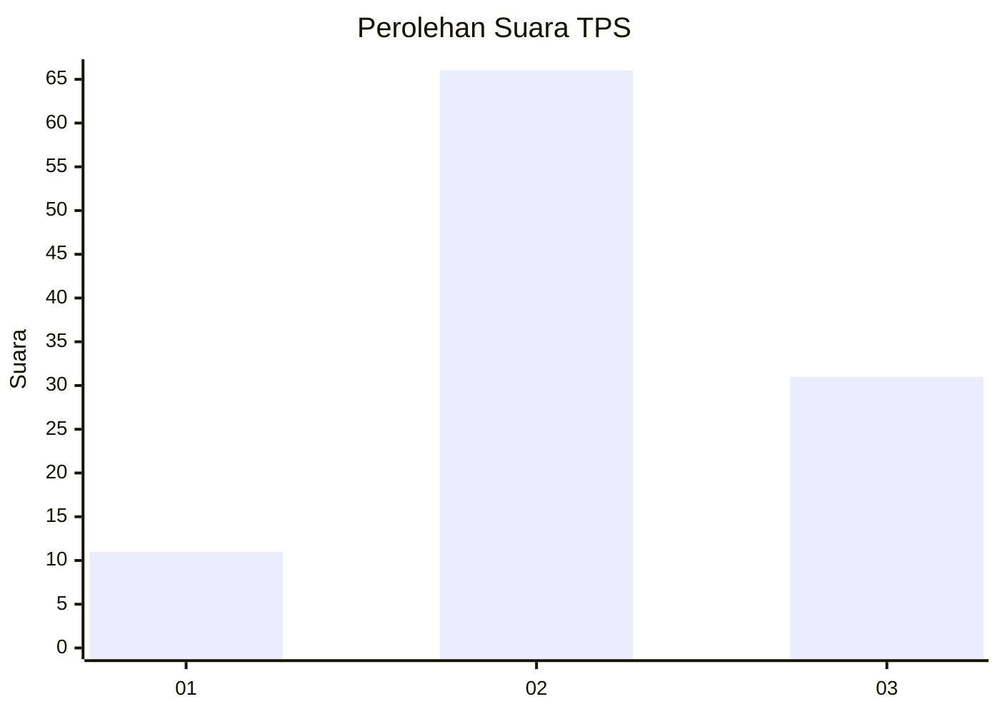
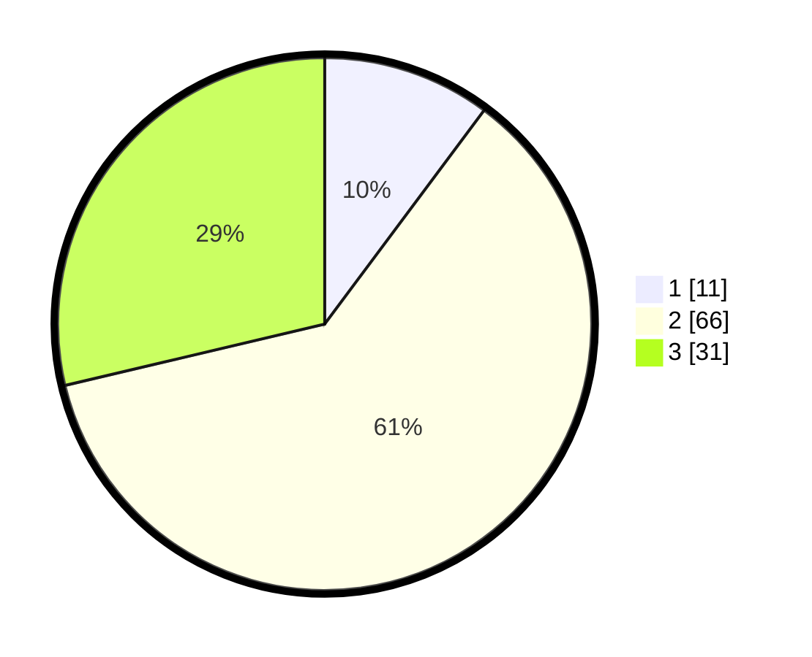

# Hasil

## Grafik

## Tabel

| No. | Nama Paslon    | Suara | Suara (raw) | Persentase |
|:--- |:-------------- | -----:| -----------:| ----------:|
| 1   | ANIES MUHAIMIN | 11    | [11][p-1]   | 10,19      |
| 2   | PRABOWO GIBRAN | 66    | [66][p-2]   | 61,11      |
| 3   | GANJAR MAHFUD  | 31    | [31][p-3]   | 28,70      |

[p-1]: https://github.com/gigit-pemilu/pemilu-2024/blob/main/pilpres/hitung-suara/sub/33-jawa-tengah/sub/12-wonogiri/sub/15-jatiroto/sub/2015-jatirejo/sub/006-tps/sub/paslon-1.txt
[p-2]: https://github.com/gigit-pemilu/pemilu-2024/blob/main/pilpres/hitung-suara/sub/33-jawa-tengah/sub/12-wonogiri/sub/15-jatiroto/sub/2015-jatirejo/sub/006-tps/sub/paslon-2.txt
[p-3]: https://github.com/gigit-pemilu/pemilu-2024/blob/main/pilpres/hitung-suara/sub/33-jawa-tengah/sub/12-wonogiri/sub/15-jatiroto/sub/2015-jatirejo/sub/006-tps/sub/paslon-3.txt

## Foto C Plano

https://sirekap-obj-formc.kpu.go.id/54ab/pemilu/ppwp/33/12/15/20/15/3312152015006-20240214-141556--7cfc4ce4-bb77-4f37-bac9-eee74e6cba20.jpg

https://sirekap-obj-formc.kpu.go.id/54ab/pemilu/ppwp/33/12/15/20/15/3312152015006-20240214-141712--6586a2fd-e98c-487e-a13b-9056a89ffb05.jpg

https://sirekap-obj-formc.kpu.go.id/54ab/pemilu/ppwp/33/12/15/20/15/3312152015006-20240214-141829--f705bb3b-8b8e-41b6-8ae4-4664d5c481c6.jpg

## Metadata

| Key        | Value               |
| ---------- | ------------------- |
| Time Stamp | 2024-02-15 00:41:44 |

