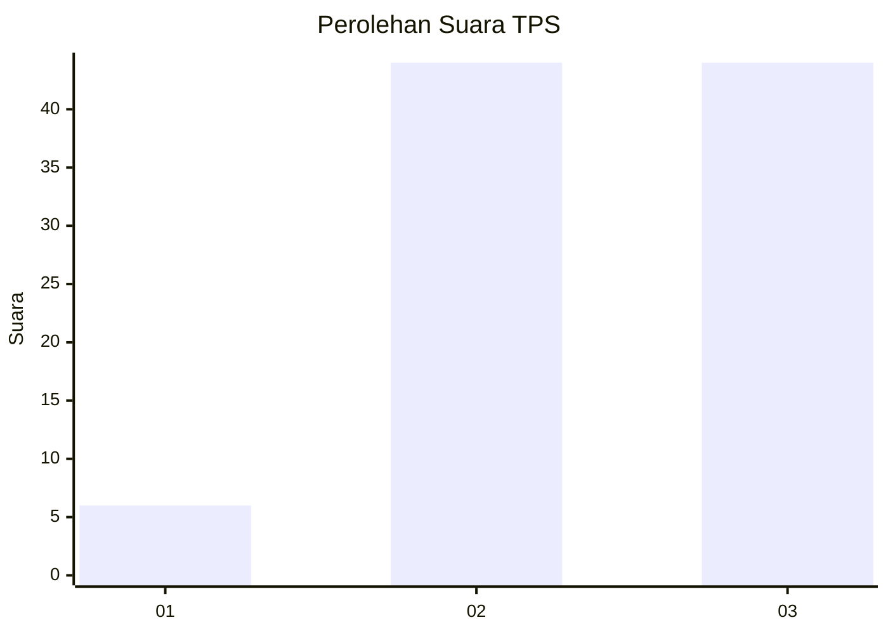
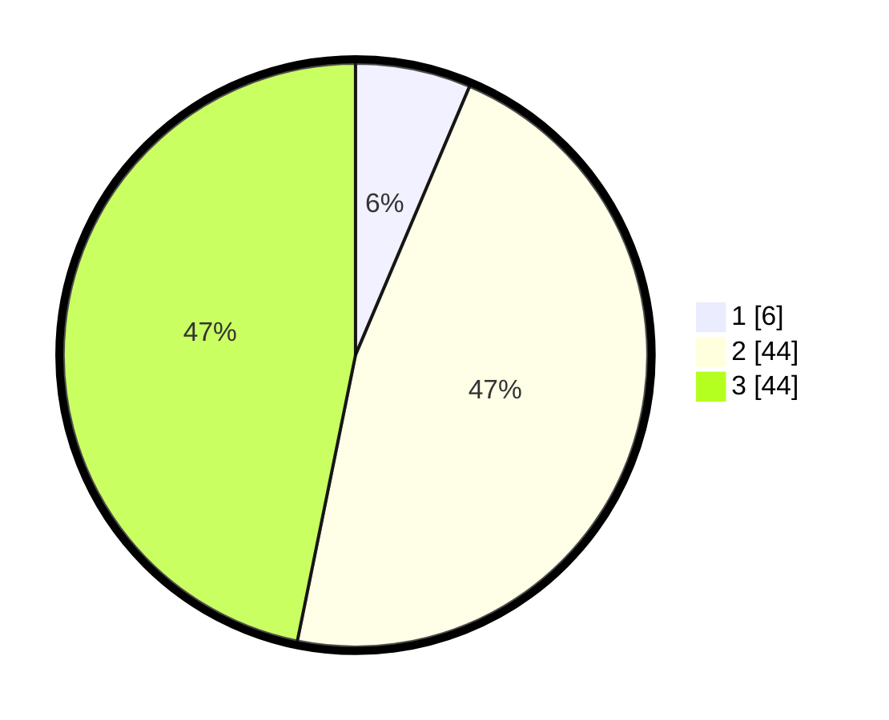

# Hasil

## Grafik

## Tabel

| No. | Nama Paslon    | Suara | Suara (raw) | Persentase |
|:--- |:-------------- | -----:| -----------:| ----------:|
| 1   | ANIES MUHAIMIN | 6     | [6][p-1]    | 6,38       |
| 2   | PRABOWO GIBRAN | 44    | [44][p-2]   | 46,81      |
| 3   | GANJAR MAHFUD  | 44    | [44][p-3]   | 46,81      |

[p-1]: https://github.com/gigit-pemilu/pemilu-2024/blob/main/pilpres/hitung-suara/sub/33-jawa-tengah/sub/12-wonogiri/sub/15-jatiroto/sub/2015-jatirejo/sub/008-tps/sub/paslon-1.txt
[p-2]: https://github.com/gigit-pemilu/pemilu-2024/blob/main/pilpres/hitung-suara/sub/33-jawa-tengah/sub/12-wonogiri/sub/15-jatiroto/sub/2015-jatirejo/sub/008-tps/sub/paslon-2.txt
[p-3]: https://github.com/gigit-pemilu/pemilu-2024/blob/main/pilpres/hitung-suara/sub/33-jawa-tengah/sub/12-wonogiri/sub/15-jatiroto/sub/2015-jatirejo/sub/008-tps/sub/paslon-3.txt

## Foto C Plano

https://sirekap-obj-formc.kpu.go.id/d1e2/pemilu/ppwp/33/12/15/20/15/3312152015008-20240214-193332--b13b1dd2-08e3-4ddf-a6d9-41e395163836.jpg

https://sirekap-obj-formc.kpu.go.id/d1e2/pemilu/ppwp/33/12/15/20/15/3312152015008-20240214-193614--a8ef70bf-7e0f-4464-ba18-b690469e863d.jpg

https://sirekap-obj-formc.kpu.go.id/d1e2/pemilu/ppwp/33/12/15/20/15/3312152015008-20240214-193850--0f773297-0de6-46b5-b0a8-35473a529258.jpg

## Metadata

| Key        | Value               |
| ---------- | ------------------- |
| Time Stamp | 2024-02-25 15:00:00 |

