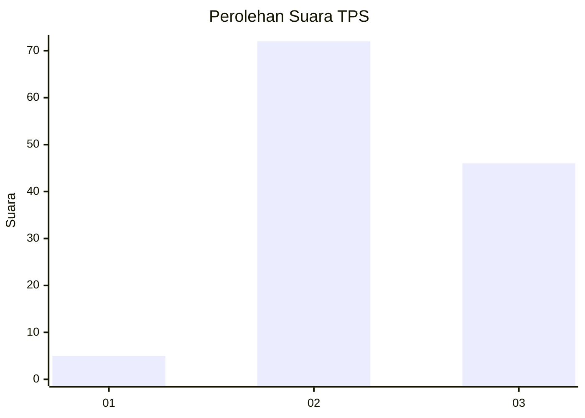
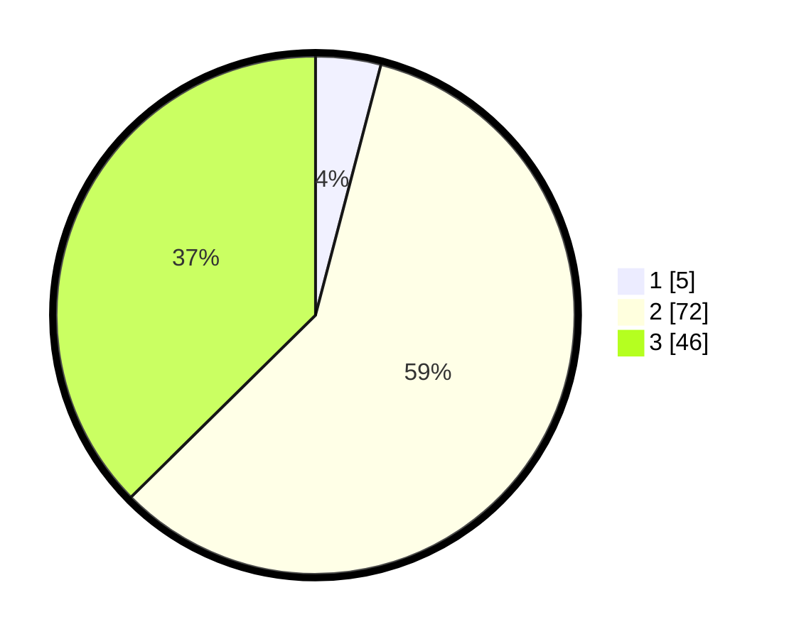

# Hasil

## Grafik

## Tabel

| No. | Nama Paslon    | Suara | Suara (raw) | Persentase |
|:--- |:-------------- | -----:| -----------:| ----------:|
| 1   | ANIES MUHAIMIN | 5     | [5][p-1]    | 4,07       |
| 2   | PRABOWO GIBRAN | 72    | [72][p-2]   | 58,54      |
| 3   | GANJAR MAHFUD  | 46    | [46][p-3]   | 37,40      |

[p-1]: https://github.com/gigit-pemilu/pemilu-2024/blob/main/pilpres/hitung-suara/sub/33-jawa-tengah/sub/12-wonogiri/sub/15-jatiroto/sub/2015-jatirejo/sub/013-tps/sub/paslon-1.txt
[p-2]: https://github.com/gigit-pemilu/pemilu-2024/blob/main/pilpres/hitung-suara/sub/33-jawa-tengah/sub/12-wonogiri/sub/15-jatiroto/sub/2015-jatirejo/sub/013-tps/sub/paslon-2.txt
[p-3]: https://github.com/gigit-pemilu/pemilu-2024/blob/main/pilpres/hitung-suara/sub/33-jawa-tengah/sub/12-wonogiri/sub/15-jatiroto/sub/2015-jatirejo/sub/013-tps/sub/paslon-3.txt

## Foto C Plano

https://sirekap-obj-formc.kpu.go.id/c055/pemilu/ppwp/33/12/15/20/15/3312152015013-20240219-113717--325857bc-467a-49d9-9188-4e144a2b06c1.jpg

https://sirekap-obj-formc.kpu.go.id/c055/pemilu/ppwp/33/12/15/20/15/3312152015013-20240214-233611--027ab245-53bd-4d8e-9f7e-9a4056577b41.jpg

https://sirekap-obj-formc.kpu.go.id/c055/pemilu/ppwp/33/12/15/20/15/3312152015013-20240214-233645--8c1ac2f3-df0c-4019-b924-74f30cb4867a.jpg

## Metadata

| Key        | Value               |
| ---------- | ------------------- |
| Time Stamp | 2024-02-19 12:00:00 |

