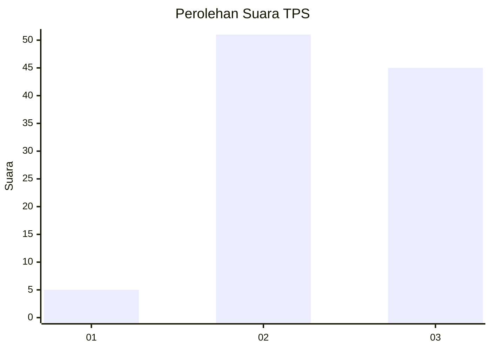
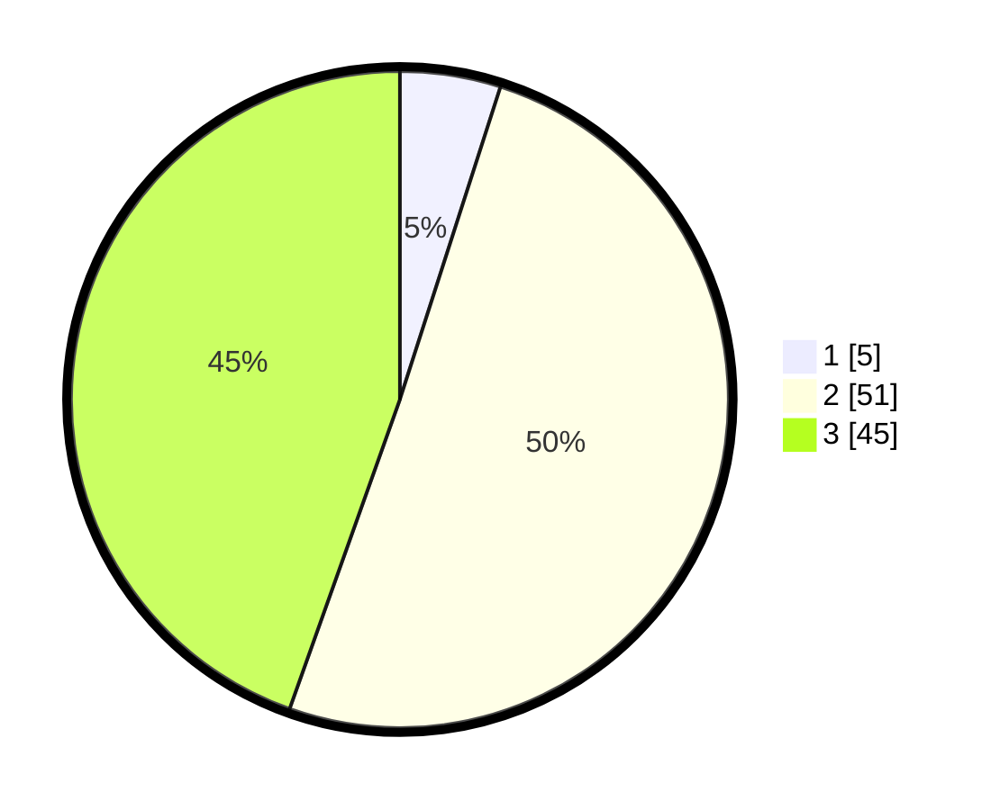

# Hasil

## Grafik

## Tabel

| No. | Nama Paslon    | Suara | Suara (raw) | Persentase |
|:--- |:-------------- | -----:| -----------:| ----------:|
| 1   | ANIES MUHAIMIN | 5     | [5][p-1]    | 4,95       |
| 2   | PRABOWO GIBRAN | 51    | [51][p-2]   | 50,50      |
| 3   | GANJAR MAHFUD  | 45    | [45][p-3]   | 44,55      |

[p-1]: https://github.com/gigit-pemilu/pemilu-2024-33-jawa-tengah/blob/main/pilpres/hitung-suara/sub/33-jawa-tengah/sub/12-wonogiri/sub/15-jatiroto/sub/2015-jatirejo/sub/015-tps/sub/paslon-1.txt
[p-2]: https://github.com/gigit-pemilu/pemilu-2024-33-jawa-tengah/blob/main/pilpres/hitung-suara/sub/33-jawa-tengah/sub/12-wonogiri/sub/15-jatiroto/sub/2015-jatirejo/sub/015-tps/sub/paslon-2.txt
[p-3]: https://github.com/gigit-pemilu/pemilu-2024-33-jawa-tengah/blob/main/pilpres/hitung-suara/sub/33-jawa-tengah/sub/12-wonogiri/sub/15-jatiroto/sub/2015-jatirejo/sub/015-tps/sub/paslon-3.txt

## Foto C Plano

https://sirekap-obj-formc.kpu.go.id/b0bd/pemilu/ppwp/33/12/15/20/15/3312152015015-20240214-194119--7c245dd2-b13a-4fa0-824f-2118adcbb142.jpg

https://sirekap-obj-formc.kpu.go.id/b0bd/pemilu/ppwp/33/12/15/20/15/3312152015015-20240219-180523--5151532b-e9f4-4cd7-bbac-f51a104ca6ff.jpg

https://sirekap-obj-formc.kpu.go.id/b0bd/pemilu/ppwp/33/12/15/20/15/3312152015015-20240219-193155--02371161-c9b6-499e-a199-3a4b3deeb457.jpg

## Metadata

| Key        | Value               |
| ---------- | ------------------- |
| Time Stamp | 2024-02-19 20:00:00 |

