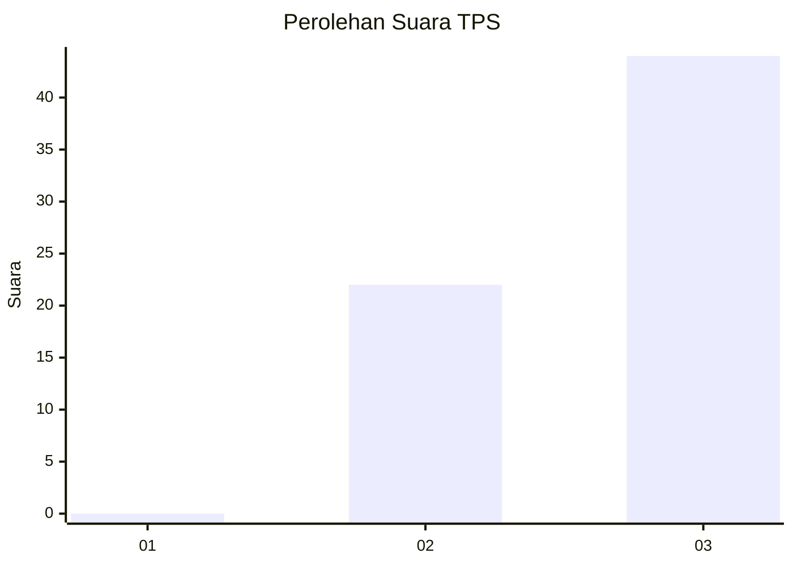
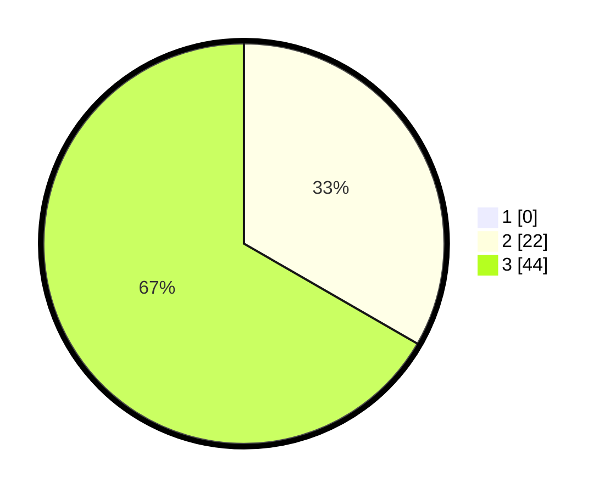

# Hasil

## Grafik

## Tabel

| No. | Nama Paslon    | Suara | Suara (raw) | Persentase |
|:--- |:-------------- | -----:| -----------:| ----------:|
| 1   | ANIES MUHAIMIN | 0     | [0][p-1]    | 0,00       |
| 2   | PRABOWO GIBRAN | 22    | [22][p-2]   | 33,33      |
| 3   | GANJAR MAHFUD  | 44    | [44][p-3]   | 66,67      |

[p-1]: https://github.com/gigit-pemilu/pemilu-2024/blob/main/pilpres/hitung-suara/sub/33-jawa-tengah/sub/12-wonogiri/sub/15-jatiroto/sub/2015-jatirejo/sub/017-tps/sub/paslon-1.txt
[p-2]: https://github.com/gigit-pemilu/pemilu-2024/blob/main/pilpres/hitung-suara/sub/33-jawa-tengah/sub/12-wonogiri/sub/15-jatiroto/sub/2015-jatirejo/sub/017-tps/sub/paslon-2.txt
[p-3]: https://github.com/gigit-pemilu/pemilu-2024/blob/main/pilpres/hitung-suara/sub/33-jawa-tengah/sub/12-wonogiri/sub/15-jatiroto/sub/2015-jatirejo/sub/017-tps/sub/paslon-3.txt

## Foto C Plano

https://sirekap-obj-formc.kpu.go.id/a234/pemilu/ppwp/33/12/15/20/15/3312152015017-20240214-223043--51e978f6-a54e-4c91-80bd-1409064b2dd6.jpg

https://sirekap-obj-formc.kpu.go.id/a234/pemilu/ppwp/33/12/15/20/15/3312152015017-20240216-020011--d7450b4e-2fce-4e52-9d73-98c34ddef8bb.jpg

https://sirekap-obj-formc.kpu.go.id/a234/pemilu/ppwp/33/12/15/20/15/3312152015017-20240214-201258--61d04acc-9724-4e48-8d6f-55105bea855c.jpg

## Metadata

| Key        | Value               |
| ---------- | ------------------- |
| Time Stamp | 2024-02-19 17:00:00 |

