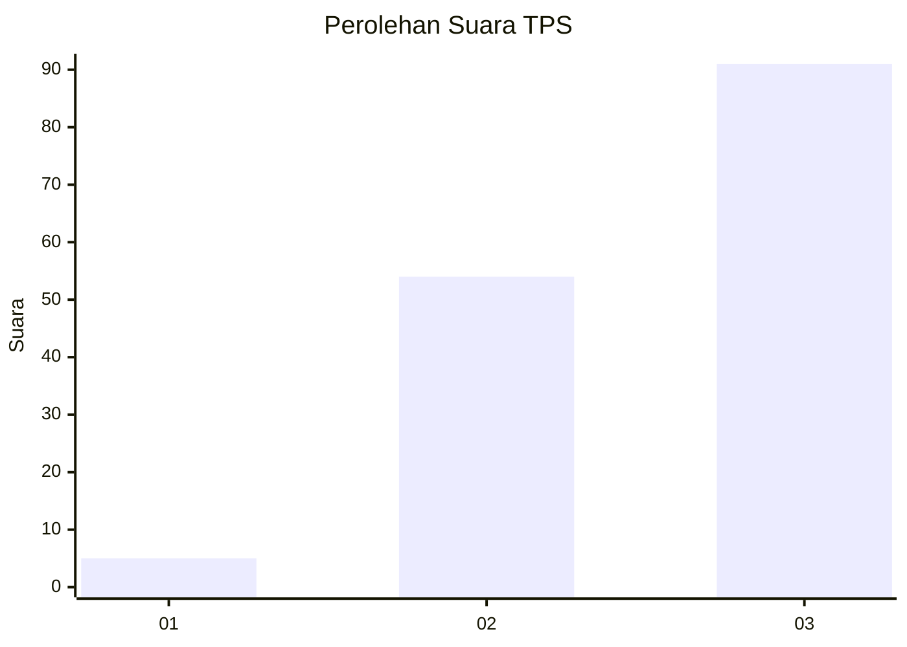
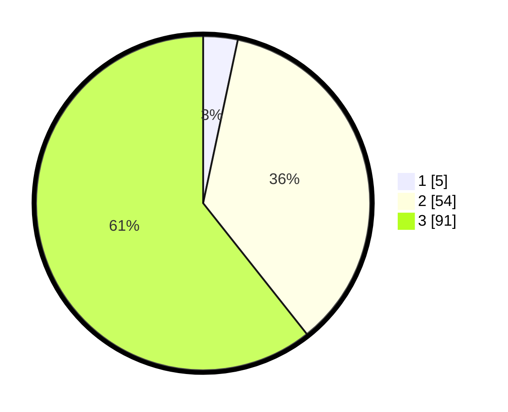

# Hasil

## Grafik

## Tabel

| No. | Nama Paslon    | Suara | Suara (raw) | Persentase |
|:--- |:-------------- | -----:| -----------:| ----------:|
| 1   | ANIES MUHAIMIN | 5     | [5][p-1]    | 3,33       |
| 2   | PRABOWO GIBRAN | 54    | [54][p-2]   | 36,00      |
| 3   | GANJAR MAHFUD  | 91    | [91][p-3]   | 60,67      |

[p-1]: https://github.com/gigit-pemilu/pemilu-2024/blob/main/pilpres/hitung-suara/sub/33-jawa-tengah/sub/12-wonogiri/sub/16-kismantoro/sub/1005-kismantoro/sub/012-tps/sub/paslon-1.txt
[p-2]: https://github.com/gigit-pemilu/pemilu-2024/blob/main/pilpres/hitung-suara/sub/33-jawa-tengah/sub/12-wonogiri/sub/16-kismantoro/sub/1005-kismantoro/sub/012-tps/sub/paslon-2.txt
[p-3]: https://github.com/gigit-pemilu/pemilu-2024/blob/main/pilpres/hitung-suara/sub/33-jawa-tengah/sub/12-wonogiri/sub/16-kismantoro/sub/1005-kismantoro/sub/012-tps/sub/paslon-3.txt

## Foto C Plano

https://sirekap-obj-formc.kpu.go.id/1ec9/pemilu/ppwp/33/12/16/10/05/3312161005012-20240214-220239--69b0176d-af9e-488b-bade-0d0f56faacaa.jpg

https://sirekap-obj-formc.kpu.go.id/1ec9/pemilu/ppwp/33/12/16/10/05/3312161005012-20240214-204823--e0aeda0a-bb2c-4983-ab45-068d31a1e0a5.jpg

https://sirekap-obj-formc.kpu.go.id/1ec9/pemilu/ppwp/33/12/16/10/05/3312161005012-20240214-204951--a2d8c981-a1b3-457e-9f17-c063b4e94110.jpg

## Metadata

| Key        | Value               |
| ---------- | ------------------- |
| Time Stamp | 2024-02-15 16:30:25 |

