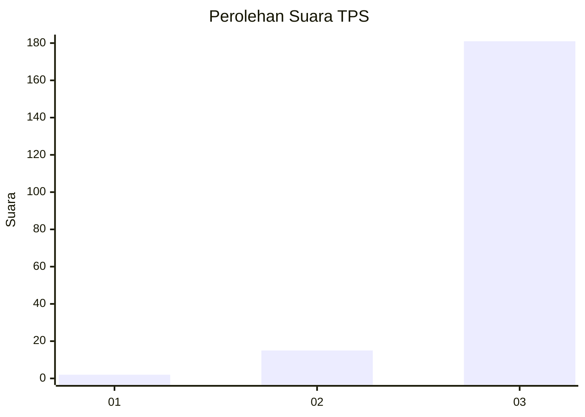
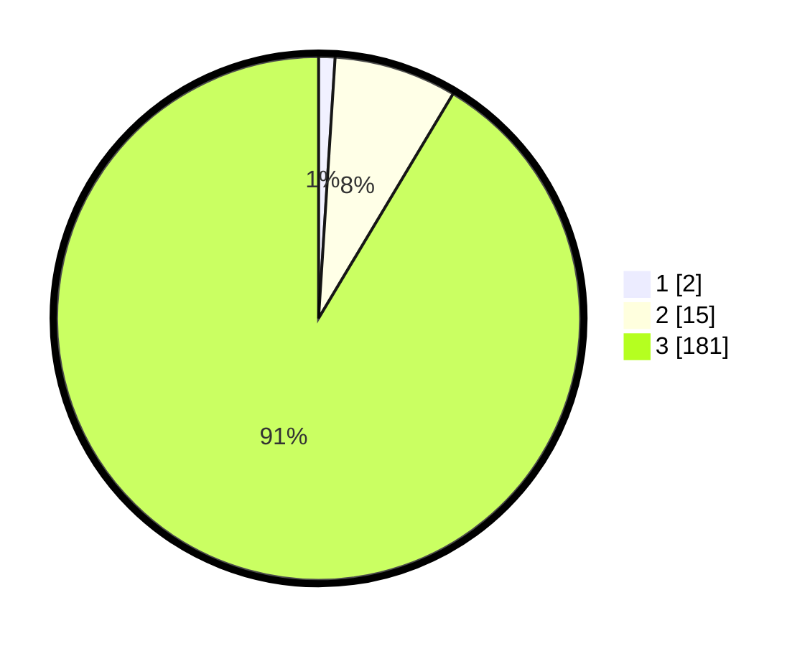

# Hasil

## Grafik

## Tabel

| No. | Nama Paslon    | Suara | Suara (raw) | Persentase |
|:--- |:-------------- | -----:| -----------:| ----------:|
| 1   | ANIES MUHAIMIN | 2     | [2][p-1]    | 1,01       |
| 2   | PRABOWO GIBRAN | 15    | [15][p-2]   | 7,58       |
| 3   | GANJAR MAHFUD  | 181   | [181][p-3]  | 91,41      |

[p-1]: https://github.com/gigit-pemilu/pemilu-2024-33-jawa-tengah/blob/main/pilpres/hitung-suara/sub/33-jawa-tengah/sub/12-wonogiri/sub/16-kismantoro/sub/2004-ngroto/sub/008-tps/sub/paslon-1.txt
[p-2]: https://github.com/gigit-pemilu/pemilu-2024-33-jawa-tengah/blob/main/pilpres/hitung-suara/sub/33-jawa-tengah/sub/12-wonogiri/sub/16-kismantoro/sub/2004-ngroto/sub/008-tps/sub/paslon-2.txt
[p-3]: https://github.com/gigit-pemilu/pemilu-2024-33-jawa-tengah/blob/main/pilpres/hitung-suara/sub/33-jawa-tengah/sub/12-wonogiri/sub/16-kismantoro/sub/2004-ngroto/sub/008-tps/sub/paslon-3.txt

## Foto C Plano

https://sirekap-obj-formc.kpu.go.id/982d/pemilu/ppwp/33/12/16/20/04/3312162004008-20240216-134936--008a7871-a5a2-4a01-9018-dde978a10876.jpg

https://sirekap-obj-formc.kpu.go.id/982d/pemilu/ppwp/33/12/16/20/04/3312162004008-20240216-135217--638cf3f1-36a6-444c-bcb3-7a8744fb5597.jpg

https://sirekap-obj-formc.kpu.go.id/982d/pemilu/ppwp/33/12/16/20/04/3312162004008-20240216-135342--26cf849b-c43d-431e-a8eb-db43093e93c5.jpg

## Metadata

| Key        | Value               |
| ---------- | ------------------- |
| Time Stamp | 2024-02-24 22:31:28 |

