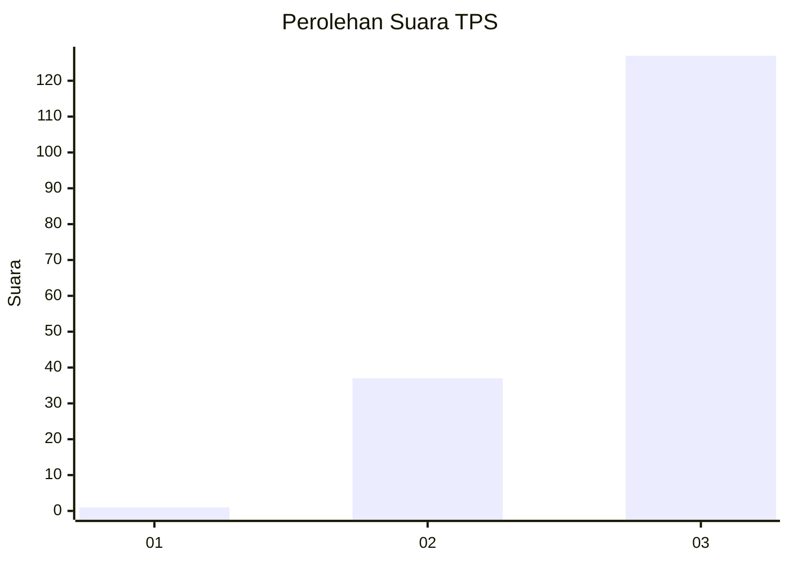
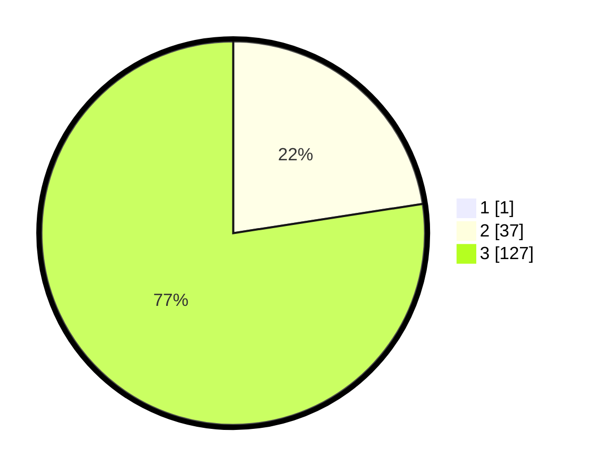

# Hasil

## Grafik

## Tabel

| No. | Nama Paslon    | Suara | Suara (raw) | Persentase |
|:--- |:-------------- | -----:| -----------:| ----------:|
| 1   | ANIES MUHAIMIN | 1     | [1][p-1]    | 0,61       |
| 2   | PRABOWO GIBRAN | 37    | [37][p-2]   | 22,42      |
| 3   | GANJAR MAHFUD  | 127   | [127][p-3]  | 76,97      |

[p-1]: https://github.com/gigit-pemilu/pemilu-2024-33-jawa-tengah/blob/main/pilpres/hitung-suara/sub/33-jawa-tengah/sub/12-wonogiri/sub/16-kismantoro/sub/2004-ngroto/sub/009-tps/sub/paslon-1.txt
[p-2]: https://github.com/gigit-pemilu/pemilu-2024-33-jawa-tengah/blob/main/pilpres/hitung-suara/sub/33-jawa-tengah/sub/12-wonogiri/sub/16-kismantoro/sub/2004-ngroto/sub/009-tps/sub/paslon-2.txt
[p-3]: https://github.com/gigit-pemilu/pemilu-2024-33-jawa-tengah/blob/main/pilpres/hitung-suara/sub/33-jawa-tengah/sub/12-wonogiri/sub/16-kismantoro/sub/2004-ngroto/sub/009-tps/sub/paslon-3.txt

## Foto C Plano

https://sirekap-obj-formc.kpu.go.id/9c86/pemilu/ppwp/33/12/16/20/04/3312162004009-20240216-103917--13401308-61a8-4a22-a9f9-0768a0683621.jpg

https://sirekap-obj-formc.kpu.go.id/9c86/pemilu/ppwp/33/12/16/20/04/3312162004009-20240216-104022--597625c6-ac71-4056-aee8-895a0db888cc.jpg

https://sirekap-obj-formc.kpu.go.id/9c86/pemilu/ppwp/33/12/16/20/04/3312162004009-20240216-104423--0e815724-5fb2-465b-89fe-4413bec9edf8.jpg

## Metadata

| Key        | Value               |
| ---------- | ------------------- |
| Time Stamp | 2024-02-25 12:00:00 |

