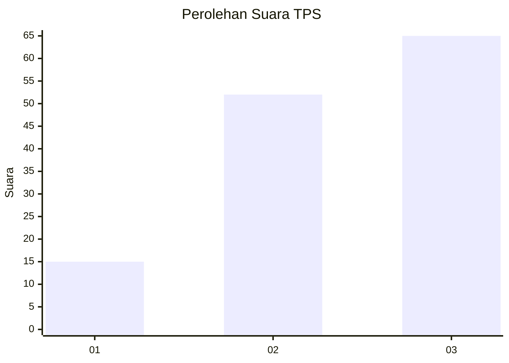
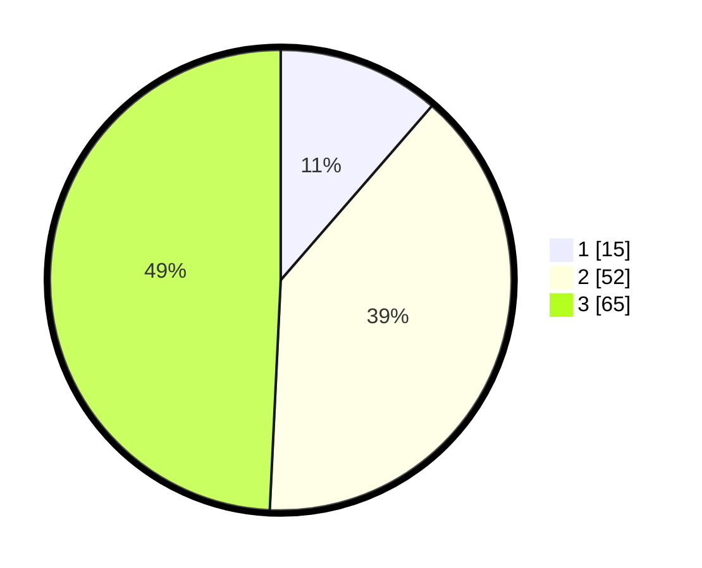

# Hasil

## Grafik

## Tabel

| No. | Nama Paslon    | Suara | Suara (raw) | Persentase |
|:--- |:-------------- | -----:| -----------:| ----------:|
| 1   | ANIES MUHAIMIN | 15    | [15][p-1]   | 11,36      |
| 2   | PRABOWO GIBRAN | 52    | [52][p-2]   | 39,39      |
| 3   | GANJAR MAHFUD  | 65    | [65][p-3]   | 49,24      |

[p-1]: https://github.com/gigit-pemilu/pemilu-2024-33-jawa-tengah/blob/main/pilpres/hitung-suara/sub/33-jawa-tengah/sub/12-wonogiri/sub/16-kismantoro/sub/2010-gedawung/sub/008-tps/sub/paslon-1.txt
[p-2]: https://github.com/gigit-pemilu/pemilu-2024-33-jawa-tengah/blob/main/pilpres/hitung-suara/sub/33-jawa-tengah/sub/12-wonogiri/sub/16-kismantoro/sub/2010-gedawung/sub/008-tps/sub/paslon-2.txt
[p-3]: https://github.com/gigit-pemilu/pemilu-2024-33-jawa-tengah/blob/main/pilpres/hitung-suara/sub/33-jawa-tengah/sub/12-wonogiri/sub/16-kismantoro/sub/2010-gedawung/sub/008-tps/sub/paslon-3.txt

## Foto C Plano

https://sirekap-obj-formc.kpu.go.id/cd03/pemilu/ppwp/33/12/16/20/10/3312162010008-20240214-141625--785e182e-75b0-43b0-8c24-1c0235c702a1.jpg

https://sirekap-obj-formc.kpu.go.id/cd03/pemilu/ppwp/33/12/16/20/10/3312162010008-20240214-141623--08f2141d-9369-4075-88de-9c0024daa18f.jpg

https://sirekap-obj-formc.kpu.go.id/cd03/pemilu/ppwp/33/12/16/20/10/3312162010008-20240214-141616--2ec9e613-2713-4e96-bc3b-76cf3c6bb9ed.jpg

## Metadata

| Key        | Value               |
| ---------- | ------------------- |
| Time Stamp | 2024-02-19 06:16:00 |

