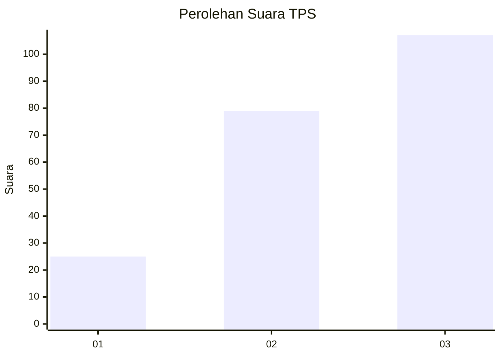
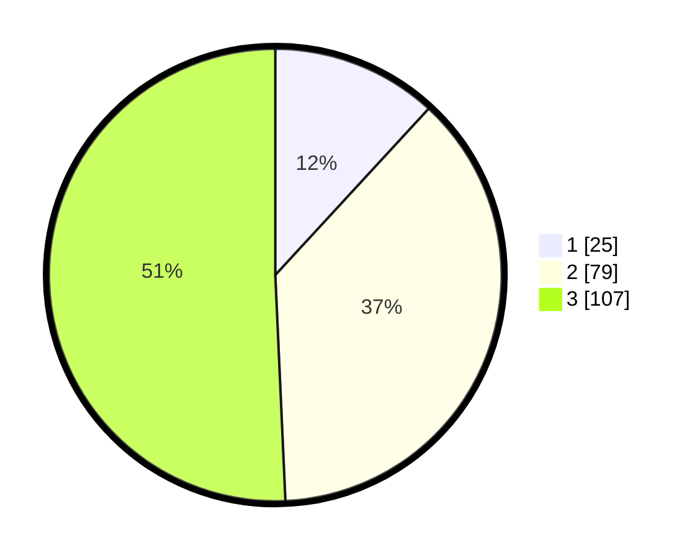

# Hasil

## Grafik

## Tabel

| No. | Nama Paslon    | Suara | Suara (raw) | Persentase |
|:--- |:-------------- | -----:| -----------:| ----------:|
| 1   | ANIES MUHAIMIN | 25    | [25][p-1]   | 11,85      |
| 2   | PRABOWO GIBRAN | 79    | [79][p-2]   | 37,44      |
| 3   | GANJAR MAHFUD  | 107   | [107][p-3]  | 50,71      |

[p-1]: https://github.com/gigit-pemilu/pemilu-2024-33-jawa-tengah/blob/main/pilpres/hitung-suara/sub/33-jawa-tengah/sub/12-wonogiri/sub/17-purwantoro/sub/1002-tegalrejo/sub/003-tps/sub/paslon-1.txt
[p-2]: https://github.com/gigit-pemilu/pemilu-2024-33-jawa-tengah/blob/main/pilpres/hitung-suara/sub/33-jawa-tengah/sub/12-wonogiri/sub/17-purwantoro/sub/1002-tegalrejo/sub/003-tps/sub/paslon-2.txt
[p-3]: https://github.com/gigit-pemilu/pemilu-2024-33-jawa-tengah/blob/main/pilpres/hitung-suara/sub/33-jawa-tengah/sub/12-wonogiri/sub/17-purwantoro/sub/1002-tegalrejo/sub/003-tps/sub/paslon-3.txt

## Foto C Plano

https://sirekap-obj-formc.kpu.go.id/6382/pemilu/ppwp/33/12/17/10/02/3312171002003-20240216-064055--e1bd7f05-031c-43f9-acfb-ab9dcb6e5cf8.jpg

https://sirekap-obj-formc.kpu.go.id/6382/pemilu/ppwp/33/12/17/10/02/3312171002003-20240216-114102--f329adbb-1af3-471c-ac3e-06ca2eee3e4b.jpg

https://sirekap-obj-formc.kpu.go.id/6382/pemilu/ppwp/33/12/17/10/02/3312171002003-20240216-232853--f69fab0f-2e45-4572-8511-d0bb92898f21.jpg

## Metadata

| Key        | Value               |
| ---------- | ------------------- |
| Time Stamp | 2024-02-25 14:00:00 |

