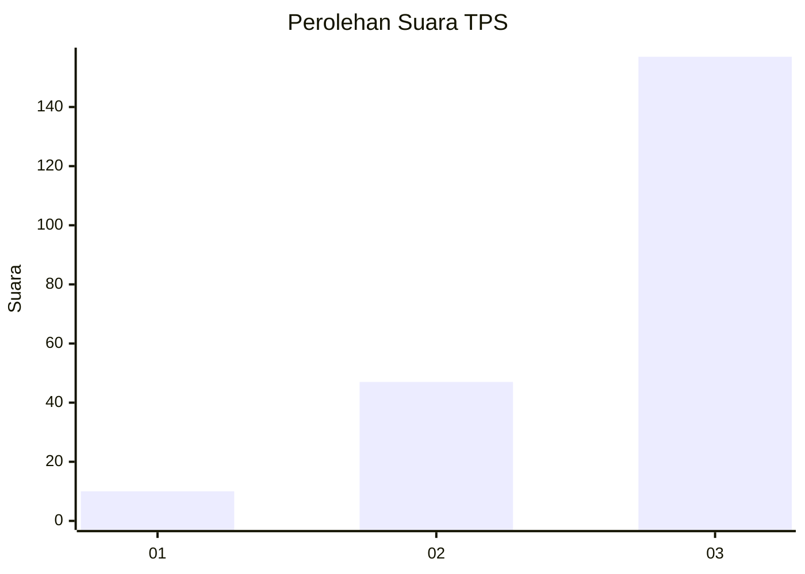
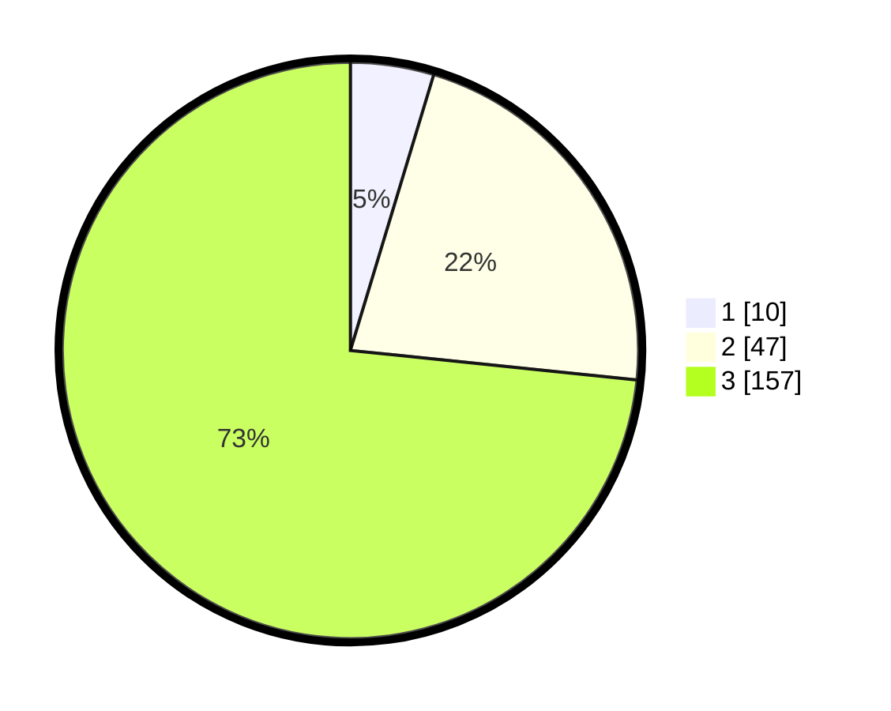

# Hasil

## Grafik

## Tabel

| No. | Nama Paslon    | Suara | Suara (raw) | Persentase |
|:--- |:-------------- | -----:| -----------:| ----------:|
| 1   | ANIES MUHAIMIN | 10    | [10][p-1]   | 4,67       |
| 2   | PRABOWO GIBRAN | 47    | [47][p-2]   | 21,96      |
| 3   | GANJAR MAHFUD  | 157   | [157][p-3]  | 73,36      |

[p-1]: https://github.com/gigit-pemilu/pemilu-2024/blob/main/pilpres/hitung-suara/sub/33-jawa-tengah/sub/12-wonogiri/sub/17-purwantoro/sub/1007-purwantoro/sub/013-tps/sub/paslon-1.txt
[p-2]: https://github.com/gigit-pemilu/pemilu-2024/blob/main/pilpres/hitung-suara/sub/33-jawa-tengah/sub/12-wonogiri/sub/17-purwantoro/sub/1007-purwantoro/sub/013-tps/sub/paslon-2.txt
[p-3]: https://github.com/gigit-pemilu/pemilu-2024/blob/main/pilpres/hitung-suara/sub/33-jawa-tengah/sub/12-wonogiri/sub/17-purwantoro/sub/1007-purwantoro/sub/013-tps/sub/paslon-3.txt

## Foto C Plano

https://sirekap-obj-formc.kpu.go.id/4391/pemilu/ppwp/33/12/17/10/07/3312171007013-20240215-112916--3f722233-6964-4818-878c-550c21a79a53.jpg

https://sirekap-obj-formc.kpu.go.id/4391/pemilu/ppwp/33/12/17/10/07/3312171007013-20240215-192304--c457f453-2a8e-4ad2-953f-b266bfe56542.jpg

https://sirekap-obj-formc.kpu.go.id/4391/pemilu/ppwp/33/12/17/10/07/3312171007013-20240215-204917--b2951072-41b3-4b0b-892d-8261007f9b90.jpg

## Metadata

| Key        | Value               |
| ---------- | ------------------- |
| Time Stamp | 2024-02-16 00:30:27 |

