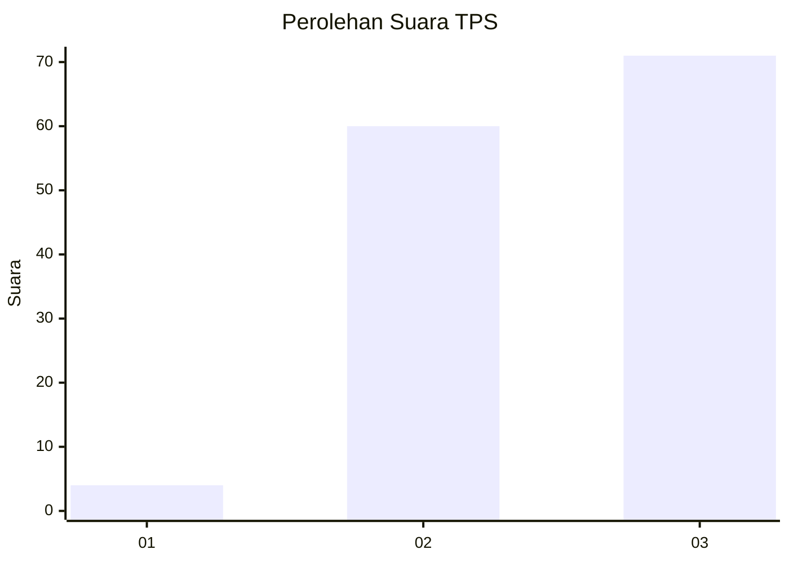
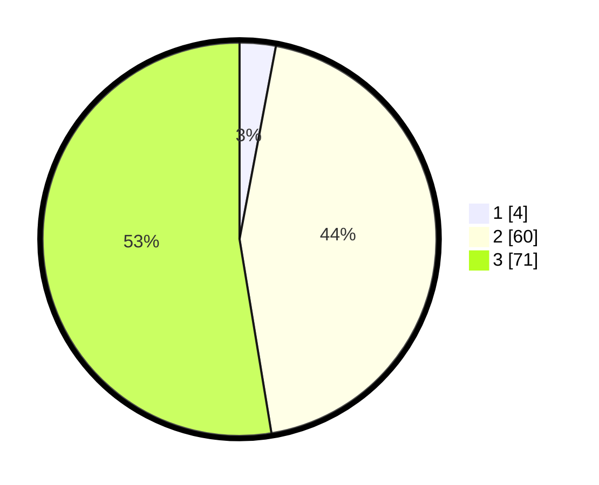

# Hasil

## Grafik

## Tabel

| No. | Nama Paslon    | Suara | Suara (raw) | Persentase |
|:--- |:-------------- | -----:| -----------:| ----------:|
| 1   | ANIES MUHAIMIN | 4     | [4][p-1]    | 2,96       |
| 2   | PRABOWO GIBRAN | 60    | [60][p-2]   | 44,44      |
| 3   | GANJAR MAHFUD  | 71    | [71][p-3]   | 52,59      |

[p-1]: https://github.com/gigit-pemilu/pemilu-2024-33-jawa-tengah/blob/main/pilpres/hitung-suara/sub/33-jawa-tengah/sub/12-wonogiri/sub/17-purwantoro/sub/2005-joho/sub/003-tps/sub/paslon-1.txt
[p-2]: https://github.com/gigit-pemilu/pemilu-2024-33-jawa-tengah/blob/main/pilpres/hitung-suara/sub/33-jawa-tengah/sub/12-wonogiri/sub/17-purwantoro/sub/2005-joho/sub/003-tps/sub/paslon-2.txt
[p-3]: https://github.com/gigit-pemilu/pemilu-2024-33-jawa-tengah/blob/main/pilpres/hitung-suara/sub/33-jawa-tengah/sub/12-wonogiri/sub/17-purwantoro/sub/2005-joho/sub/003-tps/sub/paslon-3.txt

## Foto C Plano

https://sirekap-obj-formc.kpu.go.id/c9ec/pemilu/ppwp/33/12/17/20/05/3312172005003-20240214-141917--785989c6-bd6f-4eee-8448-599ec7740bb8.jpg

https://sirekap-obj-formc.kpu.go.id/c9ec/pemilu/ppwp/33/12/17/20/05/3312172005003-20240214-141113--39d3549f-d675-4513-abe8-42bd07e5da78.jpg

https://sirekap-obj-formc.kpu.go.id/c9ec/pemilu/ppwp/33/12/17/20/05/3312172005003-20240214-193232--4b63256c-3f12-494e-978b-c4cc51a228ba.jpg

## Metadata

| Key        | Value               |
| ---------- | ------------------- |
| Time Stamp | 2024-02-14 21:46:01 |

