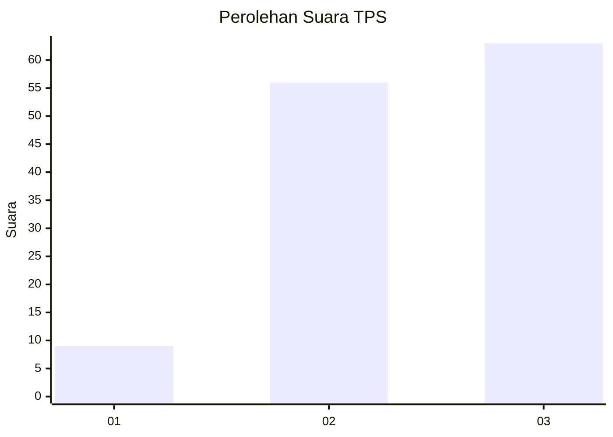
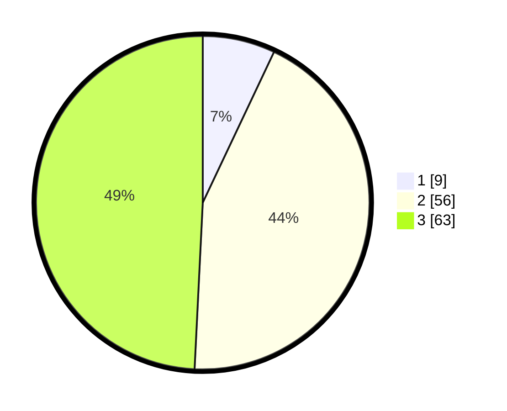

# Hasil

## Grafik

## Tabel

| No. | Nama Paslon    | Suara | Suara (raw) | Persentase |
|:--- |:-------------- | -----:| -----------:| ----------:|
| 1   | ANIES MUHAIMIN | 9     | [9][p-1]    | 7,03       |
| 2   | PRABOWO GIBRAN | 56    | [56][p-2]   | 43,75      |
| 3   | GANJAR MAHFUD  | 63    | [63][p-3]   | 49,22      |

[p-1]: https://github.com/gigit-pemilu/pemilu-2024-33-jawa-tengah/blob/main/pilpres/hitung-suara/sub/33-jawa-tengah/sub/12-wonogiri/sub/17-purwantoro/sub/2005-joho/sub/010-tps/sub/paslon-1.txt
[p-2]: https://github.com/gigit-pemilu/pemilu-2024-33-jawa-tengah/blob/main/pilpres/hitung-suara/sub/33-jawa-tengah/sub/12-wonogiri/sub/17-purwantoro/sub/2005-joho/sub/010-tps/sub/paslon-2.txt
[p-3]: https://github.com/gigit-pemilu/pemilu-2024-33-jawa-tengah/blob/main/pilpres/hitung-suara/sub/33-jawa-tengah/sub/12-wonogiri/sub/17-purwantoro/sub/2005-joho/sub/010-tps/sub/paslon-3.txt

## Foto C Plano

https://sirekap-obj-formc.kpu.go.id/f365/pemilu/ppwp/33/12/17/20/05/3312172005010-20240218-213751--b0b9f831-8bd6-4817-b198-b24f8d928c84.jpg

https://sirekap-obj-formc.kpu.go.id/f365/pemilu/ppwp/33/12/17/20/05/3312172005010-20240218-214154--03aaf499-63e9-4332-b19e-b7c80960b448.jpg

https://sirekap-obj-formc.kpu.go.id/f365/pemilu/ppwp/33/12/17/20/05/3312172005010-20240218-214557--fb415d46-e8d6-4277-9c46-ed029b822af9.jpg

## Metadata

| Key        | Value               |
| ---------- | ------------------- |
| Time Stamp | 2024-02-19 13:00:00 |

