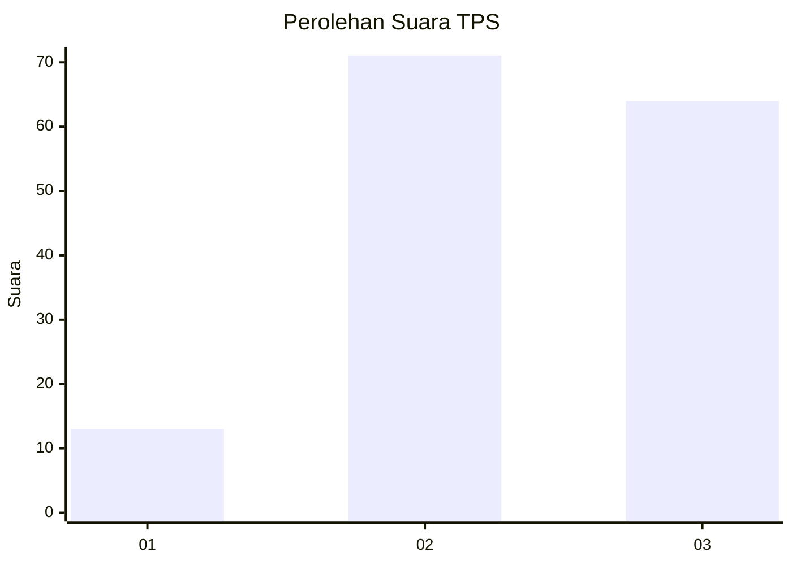
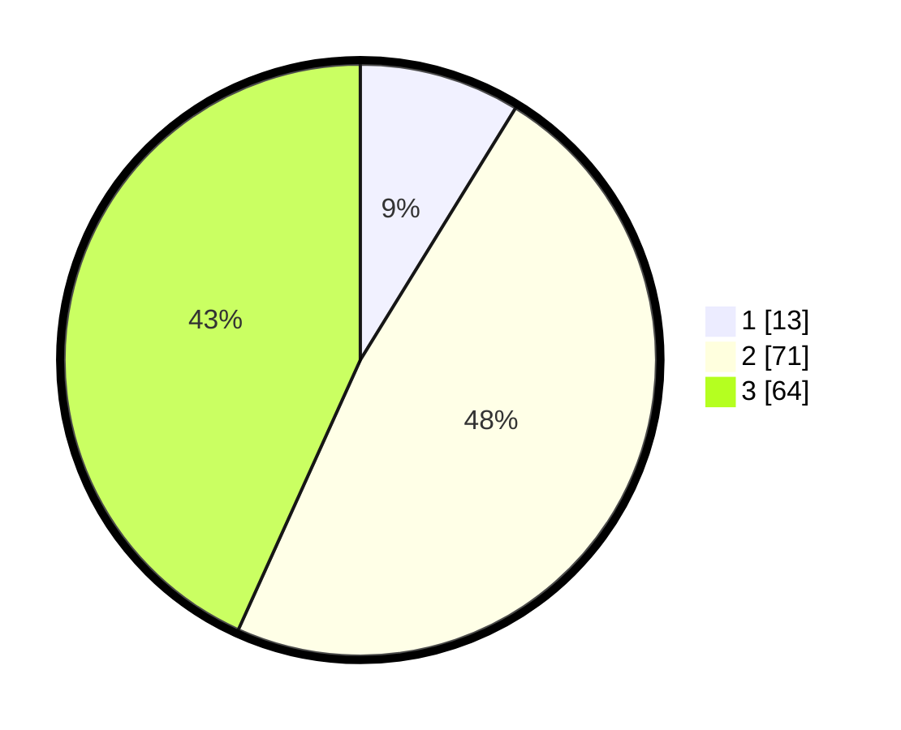

# Hasil

## Grafik

## Tabel

| No. | Nama Paslon    | Suara | Suara (raw) | Persentase |
|:--- |:-------------- | -----:| -----------:| ----------:|
| 1   | ANIES MUHAIMIN | 13    | [13][p-1]   | 8,78       |
| 2   | PRABOWO GIBRAN | 71    | [71][p-2]   | 47,97      |
| 3   | GANJAR MAHFUD  | 64    | [64][p-3]   | 43,24      |

[p-1]: https://github.com/gigit-pemilu/pemilu-2024/blob/main/pilpres/hitung-suara/sub/33-jawa-tengah/sub/12-wonogiri/sub/17-purwantoro/sub/2005-joho/sub/012-tps/sub/paslon-1.txt
[p-2]: https://github.com/gigit-pemilu/pemilu-2024/blob/main/pilpres/hitung-suara/sub/33-jawa-tengah/sub/12-wonogiri/sub/17-purwantoro/sub/2005-joho/sub/012-tps/sub/paslon-2.txt
[p-3]: https://github.com/gigit-pemilu/pemilu-2024/blob/main/pilpres/hitung-suara/sub/33-jawa-tengah/sub/12-wonogiri/sub/17-purwantoro/sub/2005-joho/sub/012-tps/sub/paslon-3.txt

## Foto C Plano

https://sirekap-obj-formc.kpu.go.id/9ce8/pemilu/ppwp/33/12/17/20/05/3312172005012-20240215-004217--af9e9f69-ed3c-47b2-b23e-65656dcc8e27.jpg

https://sirekap-obj-formc.kpu.go.id/9ce8/pemilu/ppwp/33/12/17/20/05/3312172005012-20240215-004354--0ac69e61-d070-4b1a-b267-5771feecb643.jpg

https://sirekap-obj-formc.kpu.go.id/9ce8/pemilu/ppwp/33/12/17/20/05/3312172005012-20240215-004605--6ef6fa00-d7e5-4ed5-91f6-4295254d75eb.jpg

## Metadata

| Key        | Value               |
| ---------- | ------------------- |
| Time Stamp | 2024-02-25 13:00:00 |

